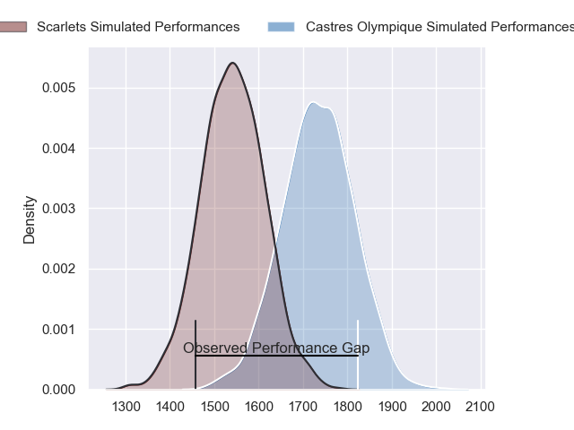
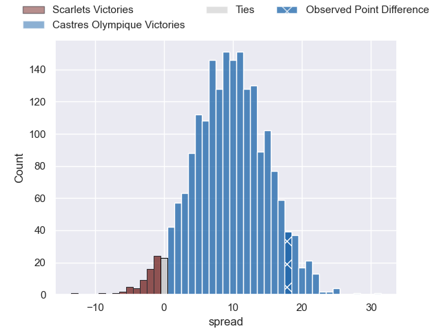
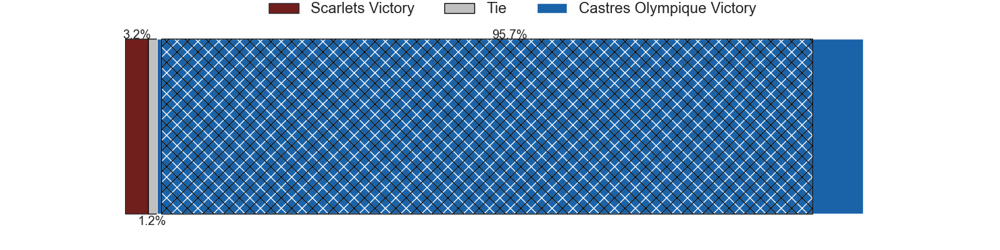
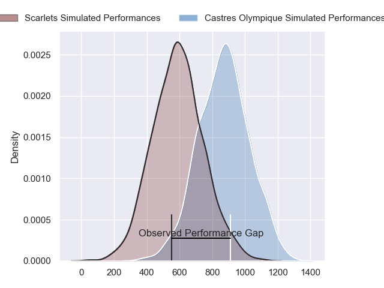
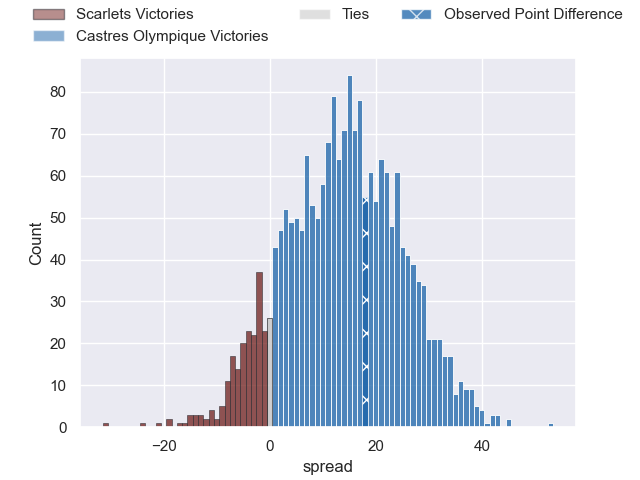
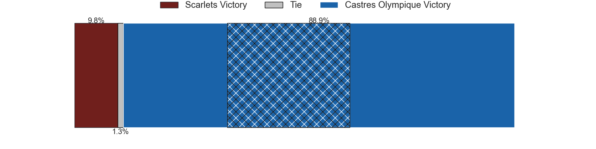
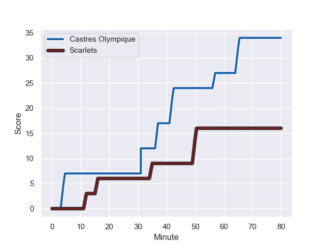
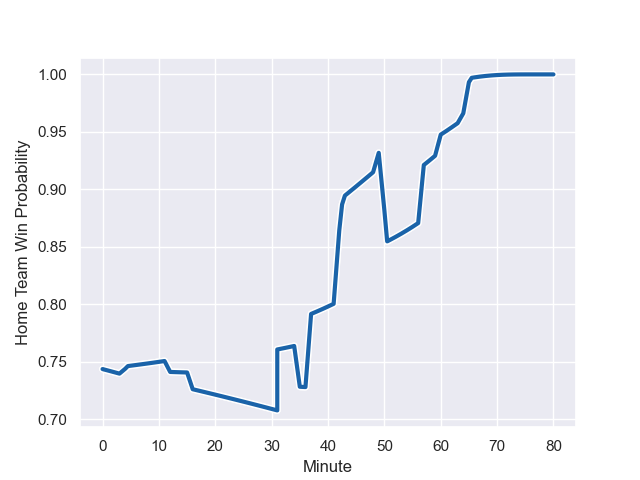

---  
layout: page  
title: Scarlets at Castres Olympique; 16-34  
date: 2023-12-09 18:00:00 -0500  
categories: "European Rugby Challenge Cup 2023" match review  
---
# Scarlets at Castres Olympique; 16-34

# Club Level Predictions

The first set of predictions treats a club as the smallest object, as the club develops its members, organizes a gameplan, and deploys its players as needed for each match. This club model has a prediction of 0.746, which translates to predicting Castres Olympique to win by 9.6.

Each club has a rating and a rating deviation (similar to a Glicko rating), and expected performances can be generated. This allows for simulated matches and spreads like the ones below.
## Projected Performances - Club Model

## Projected Spreads - Club Model

## Projected Results - Club Model

# Player Level Predictions - Version 2

Treating teams instead as an entity made up of the currently active players, I have ratings for each player in an altogether different system. These can be combined to form team ratings once teamsheets are announced, weighting starters a bit higher than the reserves. After the match is played, players can be weighted by their minutes on the field, allowing for an accurate measure of the team's composition. With these compiled team ratings, we can make predictions, measure inaccuracy, and update the individual player ratings.
## Prediction with Player Minutes: Castres Olympique by 11.7

Castres Olympique by 6.8 on a neutral field
## Prediction without Player Minutes: Castres Olympique by 10.6

Castres Olympique by 5.7 on a neutral pitch

## Projected Performances - Player Model

## Projected Spreads - Player Model

## Projected Results - Player Model

## Scores over Time

## Win Probability over Time

There were 8 large changes in win probability in this match

|   Away Minutes | Away Player         |   Away elo |   Number |   Home elo | Home Player          |   Home Minutes |
|---------------:|:--------------------|-----------:|---------:|-----------:|:---------------------|---------------:|
|             70 | Steffan Thomas      |      37.12 |        1 |      49.86 | Wayan de Benedittis  |             60 |
|             49 | Ryan Elias          |      74.97 |        2 |      81.17 | Gaetan Barlot        |             60 |
|             57 | Joe Jones           |      34.78 |        3 |      29.37 | Aurélien Azar        |             60 |
|             57 | Morgan Jones        |       9.88 |        4 |      48.13 | Florent Vanverberghe |             60 |
|             80 | Jac Price           |      19.21 |        5 |      72.92 | Tom Staniforth       |             80 |
|             80 | Ben Williams        |      39.33 |        6 |      30.48 | Romain Macurdy       |             43 |
|             80 | Teddy Leatherbarrow |      38.27 |        7 |      41.88 | Baptiste Cope        |             80 |
|             60 | Carwyn Tuipulotu    |      37.21 |        8 |      52.3  | Abraham Papali'i     |             80 |
|             57 | Kieran Hardy        |      51.03 |        9 |      16.43 | Jeremy Fernandez     |             51 |
|             64 | Ioan Lloyd          |      19.89 |       10 |      40.61 | Louis Le Brun        |             80 |
|             80 | Ryan Conbeer        |      40.92 |       11 |      45.38 | Antoine Bouzerand    |             80 |
|             57 | Johnny Williams     |      65.33 |       12 |      53.54 | Vilimoni Botitu      |             71 |
|             80 | Jonathan Davies     |      37.67 |       13 |      42.79 | Adrien Seguret       |             80 |
|             80 | Steffan Evans       |      65.55 |       14 |      48.74 | Josaia Raisuqe       |             60 |
|             80 | Tom Rogers          |      35.11 |       15 |      71.69 | Julien Dumora        |             80 |
|             10 | Sam O'Connor        |      47.99 |       16 |      82.01 | Antoine Tichit       |             20 |
|             31 | Shaun Evans         |      22.68 |       17 |      30.68 | Pierre Colonna       |             20 |
|             23 | Harri O'Connor      |      27.56 |       18 |      62.71 | Levan Chilachava     |             20 |
|             23 | Ed Scragg           |      39.07 |       19 |      78.83 | Leone Nakarawa       |             20 |
|             20 | Iwan Shenton        |      38.62 |       20 |      46.47 | Yann Peysson         |             37 |
|             23 | Archie Hughes       |      42.11 |       21 |      48.72 | Gauthier Doubrere    |             29 |
|             16 | Charlie Titcombe    |      42.1  |       22 |      61.39 | Pierre Popelin       |              9 |
|             23 | Ioan Nicholas       |      45.92 |       23 |      40.11 | Théo Chabouni        |             20 |

