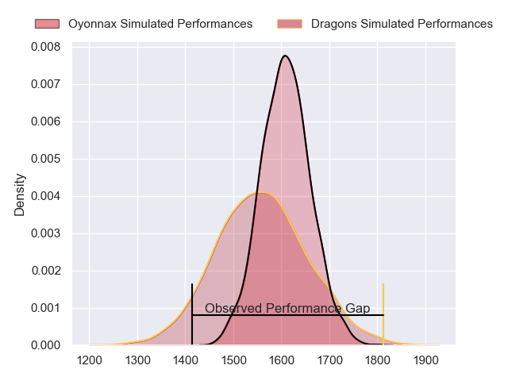
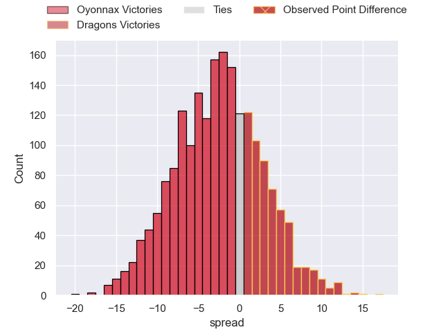
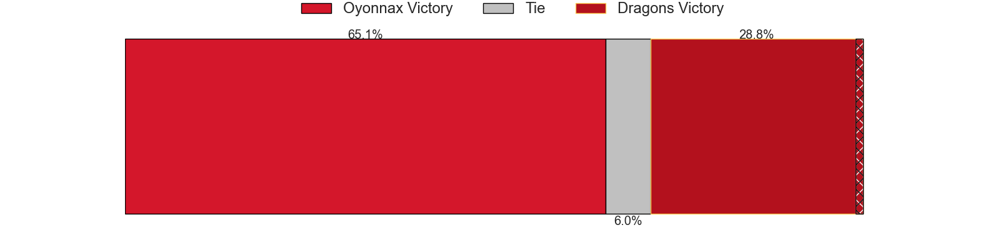
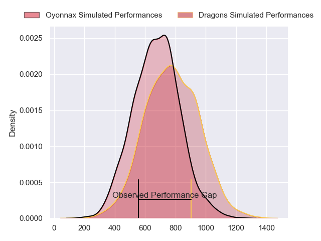
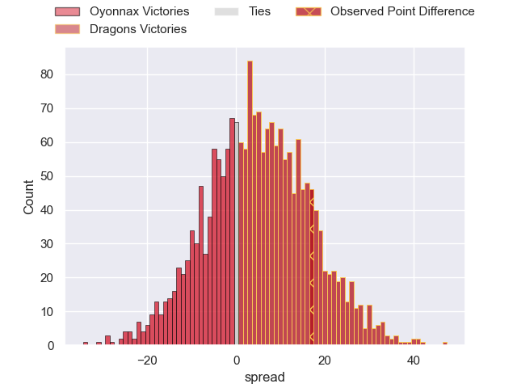
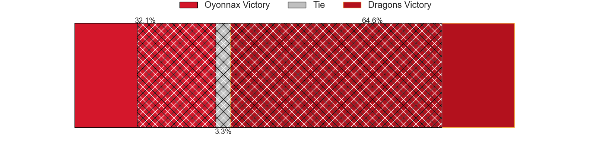
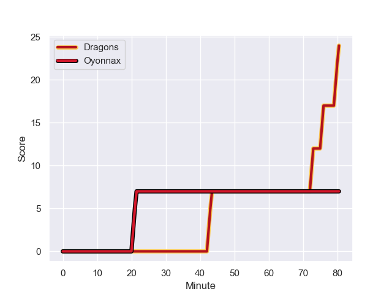
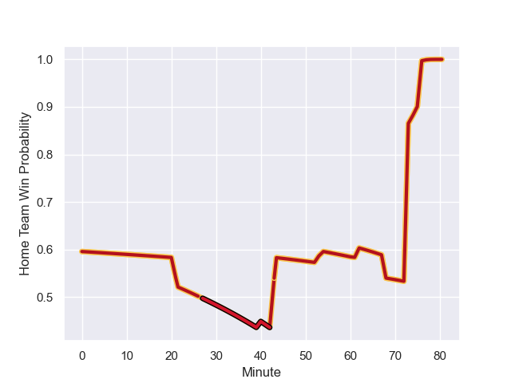

---  
layout: page  
title: Oyonnax at Dragons; 7-24  
date: 2023-12-09 18:00:00 -0500  
categories: "European Rugby Challenge Cup 2023" match review  
---
# Oyonnax at Dragons; 7-24

# Club Level Predictions

The first set of predictions treats a club as the smallest object, as the club develops its members, organizes a gameplan, and deploys its players as needed for each match. This club model has a prediction of 0.426, which translates to predicting Oyonnax to win by 2.6.

Each club has a rating and a rating deviation (similar to a Glicko rating), and expected performances can be generated. This allows for simulated matches and spreads like the ones below.
## Projected Performances - Club Model

## Projected Spreads - Club Model

## Projected Results - Club Model

# Player Level Predictions - Version 2

Treating teams instead as an entity made up of the currently active players, I have ratings for each player in an altogether different system. These can be combined to form team ratings once teamsheets are announced, weighting starters a bit higher than the reserves. After the match is played, players can be weighted by their minutes on the field, allowing for an accurate measure of the team's composition. With these compiled team ratings, we can make predictions, measure inaccuracy, and update the individual player ratings.
## Prediction with Player Minutes: Dragons by 4.3

Oyonnax by 0.0 on a neutral field
## Prediction without Player Minutes: Dragons by 2.9

Oyonnax by 1.4 on a neutral pitch

## Projected Performances - Player Model

## Projected Spreads - Player Model

## Projected Results - Player Model

## Scores over Time

## Win Probability over Time

There were 6 large changes in win probability in this match

|   Away Minutes | Away Player          |   Away elo |   Number |   Home elo | Home Player       |   Home Minutes |
|---------------:|:---------------------|-----------:|---------:|-----------:|:------------------|---------------:|
|             54 | Rory Sutherland      |      48.64 |        1 |      23.03 | Rhodri Jones      |             65 |
|             67 | Manu Leiataua        |      15.31 |        2 |      69.63 | Elliot Dee        |             75 |
|             54 | Thibault Berthaud    |      45.48 |        3 |      26.21 | Lloyd Fairbrother |             65 |
|             80 | Victor Lebas         |      22.21 |        4 |      27.96 | Joseph Davies     |             75 |
|             40 | Ewan Thomas Johnson  |      59.95 |        5 |      34.97 | George Nott       |             80 |
|             53 | Filimo Taofifenua    |      68.67 |        6 |      42.41 | Ryan Woodman      |             80 |
|             80 | Hugo Hermet          |      40.5  |        7 |     -10.38 | Harrison Keddie   |             78 |
|             68 | Loic Godener         |      30.53 |        8 |      67.7  | Aaron Wainwright  |             80 |
|             62 | Charlie Cassang      |      74.93 |        9 |      70.92 | Rhodri Williams   |             75 |
|             80 | Jules Soulan         |      64.7  |       10 |      41.3  | Will Reed         |             80 |
|             80 | Joe Ravouvou         |      64.82 |       11 |      63.75 | Ashton Hewitt     |             78 |
|             80 | Pedro Bettencourt    |      17.71 |       12 |      67.49 | Steffan Hughes    |             80 |
|             61 | Leo Treilles         |      48.01 |       13 |      71.86 | Sio Tomkinson     |             69 |
|             80 | Souleymane Coulibaly |      44.46 |       14 |      26.54 | Rio Dyer          |             80 |
|             80 | Maxime Salles        |      54.84 |       15 |      55.17 | Jordan Williams   |             80 |
|             26 | Adrien Bordenave     |      27.8  |       16 |      28.38 | Aki Seiuli        |             15 |
|             13 | Julien Ratajczak     |      46.4  |       17 |      42.33 | Brodie Coghlan    |              5 |
|             26 | Irakli Mirtskhulava  |      50.27 |       18 |      38.83 | Chris Coleman     |             15 |
|             40 | Steve Mafi           |      38.02 |       19 |      33.94 | Sean Lonsdale     |              5 |
|             27 | David Odiase         |      46.65 |       20 |      46.54 | George Young      |              2 |
|             12 | Antonin Corso        |      46.3  |       21 |      27.35 | Dane Blacker      |              5 |
|             18 | Ilan El Khattabi     |      35.68 |       22 |      10.52 | Corey Baldwin     |              2 |
|             19 | Alexis Pisani        |      46.54 |       23 |      46.65 | Harri Ackerman    |             11 |

