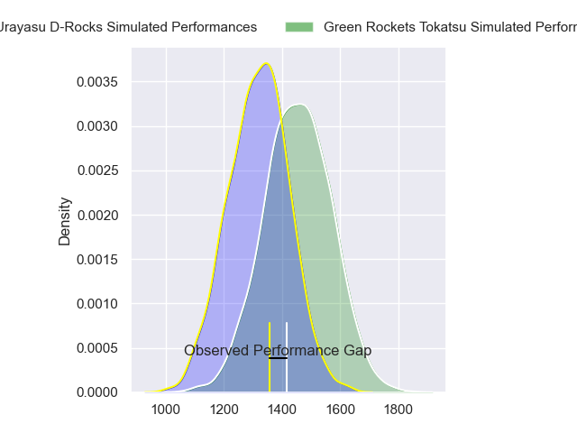
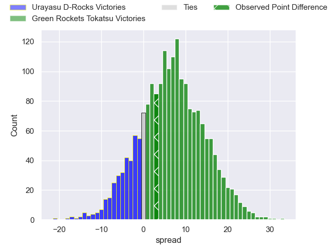
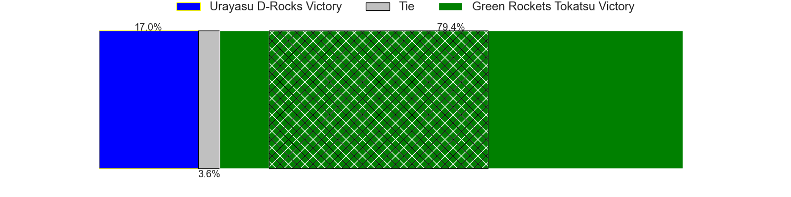
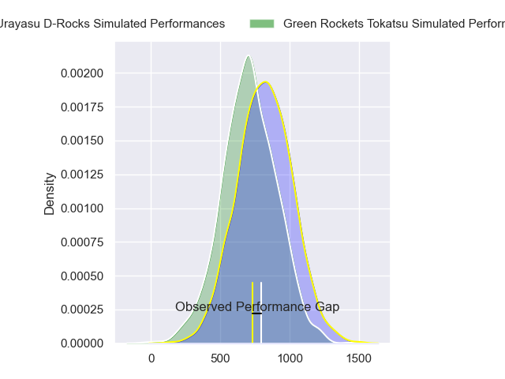
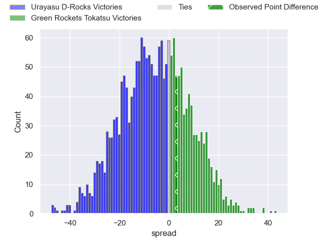
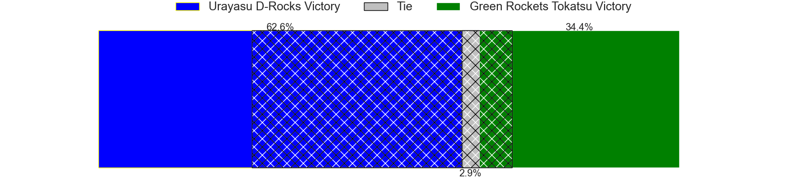

---  
layout: page  
title: Urayasu D-Rocks at Green Rockets Tokatsu; 28-31  
date: 2023-12-09 18:00:00 -0500  
categories: "Japan Rugby League One D2 2023" match review  
---
# Urayasu D-Rocks at Green Rockets Tokatsu; 28-31

# Club Level Predictions

The first set of predictions treats a club as the smallest object, as the club develops its members, organizes a gameplan, and deploys its players as needed for each match. This club model has a prediction of 0.677, which translates to predicting Green Rockets Tokatsu to win by 6.8.

Each club has a rating and a rating deviation (similar to a Glicko rating), and expected performances can be generated. This allows for simulated matches and spreads like the ones below.
## Projected Performances - Club Model

## Projected Spreads - Club Model

## Projected Results - Club Model

# Player Level Predictions - Version 2

Treating teams instead as an entity made up of the currently active players, I have ratings for each player in an altogether different system. These can be combined to form team ratings once teamsheets are announced, weighting starters a bit higher than the reserves. After the match is played, players can be weighted by their minutes on the field, allowing for an accurate measure of the team's composition. With these compiled team ratings, we can make predictions, measure inaccuracy, and update the individual player ratings.
## Prediction with Player Minutes: Urayasu D-Rocks by 5.0

Urayasu D-Rocks by 8.4 on a neutral field
## Prediction without Player Minutes: Urayasu D-Rocks by 5.0

Urayasu D-Rocks by 8.4 on a neutral pitch

## Projected Performances - Player Model

## Projected Spreads - Player Model

## Projected Results - Player Model

|   Away Minutes | Away Player          |   Away elo |   Number |   Home elo | Home Player           |   Home Minutes |
|---------------:|:---------------------|-----------:|---------:|-----------:|:----------------------|---------------:|
|             80 | Gakuto Ishida        |      39.85 |        1 |      47.44 | Kosei Yamamoto        |             80 |
|             80 | Ryuji Fujimura       |      57.17 |        2 |      66.86 | Ash Dixon             |             80 |
|             80 | Kim Ryom             |      50.53 |        3 |      50.7  | Keisuke Kikuta        |             80 |
|             80 | Yuta Kojima          |      70.25 |        4 |      86.42 | Sam Jeffries          |             80 |
|             80 | Lourens Erasmus      |      64.08 |        5 |      19.67 | Daiki Yamagiwa        |             80 |
|             80 | Shin Takeuchi        |      46.65 |        6 |      46.44 | Viliami Lutua Ahofono |             80 |
|             80 | Liam Gill            |      56.95 |        7 |      35.06 | Ryoi Kamei            |             80 |
|             80 | Tyler Paul           |      73.66 |        8 |      31.02 | Aseri Masivou         |             80 |
|             80 | Ren Iinuma           |      45.04 |        9 |      67.74 | Nick Phipps           |             80 |
|             80 | Hayden Cripps        |      59.15 |       10 |      48.73 | Tiaan Swanepoel       |             80 |
|             80 | Kai Ishii            |      14.18 |       11 |      37.22 | Kenta Omata           |             80 |
|             80 | Samu Kerevi          |      91.55 |       12 |      46.65 | Nathanael Tupou       |             80 |
|             80 | Samisoni Ahokovi Tua |      40.69 |       13 |      -8.02 | Maritino Nemani       |             80 |
|             80 | Larry Steven Sulunga |      40.66 |       14 |      12.69 | Teruya Goto           |             80 |
|             80 | Takuhei Yasuda       |      72.92 |       15 |      31.12 | Lomano Lemeki         |             80 |

