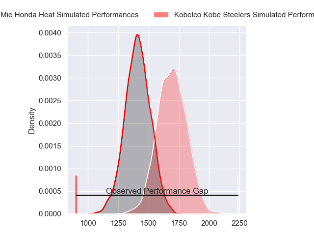
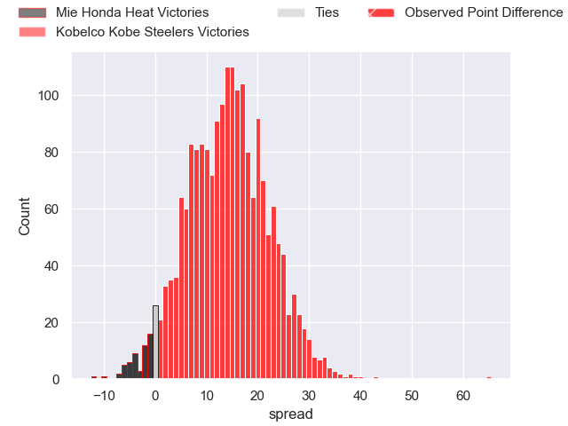
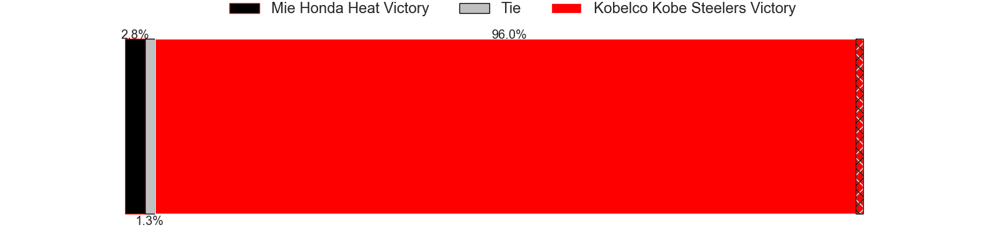
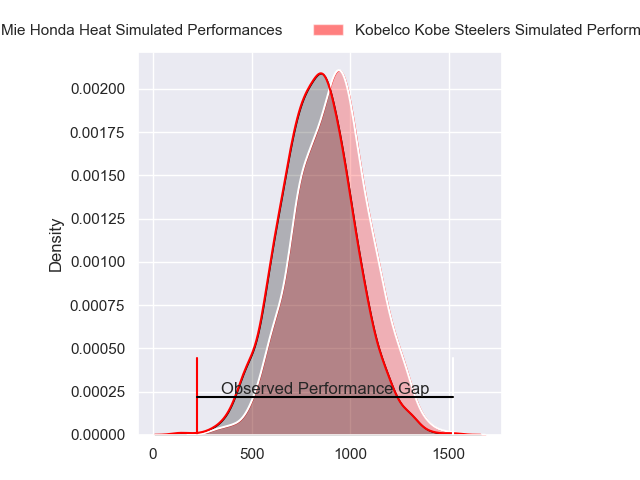
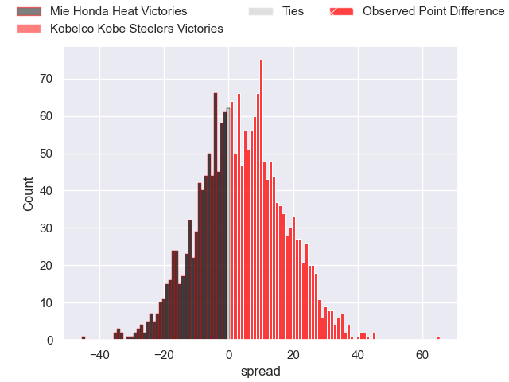
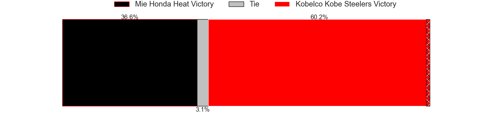

---  
layout: page  
title: Mie Honda Heat at Kobelco Kobe Steelers; 15-80  
date: 2023-12-09 18:00:00 -0500  
categories: "Japan Rugby League One 2023" match review  
---
# Mie Honda Heat at Kobelco Kobe Steelers; 15-80

# Club Level Predictions

The first set of predictions treats a club as the smallest object, as the club develops its members, organizes a gameplan, and deploys its players as needed for each match. This club model has a prediction of 0.829, which translates to predicting Kobelco Kobe Steelers to win by 14.4.

Each club has a rating and a rating deviation (similar to a Glicko rating), and expected performances can be generated. This allows for simulated matches and spreads like the ones below.
## Projected Performances - Club Model

## Projected Spreads - Club Model

## Projected Results - Club Model

# Player Level Predictions - Version 2

Treating teams instead as an entity made up of the currently active players, I have ratings for each player in an altogether different system. These can be combined to form team ratings once teamsheets are announced, weighting starters a bit higher than the reserves. After the match is played, players can be weighted by their minutes on the field, allowing for an accurate measure of the team's composition. With these compiled team ratings, we can make predictions, measure inaccuracy, and update the individual player ratings.
## Prediction with Player Minutes: Kobelco Kobe Steelers by 3.5

Kobelco Kobe Steelers by 0.1 on a neutral field
## Prediction without Player Minutes: Kobelco Kobe Steelers by 3.5

Kobelco Kobe Steelers by 0.1 on a neutral pitch

## Projected Performances - Player Model

## Projected Spreads - Player Model

## Projected Results - Player Model

|   Away Minutes | Away Player         |   Away elo |   Number |   Home elo | Home Player       |   Home Minutes |
|---------------:|:--------------------|-----------:|---------:|-----------:|:------------------|---------------:|
|             80 | Tatsuhiko Tsurukawa |      35.17 |        1 |      40.42 | Shigure Takao     |             80 |
|             80 | Tateo Kanai         |      70.99 |        2 |      39.27 | Kenta Matsuoka    |             80 |
|             80 | Taiki Yoshioka      |      44.52 |        3 |       8.23 | Koo Ji-won        |             80 |
|             80 | Tetuhi Roberts      |      46.23 |        4 |      46.65 | Waisake Raratubua |             80 |
|             80 | Franco Mostert      |     108.56 |        5 |     144.5  | Brodie Retallick  |             80 |
|             80 | Waimana Kapa        |      57.93 |        6 |      45.72 | Amanaki Saumaki   |             80 |
|             80 | Ryo Furuta          |      28.92 |        7 |     110.23 | Ardie Savea       |             80 |
|             80 | Sosiceni Tokoqio    |      42.33 |        8 |      41.02 | Tiennan Costley   |             80 |
|             80 | Kenta Yamaji        |      39.69 |        9 |      58.54 | Kenta Tokuda      |             80 |
|             80 | Gwangtee Oh         |      53.4  |       10 |      79.59 | Bryn Gatland      |             80 |
|             80 | Tevita Li           |     113.49 |       11 |      66.88 | Rakuhei Yamashita |             80 |
|             80 | Fraser Quirk        |      39.1  |       12 |      12.34 | Seungsin Lee      |             80 |
|             80 | Clinton Knox        |      31.36 |       13 |      61.48 | Ngani Laumape     |             80 |
|             80 | Naoki Motomura      |      40.94 |       14 |      43.23 | Kanta Matsunaga   |             80 |
|             80 | Mitch Hunt          |      75.39 |       15 |      32.84 | Ryohei Yamanaka   |             80 |

