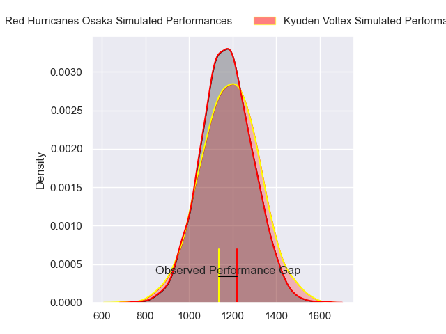
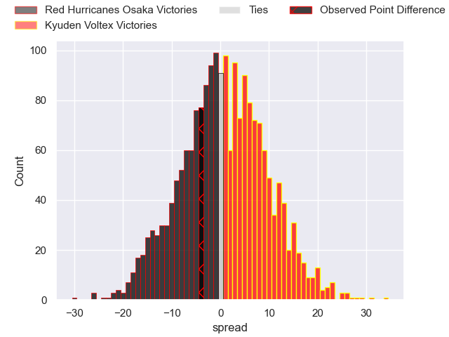
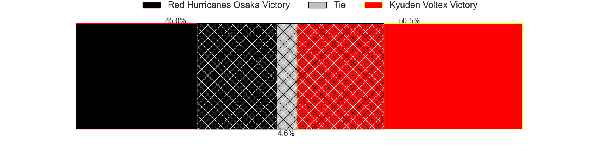
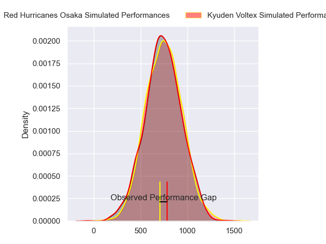
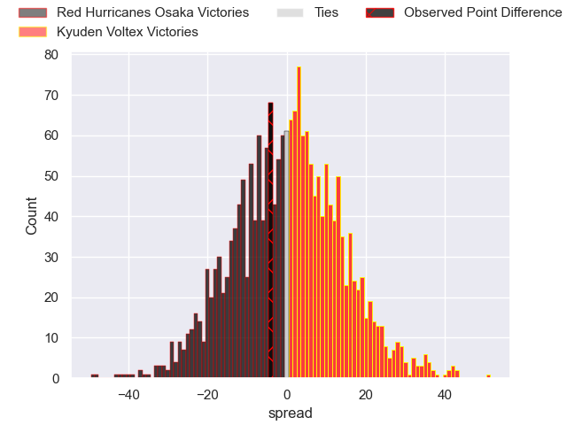
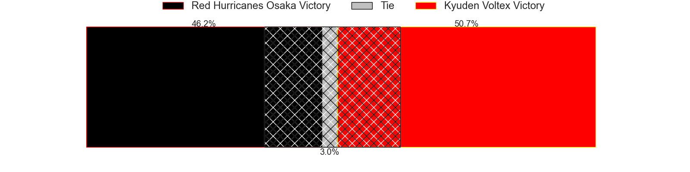

---  
layout: page  
title: Red Hurricanes Osaka at Kyuden Voltex; 26-22  
date: 2023-12-09 18:00:00 -0500  
categories: "Japan Rugby League One D2 2023" match review  
---
# Red Hurricanes Osaka at Kyuden Voltex; 26-22

# Club Level Predictions

The first set of predictions treats a club as the smallest object, as the club develops its members, organizes a gameplan, and deploys its players as needed for each match. This club model has a prediction of 0.524, which translates to predicting Kyuden Voltex to win by 0.9.

Each club has a rating and a rating deviation (similar to a Glicko rating), and expected performances can be generated. This allows for simulated matches and spreads like the ones below.
## Projected Performances - Club Model

## Projected Spreads - Club Model

## Projected Results - Club Model

# Player Level Predictions - Version 2

Treating teams instead as an entity made up of the currently active players, I have ratings for each player in an altogether different system. These can be combined to form team ratings once teamsheets are announced, weighting starters a bit higher than the reserves. After the match is played, players can be weighted by their minutes on the field, allowing for an accurate measure of the team's composition. With these compiled team ratings, we can make predictions, measure inaccuracy, and update the individual player ratings.
## Prediction with Player Minutes: Kyuden Voltex by 0.8

Red Hurricanes Osaka by 2.4 on a neutral field
## Prediction without Player Minutes: Kyuden Voltex by 0.8

Red Hurricanes Osaka by 2.4 on a neutral pitch

## Projected Performances - Player Model

## Projected Spreads - Player Model

## Projected Results - Player Model

|   Away Minutes | Away Player       |   Away elo |   Number |   Home elo | Home Player            |   Home Minutes |
|---------------:|:------------------|-----------:|---------:|-----------:|:-----------------------|---------------:|
|             80 | Takai Shota       |      45.98 |        1 |      62.04 | Samuel Nozomu Faialaga |             80 |
|             80 | Hisamitsu Shimada |      65.12 |        2 |      31.36 | Kyungmun Wang          |             80 |
|             80 | Munekata Sashida  |      60.15 |        3 |      42.03 | Yasuo Saruwatari       |             80 |
|             80 | Michael Allardice |      51.48 |        4 |      55.06 | Tomotaka Ishimatsu     |             80 |
|             80 | Tatsunari Fujita  |      39.56 |        5 |      44.06 | Sean Robinson          |             80 |
|             80 | Hiroki Hanada     |      62.14 |        6 |      54.81 | Ken Nakashima          |             80 |
|             80 | Blake Gibson      |      75.67 |        7 |      24.76 | Colby Fainga'a         |             80 |
|             80 | Josh Fenner       |      44.96 |        8 |      47.05 | Walker Alex Takuya     |             80 |
|             80 | Akira Inoue       |      25.62 |        9 |      59.6  | Shunta Takenouchi      |             80 |
|             80 | Bryce Hegarty     |      22.07 |       10 |      82.96 | Tom Taylor             |             80 |
|             80 | Michael Zakhia    |      45.57 |       11 |      47.46 | Ren Hagiwara           |             80 |
|             80 | Mifiposeti Paea   |      26.24 |       12 |      53.35 | Hayato Kojyo           |             80 |
|             80 | Daisuke Iba       |      53.42 |       13 |      41.46 | Sam Vaka               |             80 |
|             80 | Ryo Tsuruda       |      72.02 |       14 |      26.01 | Yasunari Isoda         |             80 |
|             80 | Dobashi Fumiya    |      46.65 |       15 |       6.07 | Makoto Kato            |             80 |

