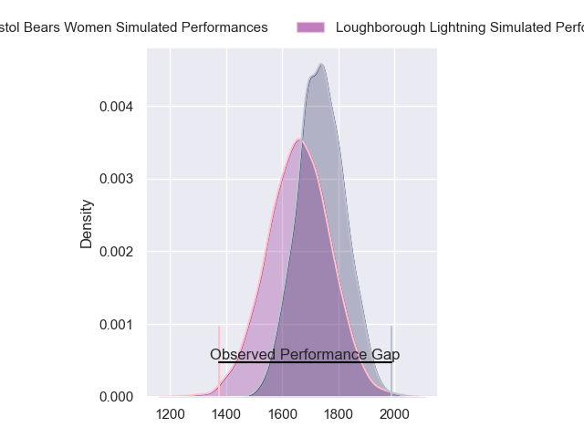
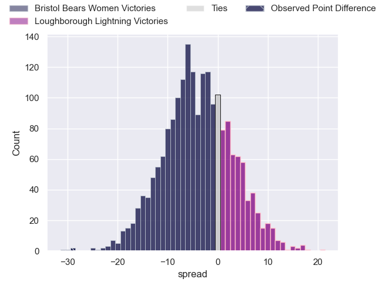
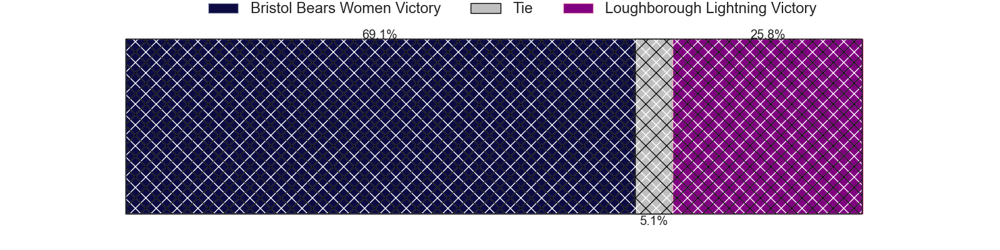

---  
layout: page  
title: Bristol Bears Women at Loughborough Lightning; 46-17  
date: 2023-12-09 18:00:00 -0500  
categories: "Allianz Premier 15s 2023" match review  
---
# Bristol Bears Women at Loughborough Lightning; 46-17

# Club Level Predictions

The first set of predictions treats a club as the smallest object, as the club develops its members, organizes a gameplan, and deploys its players as needed for each match. This club model has a prediction of 0.39, which translates to predicting Bristol Bears Women to win by 4.0.

Each club has a rating and a rating deviation (similar to a Glicko rating), and expected performances can be generated. This allows for simulated matches and spreads like the ones below.
## Projected Performances - Club Model

## Projected Spreads - Club Model

## Projected Results - Club Model

