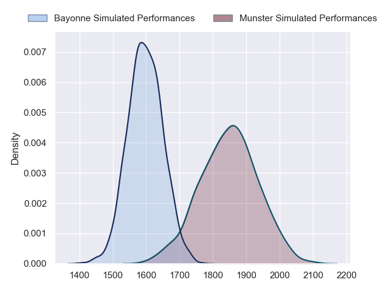
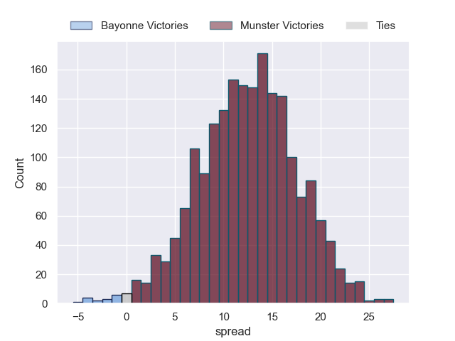
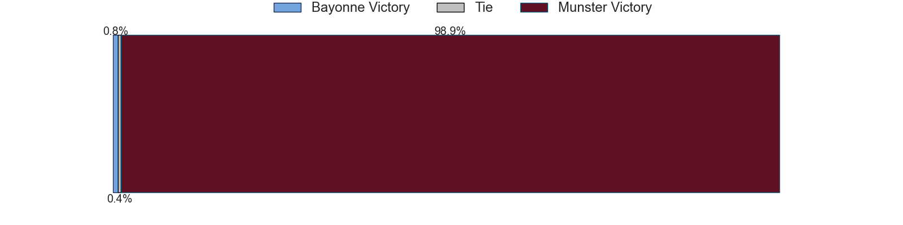
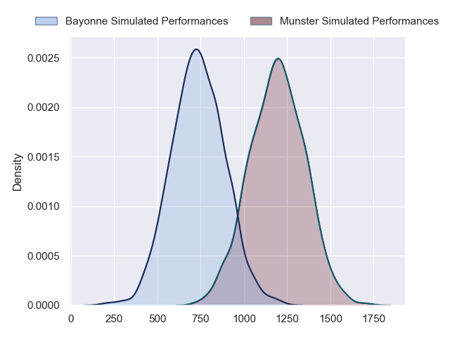
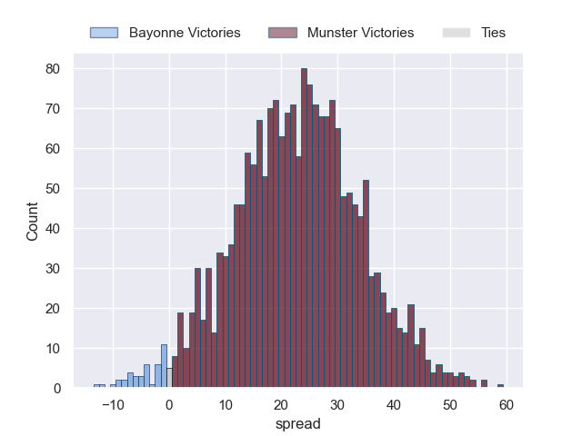
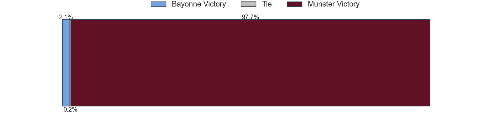
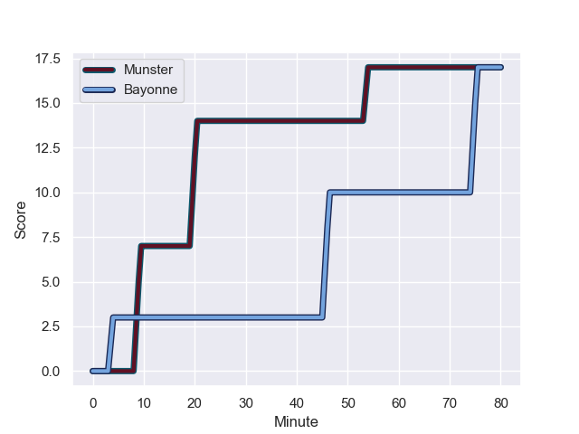
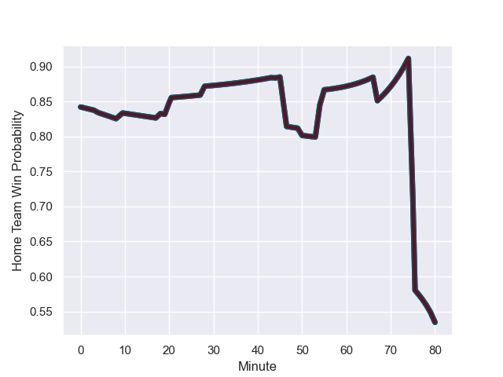

---  
layout: page  
title: Bayonne at Munster; 17-17  
date: 2023-12-09 18:00:00 -0500  
categories: "European Rugby Champions Cup 2023" match review  
---
# Bayonne at Munster; 17-17

# Club Level Predictions

The first set of predictions treats a club as the smallest object, as the club develops its members, organizes a gameplan, and deploys its players as needed for each match. This club model has a prediction of 0.805, which translates to predicting Munster to win by 12.5.

Each club has a rating and a rating deviation (similar to a Glicko rating), and expected performances can be generated. This allows for simulated matches and spreads like the ones below.
## Projected Performances - Club Model

## Projected Spreads - Club Model

## Projected Results - Club Model

# Player Level Predictions - Version 2

Treating teams instead as an entity made up of the currently active players, I have ratings for each player in an altogether different system. These can be combined to form team ratings once teamsheets are announced, weighting starters a bit higher than the reserves. After the match is played, players can be weighted by their minutes on the field, allowing for an accurate measure of the team's composition. With these compiled team ratings, we can make predictions, measure inaccuracy, and update the individual player ratings.
## Prediction with Player Minutes: Munster by 18.4

Munster by 14.1 on a neutral field
## Prediction without Player Minutes: Munster by 18.3

Munster by 14.0 on a neutral pitch

## Projected Performances - Player Model

## Projected Spreads - Player Model

## Projected Results - Player Model

## Scores over Time

## Win Probability over Time

There were 5 large changes in win probability in this match

|   Away Minutes | Away Player           |   Away elo |   Number |   Home elo | Home Player      |   Home Minutes |
|---------------:|:----------------------|-----------:|---------:|-----------:|:-----------------|---------------:|
|             60 | Matis Perchaud        |      38.96 |        1 |      81.39 | Jeremy Loughman  |             60 |
|             67 | Facundo Bosch         |      69.3  |        2 |      47.13 | Scott Buckley    |             72 |
|             44 | Tevita Tatafu         |      42.11 |        3 |      81.7  | John Ryan        |             50 |
|             80 | Denis Marchois        |      98.74 |        4 |      40.66 | Fineen Wycherley |             80 |
|             55 | Konstantin Mikautadze |       2.29 |        5 |     134.21 | Tadhg Beirne     |             80 |
|             80 | Pierre Huguet         |      28.87 |        6 |      58.78 | Thomas Ahern     |             80 |
|             80 | Baptiste Heguy        |      65.86 |        7 |      68.8  | John Hodnett     |             72 |
|             55 | Rodrigo Bruni         |     101.38 |        8 |      73.3  | Gavin Coombes    |             55 |
|             72 | Maxime Machenaud      |      64.38 |        9 |     112.24 | Conor Murray     |             50 |
|             80 | Thomas Dolhagaray     |      32.98 |       10 |      53.77 | Jack Crowley     |             80 |
|             80 | Remy Baget            |      68.23 |       11 |      31.45 | Sean O'Brien     |             18 |
|             57 | Eneriko Buliruarua    |       9.64 |       12 |     103.74 | Rory Scannell    |             67 |
|             28 | Peyo Muscarditz       |      71.8  |       13 |      84.49 | Alex Nankivell   |             80 |
|             80 | Bastien Pourailly     |      10.33 |       14 |      44.42 | Shay McCarthy    |             80 |
|             80 | Cheikh Tiberghien     |      29.73 |       15 |      85.01 | Calvin Nash      |             80 |
|             20 | Swan Cormenier        |      46.68 |       16 |      43.17 | Josh Wycherley   |             20 |
|             13 | Thomas Acquier        |      59.84 |       17 |      73.09 | Eoghan Clarke    |              8 |
|             36 | Luke Tagi             |      47.71 |       18 |     100.78 | Stephen Archer   |             30 |
|             25 | Arthur Iturria        |      84.51 |       19 |      77.39 | Jack O'Donoghue  |              8 |
|             25 | Remi Bourdeau         |      84    |       20 |      56.59 | Alex Kendellen   |             25 |
|              8 | Gela Aprasidze        |      49.59 |       21 |      67.12 | Craig Casey      |             30 |
|             23 | Tom Spring            |      28.02 |       22 |      46.45 | Ben O'Connor     |             62 |
|             52 | Arnaud Erbinartegaray |      39.7  |       23 |      48.21 | Tony Butler      |             13 |

