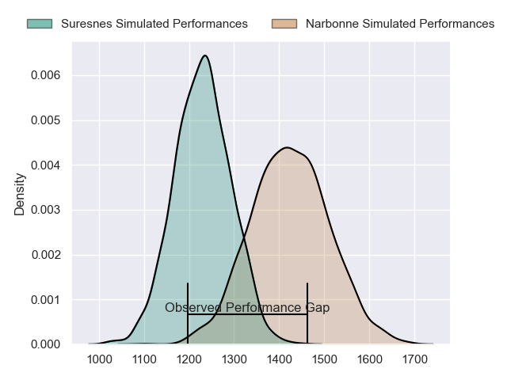
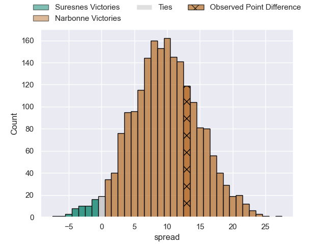
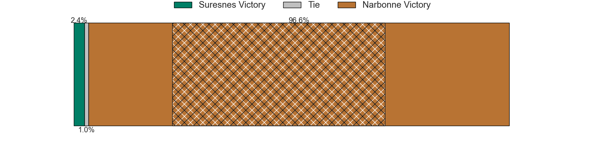
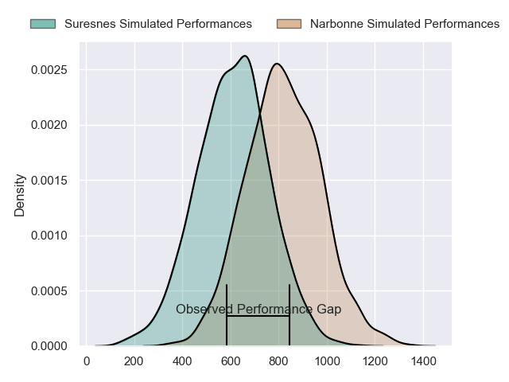
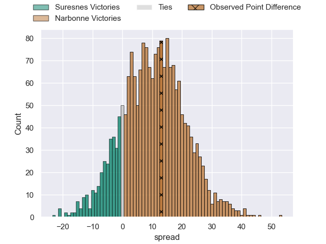
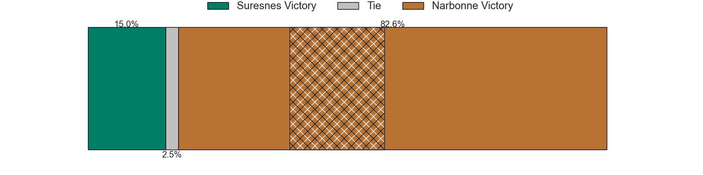
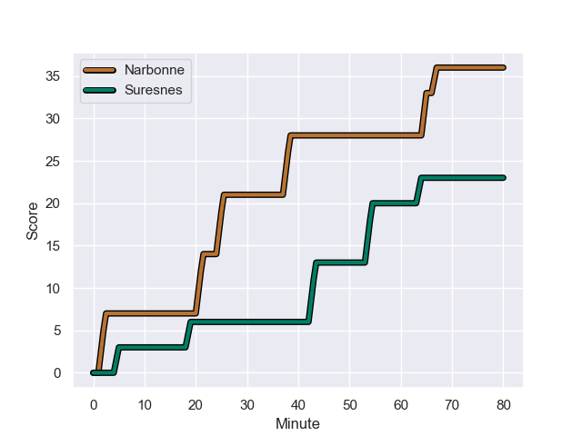
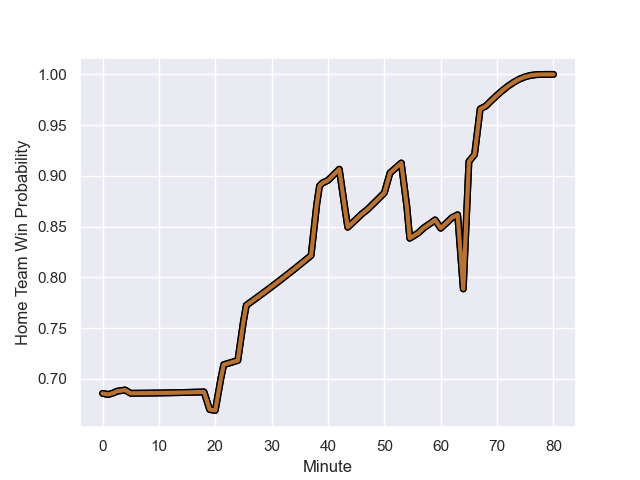

---  
layout: page  
title: Suresnes at Narbonne; 23-36  
date: 2023-12-09 18:00:00 -0500  
categories: "Nationale 2023" match review  
---
# Suresnes at Narbonne; 23-36

# Club Level Predictions

The first set of predictions treats a club as the smallest object, as the club develops its members, organizes a gameplan, and deploys its players as needed for each match. This club model has a prediction of 0.749, which translates to predicting Narbonne to win by 9.7.

Each club has a rating and a rating deviation (similar to a Glicko rating), and expected performances can be generated. This allows for simulated matches and spreads like the ones below.
## Projected Performances - Club Model

## Projected Spreads - Club Model

## Projected Results - Club Model

# Player Level Predictions - Version 2

Treating teams instead as an entity made up of the currently active players, I have ratings for each player in an altogether different system. These can be combined to form team ratings once teamsheets are announced, weighting starters a bit higher than the reserves. After the match is played, players can be weighted by their minutes on the field, allowing for an accurate measure of the team's composition. With these compiled team ratings, we can make predictions, measure inaccuracy, and update the individual player ratings.
## Prediction with Player Minutes: Narbonne by 8.6

Narbonne by 4.0 on a neutral field
## Prediction without Player Minutes: Narbonne by 8.3

Narbonne by 3.6 on a neutral pitch

## Projected Performances - Player Model

## Projected Spreads - Player Model

## Projected Results - Player Model

## Scores over Time

## Win Probability over Time

There were 9 large changes in win probability in this match

|   Away Minutes | Away Player           |   Away elo |   Number |   Home elo | Home Player        |   Home Minutes |
|---------------:|:----------------------|-----------:|---------:|-----------:|:-------------------|---------------:|
|             51 | Elias Coulibaly       |      56.74 |        1 |      31.85 | Sylvain Abadie     |             54 |
|             40 | Anthony Bajart        |      38.68 |        2 |      55.14 | Christophe David   |             47 |
|             51 | Leandro Mario Assi    |      44.02 |        3 |      61.1  | John Roy Jenkinson |             51 |
|             63 | Youssouf Yatera       |      40.07 |        4 |      46.99 | Marius Antonescu   |             80 |
|             60 | Yakine Djebarri       |      30.66 |        5 |      43.37 | Mohamed Kbaier     |             57 |
|             80 | Florian Desbordes     |      36.83 |        6 |      52.51 | Thibault Clauzade  |             51 |
|             80 | Damien Bozic          |      53.09 |        7 |      48.9  | Arthur Christienne |             80 |
|             80 | Louis-Mathieu Jazeix  |      35.56 |        8 |      15.47 | Charles Malet      |             80 |
|             51 | Peïo Etchebest        |      52.63 |        9 |      78.64 | Josh Valentine     |             68 |
|             80 | Tanguy Lacoste        |      54.27 |       10 |       5.43 | Gilles Bosch       |             54 |
|             80 | Alexis Clement        |      25.58 |       11 |      28.59 | Ambrose Curtis     |             80 |
|             80 | Lilan Savioz Fouillet |      43.49 |       12 |     110.43 | Peter Betham       |             80 |
|             80 | Victor Barnier        |      74.81 |       13 |      31.04 | Sébastien Giorgis  |             80 |
|             80 | Ervin Muric           |      14.68 |       14 |      37.5  | Étienne Ducom      |             80 |
|             60 | Goulwen Gueho         |      18.51 |       15 |      53.56 | Paul Auradou       |             68 |
|             29 | Lucas Dycke           |      21.98 |       16 |      49.97 | Théo Castinel      |             26 |
|             40 | Hayam El Bibouji      |      47.21 |       17 |      52.62 | Mehdi Boundjema    |             33 |
|             29 | Guiterembi Vickos     |      40.99 |       18 |      45.72 | Levi Tikoipau      |             29 |
|             17 | Sacha Yahi            |      51.01 |       19 |      47.92 | Morgan Maga        |             23 |
|             20 | Marvin Woki           |      64.29 |       20 |      66.3  | Luke Nakobukobua   |             29 |
|             29 | Thomas Lacroix        |      38.06 |       21 |      47.53 | Pablo Barbaste     |             12 |
|             20 | Thomas Baudy          |      27.21 |       22 |      45.14 | Tom Chauvet        |             26 |
|            nan | nan                   |     nan    |       23 |      49.95 | James Kane         |             12 |

