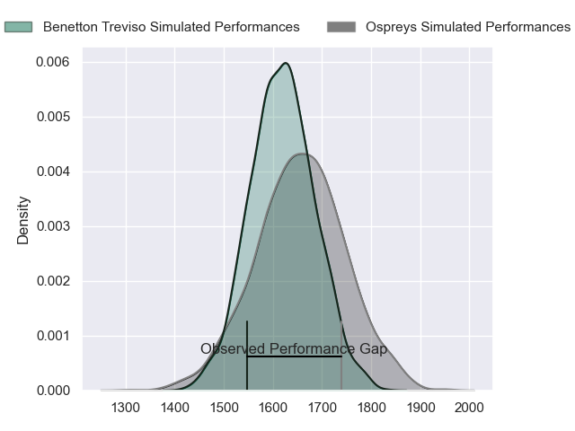
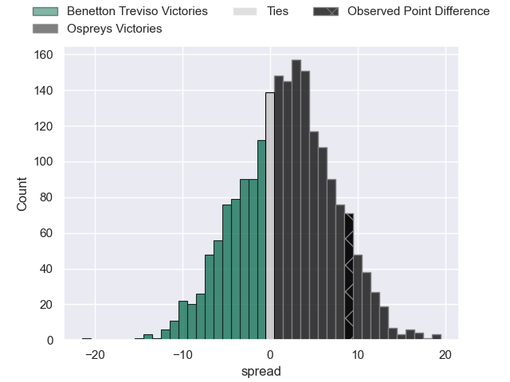
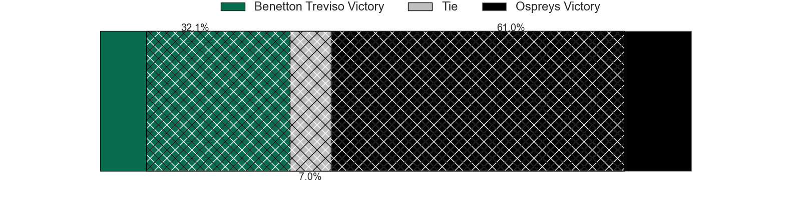
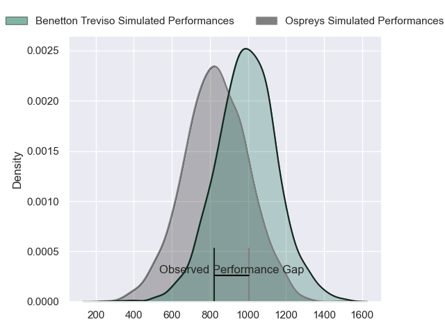
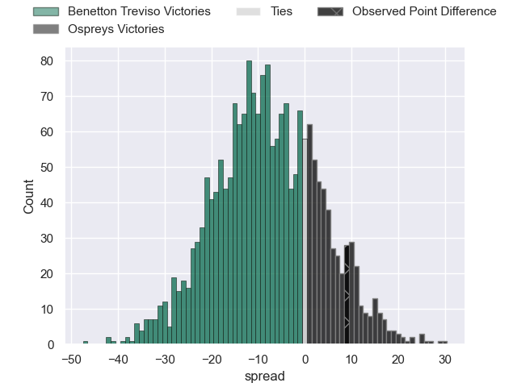
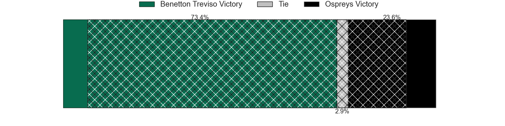
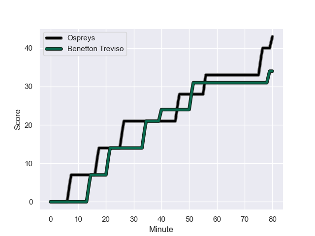
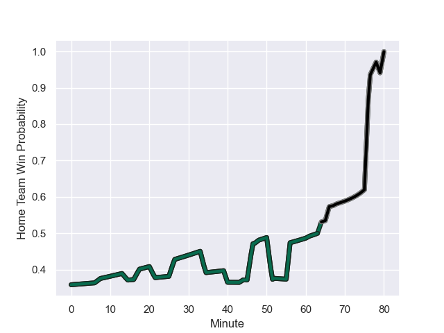

---  
layout: page  
title: Benetton Treviso at Ospreys; 34-43  
date: 2023-12-09 18:00:00 -0500  
categories: "European Rugby Challenge Cup 2023" match review  
---
# Benetton Treviso at Ospreys; 34-43

# Club Level Predictions

The first set of predictions treats a club as the smallest object, as the club develops its members, organizes a gameplan, and deploys its players as needed for each match. This club model has a prediction of 0.544, which translates to predicting Ospreys to win by 1.6.

Each club has a rating and a rating deviation (similar to a Glicko rating), and expected performances can be generated. This allows for simulated matches and spreads like the ones below.
## Projected Performances - Club Model

## Projected Spreads - Club Model

## Projected Results - Club Model

# Player Level Predictions - Version 2

Treating teams instead as an entity made up of the currently active players, I have ratings for each player in an altogether different system. These can be combined to form team ratings once teamsheets are announced, weighting starters a bit higher than the reserves. After the match is played, players can be weighted by their minutes on the field, allowing for an accurate measure of the team's composition. With these compiled team ratings, we can make predictions, measure inaccuracy, and update the individual player ratings.
## Prediction with Player Minutes: Benetton Treviso by 6.4

Benetton Treviso by 10.7 on a neutral field
## Prediction without Player Minutes: Benetton Treviso by 7.3

Benetton Treviso by 11.5 on a neutral pitch

## Projected Performances - Player Model

## Projected Spreads - Player Model

## Projected Results - Player Model

## Scores over Time

## Win Probability over Time

There were 14 large changes in win probability in this match

|   Away Minutes | Away Player         |   Away elo |   Number |   Home elo | Home Player            |   Home Minutes |
|---------------:|:--------------------|-----------:|---------:|-----------:|:-----------------------|---------------:|
|             61 | Thomas Gallo        |      71.45 |        1 |      35.89 | Gareth Thomas          |             64 |
|             44 | Gianmarco Lucchesi  |      58.29 |        2 |      37    | Dewi Lake              |             64 |
|             70 | Giosue Zilocchi     |      53.14 |        3 |      37.95 | Tom Botha              |             64 |
|             48 | Niccolo Cannone     |      38.87 |        4 |      47.24 | James Fender           |             80 |
|             64 | Federico Ruzza      |      97.08 |        5 |      57.18 | Adam Beard             |             80 |
|             80 | Sebastian Negri     |      61.59 |        6 |      59.34 | Rhys Davies            |             80 |
|             80 | Michele Lamaro      |      97.15 |        7 |      74.01 | Jac Morgan             |             80 |
|             52 | Lorenzo Cannone     |      84.82 |        8 |       2.85 | Morgan Morris          |             79 |
|             76 | Andy Uren           |      40.22 |        9 |      36.42 | Reuben Morgan-Williams |             68 |
|             80 | Jacob Umaga         |      77.03 |       10 |      74.87 | Owen Williams          |             80 |
|             80 | Onisi Ratave        |      45.63 |       11 |      -1.4  | Keelan Giles           |             66 |
|             80 | Malakai Fekitoa     |      81.06 |       12 |      86.84 | Owen Watkin            |             80 |
|             80 | Juan Ignacio Brex   |      86.87 |       13 |     110.67 | George North           |             80 |
|             80 | Paolo Odogwu        |      70.6  |       14 |       7.24 | Luke Morgan            |             66 |
|             61 | Edoardo Padovani    |      52.51 |       15 |      36.53 | Iestyn Hopkins         |             80 |
|             19 | Mirco Spagnolo      |      56.54 |       16 |      46.21 | Nicky Smith            |             16 |
|             36 | Bautista Bernasconi |      42.72 |       17 |      45.59 | Sam Parry              |             16 |
|             10 | Filippo Alongi      |      36.79 |       18 |      48.48 | Ben Warren             |             16 |
|             32 | Gideon Koegelenberg |      27.82 |       19 |      44.5  | Luke Davies            |             12 |
|             16 | Riccardo Favretto   |      39.21 |       20 |      72.95 | Matt Protheroe         |             14 |
|             28 | Toa Halafihi        |      77.62 |       21 |      51.84 | Jack Walsh             |             14 |
|              4 | Sam Hidalgo-Clyne   |      85.33 |       22 |      48.39 | Harri Deaves           |              1 |
|             19 | Leonardo Marin      |      61.08 |       23 |     nan    | nan                    |            nan |

