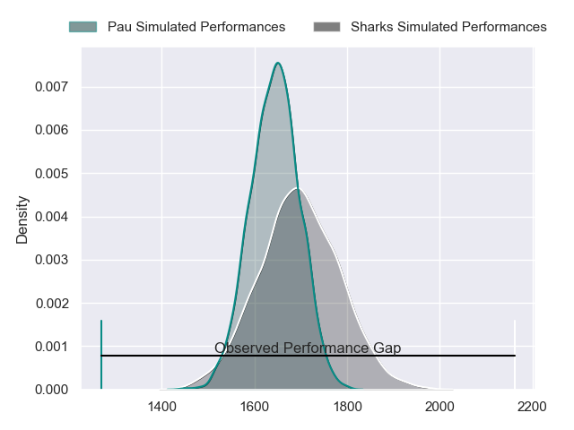
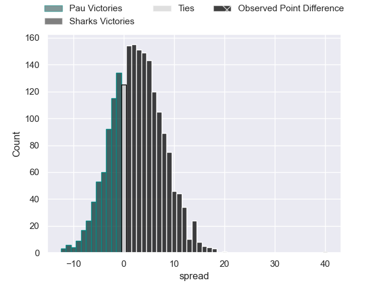
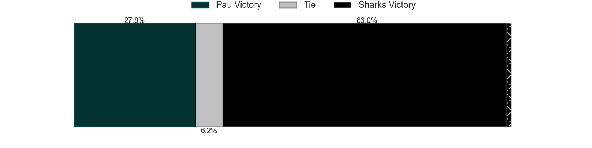
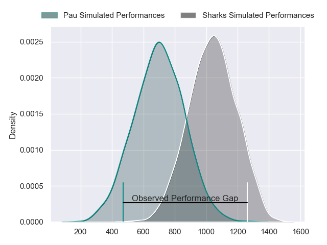
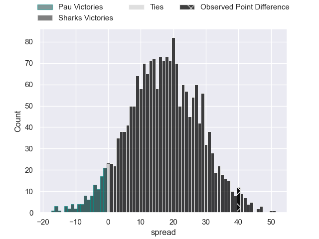
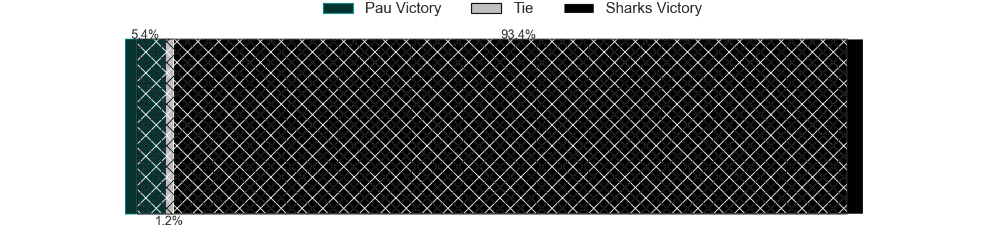
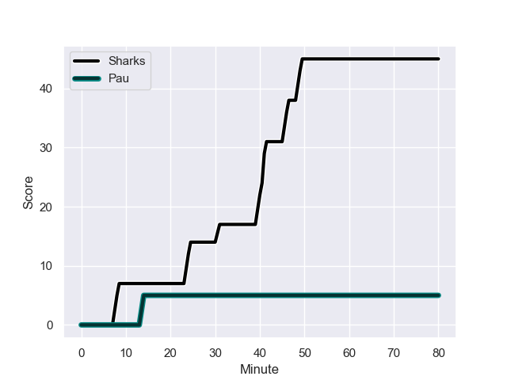
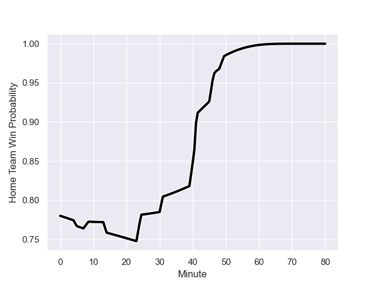

---  
layout: page  
title: Pau at Sharks; 5-45  
date: 2023-12-09 18:00:00 -0500  
categories: "European Rugby Challenge Cup 2023" match review  
---
# Pau at Sharks; 5-45

# Club Level Predictions

The first set of predictions treats a club as the smallest object, as the club develops its members, organizes a gameplan, and deploys its players as needed for each match. This club model has a prediction of 0.579, which translates to predicting Sharks to win by 2.8.

Each club has a rating and a rating deviation (similar to a Glicko rating), and expected performances can be generated. This allows for simulated matches and spreads like the ones below.
## Projected Performances - Club Model

## Projected Spreads - Club Model

## Projected Results - Club Model

# Player Level Predictions - Version 2

Treating teams instead as an entity made up of the currently active players, I have ratings for each player in an altogether different system. These can be combined to form team ratings once teamsheets are announced, weighting starters a bit higher than the reserves. After the match is played, players can be weighted by their minutes on the field, allowing for an accurate measure of the team's composition. With these compiled team ratings, we can make predictions, measure inaccuracy, and update the individual player ratings.
## Prediction with Player Minutes: Sharks by 13.9

Sharks by 10.1 on a neutral field
## Prediction without Player Minutes: Sharks by 15.7

Sharks by 11.9 on a neutral pitch

## Projected Performances - Player Model

## Projected Spreads - Player Model

## Projected Results - Player Model

## Scores over Time

## Win Probability over Time

There were 3 large changes in win probability in this match

|   Away Minutes | Away Player         |   Away elo |   Number |   Home elo | Home Player           |   Home Minutes |
|---------------:|:--------------------|-----------:|---------:|-----------:|:----------------------|---------------:|
|             47 | Paul Tailhades      |      48.01 |        1 |     106.74 | Ox Nche               |             58 |
|             53 | Romain Ruffenach    |      39.2  |        2 |      29.28 | Kerron van Vuuren     |             53 |
|             64 | Nicolas Corato      |      32.43 |        3 |     118.29 | Coenie Oosthuizen     |             49 |
|              5 | Guillaume Ducat     |      35.44 |        4 |     110.98 | Eben Etzebeth         |             49 |
|             80 | Fabrice Metz        |      68.81 |        5 |      27.44 | Corne Rahl            |             80 |
|             64 | Mehdi Tlili         |      40.49 |        6 |      42.35 | James Venter          |             80 |
|             80 | Martin Puech        |      59.93 |        7 |      36.26 | Phepsi Buthelezi      |             47 |
|             80 | Thibault Hamonou    |      29.37 |        8 |      72.92 | Sikhumbuzo Notshe     |             80 |
|             64 | Thibault Daubagna   |      89.19 |        9 |      46.47 | Grant Williams        |             49 |
|             80 | Axel Desperes       |      46.71 |       10 |      62.7  | Curwin Bosch          |             58 |
|             60 | Gregoire Arfeuil    |      46.94 |       11 |     110.01 | Makazole Mapimpi      |             80 |
|             80 | Jale Vatubua        |      -3.92 |       12 |      46.83 | Francois Venter       |             49 |
|             40 | Samuel Ezeala       |      24.4  |       13 |      59.13 | Lukhanyo Am           |             80 |
|             80 | Aminiasi Tuimaba    |      71.54 |       14 |      59.9  | Marnus Potgieter      |             80 |
|             80 | Thomas Carol        |      52.96 |       15 |      69.15 | Aphelele Fassi        |             80 |
|             33 | Facundo Gigena      |      38.01 |       16 |      33.86 | Ntuthuko Mchunu       |             22 |
|             27 | Youri Delhommel     |      39.8  |       17 |      45.65 | Daniel Viljoen Jooste |             27 |
|             16 | Siegfried Fisi'ihoi |      49    |       18 |      44.5  | Hanro Jacobs          |             31 |
|             75 | Brent Liufau        |      46.15 |       19 |      33.26 | Le Roux Roets         |             31 |
|             16 | Josselin Bouhier    |      46.65 |       20 |      42.39 | Jeandre Labuschagne   |             33 |
|             16 | Thomas Souverbie    |      46.65 |       21 |      99.11 | Lionel Cronje         |             22 |
|             40 | Nathan Decron       |      58.91 |       22 |      46.61 | Ethan Hooker          |             31 |
|             20 | Thibault Debaes     |      48.07 |       23 |      69.1  | Jaden Hendrikse       |             31 |

