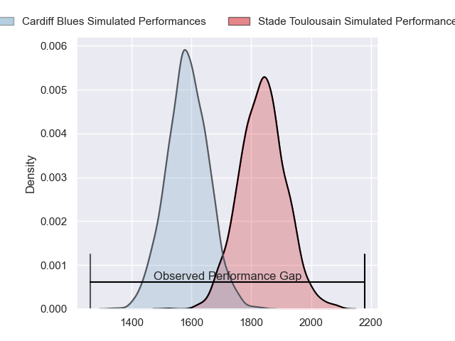
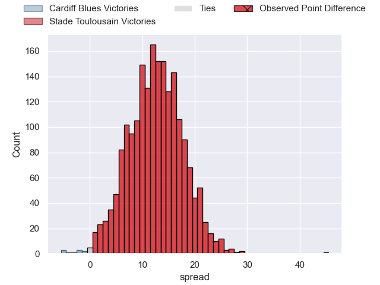
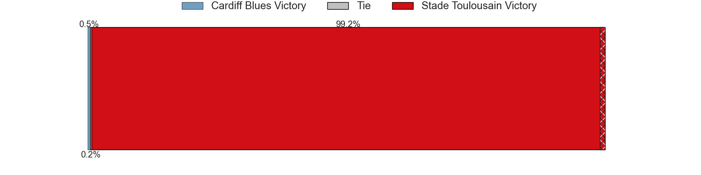
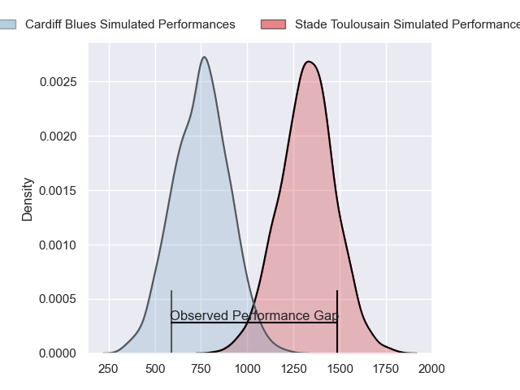
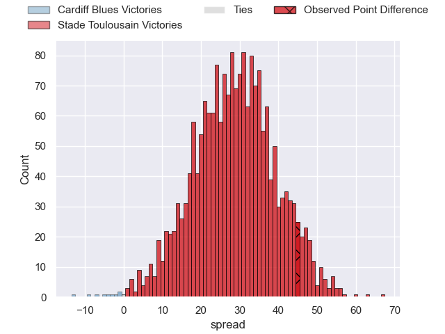
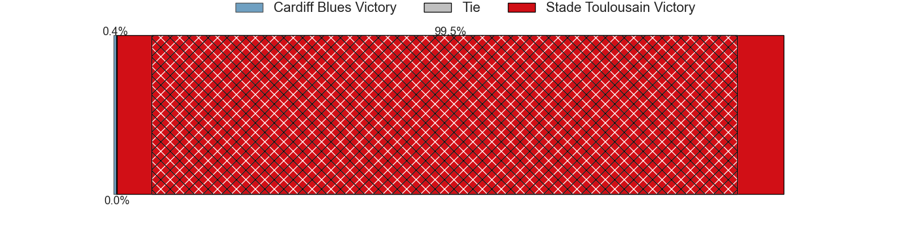
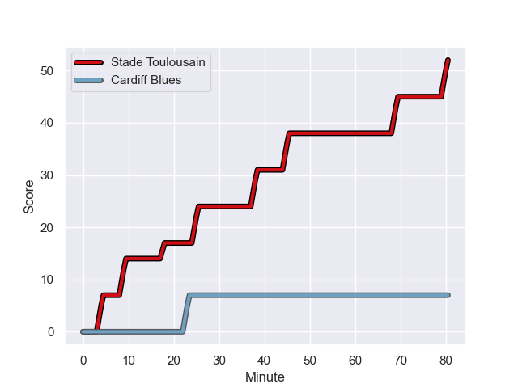
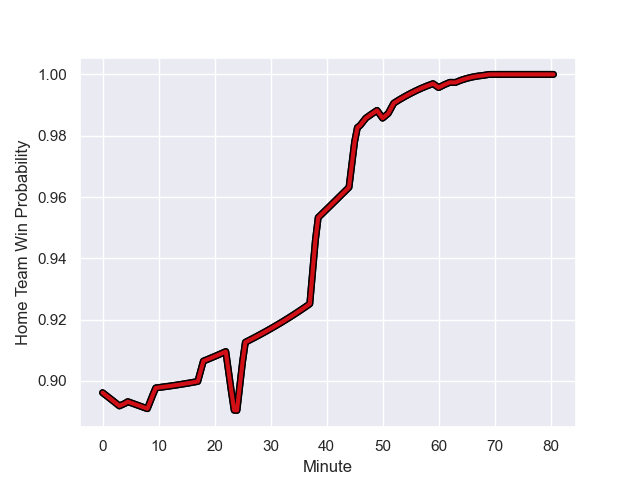

---  
layout: page  
title: Cardiff Blues at Stade Toulousain; 7-52  
date: 2023-12-09 18:00:00 -0500  
categories: "European Rugby Champions Cup 2023" match review  
---
# Cardiff Blues at Stade Toulousain; 7-52

# Club Level Predictions

The first set of predictions treats a club as the smallest object, as the club develops its members, organizes a gameplan, and deploys its players as needed for each match. This club model has a prediction of 0.806, which translates to predicting Stade Toulousain to win by 12.7.

Each club has a rating and a rating deviation (similar to a Glicko rating), and expected performances can be generated. This allows for simulated matches and spreads like the ones below.
## Projected Performances - Club Model

## Projected Spreads - Club Model

## Projected Results - Club Model

# Player Level Predictions - Version 2

Treating teams instead as an entity made up of the currently active players, I have ratings for each player in an altogether different system. These can be combined to form team ratings once teamsheets are announced, weighting starters a bit higher than the reserves. After the match is played, players can be weighted by their minutes on the field, allowing for an accurate measure of the team's composition. With these compiled team ratings, we can make predictions, measure inaccuracy, and update the individual player ratings.
## Prediction with Player Minutes: Stade Toulousain by 23.6

Stade Toulousain by 18.6 on a neutral field
## Prediction without Player Minutes: Stade Toulousain by 23.4

Stade Toulousain by 18.5 on a neutral pitch

## Projected Performances - Player Model

## Projected Spreads - Player Model

## Projected Results - Player Model

## Scores over Time

## Win Probability over Time

|   Away Minutes | Away Player        |   Away elo |   Number |   Home elo | Home Player          |   Home Minutes |
|---------------:|:-------------------|-----------:|---------:|-----------:|:---------------------|---------------:|
|             50 | Rhys Carré         |      30.39 |        1 |      92.96 | Cyril Baille         |             50 |
|             47 | Efan Daniel        |      43.28 |        2 |      88.63 | Peato Mauvaka        |             60 |
|             50 | Keiron Assiratti   |      41.18 |        3 |      62.12 | David Ainu'u         |             47 |
|             80 | Rory Thornton      |      24.01 |        4 |      38.75 | Richie Arnold        |             52 |
|             47 | Teddy Williams     |      48.38 |        5 |      57.65 | Emmanuel Meafou      |             60 |
|             52 | Shane Lewis-Hughes |      18.48 |        6 |      74.52 | Thibaud Flament      |             80 |
|             80 | Lucas De la Rua    |      46.4  |        7 |     102.21 | Anthony Jelonch      |             80 |
|             80 | Mackenzie Martin   |      48.66 |        8 |      85.69 | Alexandre Roumat     |             80 |
|             63 | Tomos Williams     |      72.42 |        9 |     132.71 | Antoine Dupont       |             80 |
|             60 | Tinus de Beer      |      69.46 |       10 |     117.74 | Thomas Ramos         |             63 |
|             80 | Mason Grady        |      72.18 |       11 |      79.38 | Arthur Retiere       |             80 |
|             80 | Ben Thomas         |      52.32 |       12 |      42.42 | Pita Ahki            |             52 |
|             80 | Uilisi Halaholo    |      96.96 |       13 |      58.37 | Pierre-Louis Barassi |             80 |
|             49 | Josh Adams         |      58.95 |       14 |     101.3  | Matthis Lebel        |             60 |
|             80 | Jacob Beetham      |      32    |       15 |     128.11 | Blair Kinghorn       |             80 |
|             30 | Corey Domachowski  |      58.17 |       16 |      39.94 | Rodrigue Neti        |             30 |
|             33 | Evan Lloyd         |      47.1  |       17 |      50.49 | Guillaume Cramont    |             20 |
|             30 | Rhys Litterick     |      43.91 |       18 |      84.74 | Nepo Laulala         |             33 |
|             33 | Josh Turnbull      |      66.77 |       19 |      35.52 | Alban Placines       |             28 |
|             28 | Alun Lawrence      |      65.34 |       20 |      66.14 | Piula Faasalele      |             20 |
|             17 | Ellis Bevan        |      44.53 |       21 |      14.64 | Baptiste Germain     |             17 |
|             20 | Harri Millard      |      31.07 |       22 |      40.51 | Santiago Chocobares  |             28 |
|             31 | Owen Lane          |       5.54 |       23 |      44.65 | Paul Costes          |             20 |

