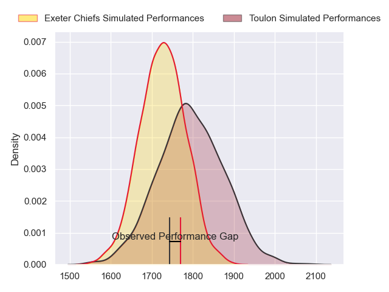
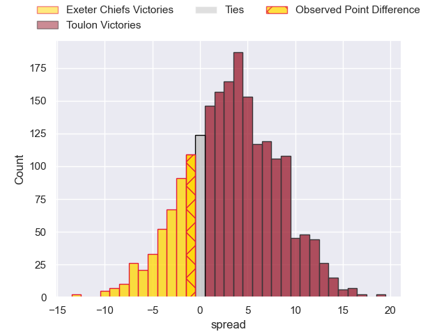
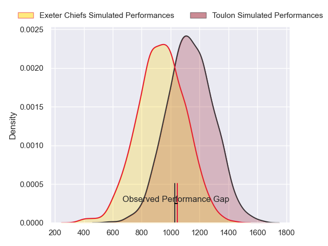
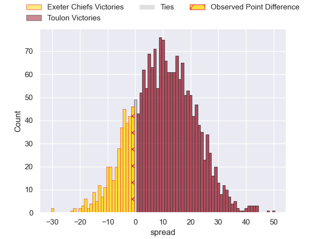
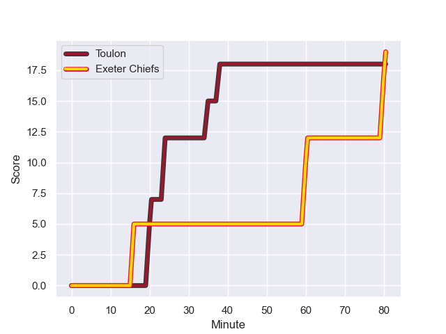
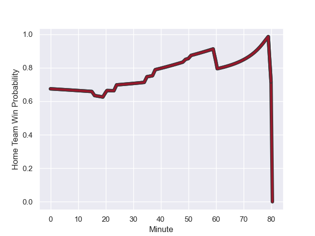

---  
layout: page  
title: Exeter Chiefs at Toulon; 19-18  
date: 2023-12-09 18:00:00 -0500  
categories: "European Rugby Champions Cup 2023" match review  
---
# Exeter Chiefs at Toulon; 19-18

# Club Level Predictions

The first set of predictions treats a club as the smallest object, as the club develops its members, organizes a gameplan, and deploys its players as needed for each match. This club model has a prediction of 0.597, which translates to predicting Toulon to win by 3.5.

Each club has a rating and a rating deviation (similar to a Glicko rating), and expected performances can be generated. This allows for simulated matches and spreads like the ones below.
## Projected Performances - Club Model

## Projected Spreads - Club Model

## Projected Results - Club Model

# Player Level Predictions - Version 2

Treating teams instead as an entity made up of the currently active players, I have ratings for each player in an altogether different system. These can be combined to form team ratings once teamsheets are announced, weighting starters a bit higher than the reserves. After the match is played, players can be weighted by their minutes on the field, allowing for an accurate measure of the team's composition. With these compiled team ratings, we can make predictions, measure inaccuracy, and update the individual player ratings.
## Prediction with Player Minutes: Toulon by 8.0

Toulon by 3.3 on a neutral field
## Prediction without Player Minutes: Toulon by 8.7

Toulon by 3.9 on a neutral pitch

## Projected Performances - Player Model

## Projected Spreads - Player Model

## Projected Results - Player Model

## Scores over Time

## Win Probability over Time

There were 8 large changes in win probability in this match

|   Away Minutes | Away Player          |   Away elo |   Number |   Home elo | Home Player                    |   Home Minutes |
|---------------:|:---------------------|-----------:|---------:|-----------:|:-------------------------------|---------------:|
|             51 | Scott Sio            |      83.66 |        1 |      43.11 | Bruce Devaux                   |             49 |
|             51 | Dan Frost            |      53.12 |        2 |      82.86 | Jack Singleton                 |             49 |
|             51 | Ehren Painter        |      54.71 |        3 |      54.87 | Beka Gigashvili                |             57 |
|             54 | Rusiate Tuima        |      36.37 |        4 |      45.95 | Matthias Halagahu              |             52 |
|             80 | Dafydd Jenkins       |      70.25 |        5 |      69.49 | Brian Alainu'uese              |             80 |
|             80 | Ethan Roots          |      65.12 |        6 |      42.53 | Esteban Abadie                 |             80 |
|             80 | Jacques Vermeulen    |      67.4  |        7 |     113.3  | Charles Ollivon                |             80 |
|             80 | Greg Fisilau         |      60.11 |        8 |      99.06 | Facundo Isa                    |             57 |
|             54 | Tom Cairns           |      59.88 |        9 |      64.98 | Ben White                      |             52 |
|             80 | Harvey Skinner       |      39.84 |       10 |      66.3  | Enzo Herve                     |             80 |
|             80 | Ben Hammersley       |      55.37 |       11 |      76.91 | Gabin Villiere                 |             80 |
|             80 | Joe Hawkins          |      32.66 |       12 |      25.33 | Mathieu Smaili                 |             80 |
|             80 | Henry Slade          |     106.05 |       13 |     125.92 | Waisea Nayacalevu Vuidravuwalu |             80 |
|             10 | Immanuel Feyi-Waboso |      64.87 |       14 |      32.41 | Gaël Dréan                     |             80 |
|             80 | Tom Wyatt            |      80.3  |       15 |      65.48 | Melvyn Jaminet                 |             80 |
|             29 | Nika Abuladze        |      69.19 |       16 |      75.06 | Dany Priso                     |             31 |
|             29 | Max Norey            |      46.2  |       17 |      83.78 | Christopher Tolofua            |             31 |
|             29 | Marcus Street        |      29.98 |       18 |      70.4  | Emerick Setiano                |             23 |
|             26 | Lewis Pearson        |      51.67 |       19 |      75.53 | David Ribbans                  |             28 |
|             26 | Stu Townsend         |      66.53 |       20 |      76.06 | Cornell du Preez               |             23 |
|             70 | Olly Woodburn        |      88.71 |       21 |      94.76 | Baptiste Serin                 |              2 |
|            nan | nan                  |     nan    |       22 |      34.41 | Maëlan Rabut                   |             26 |

