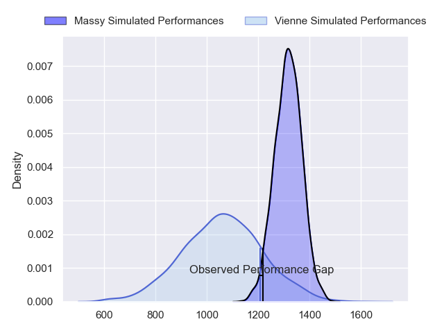
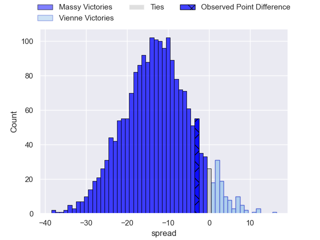
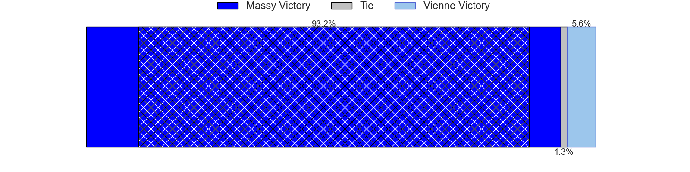
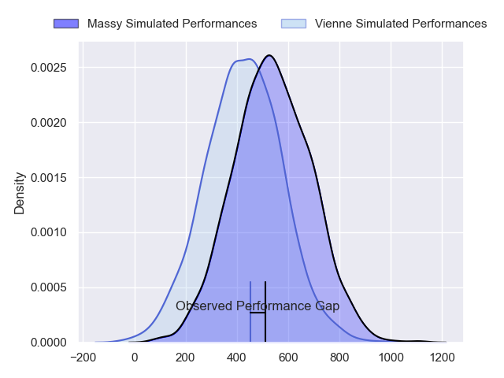
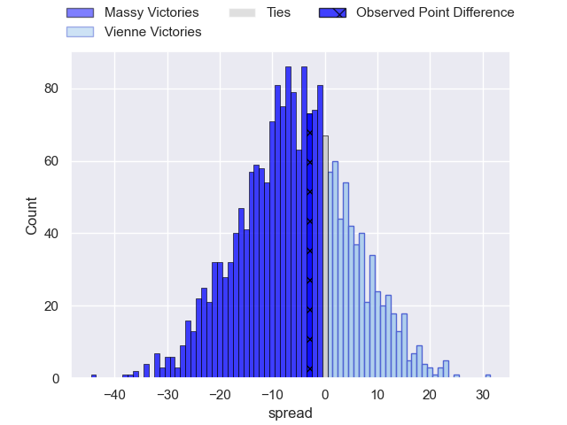
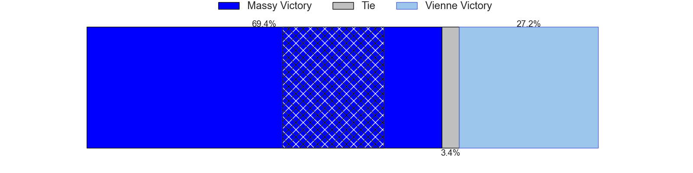
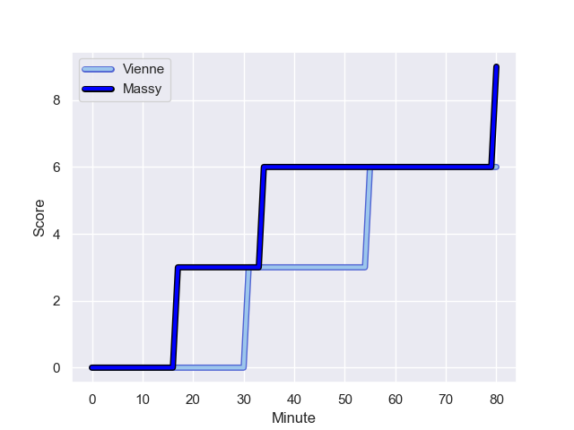
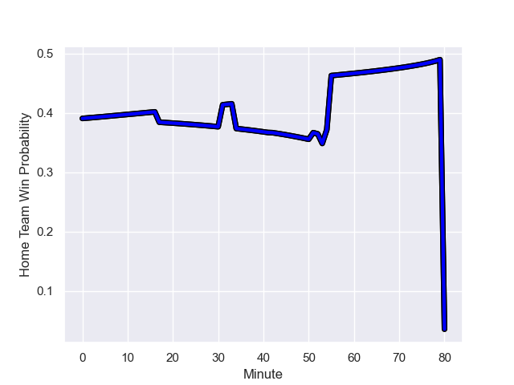

---  
layout: page  
title: Massy at Vienne; 9-6  
date: 2023-12-09 18:00:00 -0500  
categories: "Nationale 2023" match review  
---
# Massy at Vienne; 9-6

# Club Level Predictions

The first set of predictions treats a club as the smallest object, as the club develops its members, organizes a gameplan, and deploys its players as needed for each match. This club model has a prediction of 0.19, which translates to predicting Massy to win by 12.7.

Each club has a rating and a rating deviation (similar to a Glicko rating), and expected performances can be generated. This allows for simulated matches and spreads like the ones below.
## Projected Performances - Club Model

## Projected Spreads - Club Model

## Projected Results - Club Model

# Player Level Predictions - Version 2

Treating teams instead as an entity made up of the currently active players, I have ratings for each player in an altogether different system. These can be combined to form team ratings once teamsheets are announced, weighting starters a bit higher than the reserves. After the match is played, players can be weighted by their minutes on the field, allowing for an accurate measure of the team's composition. With these compiled team ratings, we can make predictions, measure inaccuracy, and update the individual player ratings.
## Prediction with Player Minutes: Massy by 4.9

Massy by 7.9 on a neutral field
## Prediction without Player Minutes: Massy by 4.4

Massy by 7.4 on a neutral pitch

## Projected Performances - Player Model

## Projected Spreads - Player Model

## Projected Results - Player Model

## Scores over Time

## Win Probability over Time

There were 4 large changes in win probability in this match

|   Away Minutes | Away Player              |   Away elo |   Number |   Home elo | Home Player            |   Home Minutes |
|---------------:|:-------------------------|-----------:|---------:|-----------:|:-----------------------|---------------:|
|             54 | Charif Mansour           |      46.65 |        1 |      27.67 | Benjamin Robin         |             42 |
|             64 | Mike Tadjer              |      11.82 |        2 |      44.14 | Yanis Gimenez          |             51 |
|             53 | Tijde Visser             |      44.21 |        3 |      24.44 | Guram Kavtidze         |             53 |
|             80 | Saba Pesvianidze         |      58.75 |        4 |      16.59 | Ciaran O'Flynn         |             64 |
|             56 | Koen Bloemen             |      21.34 |        5 |       2.31 | Geoffrey Nouhaillaguet |             80 |
|             53 | Tony Tissot              |      41.48 |        6 |      24.61 | Léon Peyrat            |             80 |
|             53 | Clément Vidoni           |      44.07 |        7 |      21.17 | Charles Massot         |             70 |
|             80 | Abongile Nonkontwana     |       3.34 |        8 |      42.41 | Théo Minodier          |             80 |
|             56 | Lucas Rubio              |      21.25 |        9 |      13.29 | Malory Piet            |             64 |
|             80 | Hugo Verdu               |      22.37 |       10 |      14.12 | Tom Richard            |             51 |
|             80 | Martin Carre             |      59.54 |       11 |      22.75 | Antoine Grange         |             80 |
|             80 | Victorien Jacomme        |      55.72 |       12 |      22.47 | Matthias Giovale       |             80 |
|             80 | Arthur Seigneuret        |      50.56 |       13 |      13.54 | Pierre Mollard         |             80 |
|             56 | Kimami Sitauti           |     -13.24 |       14 |      33.21 | Martin Arfi            |             80 |
|             80 | Giorgi Gogoladze         |      38.19 |       15 |       9.08 | Brandon Bellavia       |             62 |
|             27 | Pierre Trassoudaine      |      69.88 |       16 |      28.8  | Louan Capuano          |             38 |
|             27 | Alexandre Loubiere       |      54.32 |       17 |      36.95 | Pierre Bourquin        |             29 |
|             27 | Nolan Pienaar            |      50.75 |       18 |      41.71 | Charles Hager          |             29 |
|             26 | Fernandez Correa         |       4.31 |       19 |      -7.92 | Bastien Colliat        |             18 |
|             24 | Benjamin Prier           |      32.98 |       20 |      46.65 | Corentin Durand        |             27 |
|             24 | Lilian Rousset           |      48.34 |       21 |      40.13 | Enzo Ravanello         |             16 |
|             24 | Tom Deleuze              |      36.01 |       22 |      17.31 | Victor Comptat         |             16 |
|             16 | Pierre-Alexandre Duclieu |      45.91 |       23 |      20.9  | Steven Giroud          |             10 |

