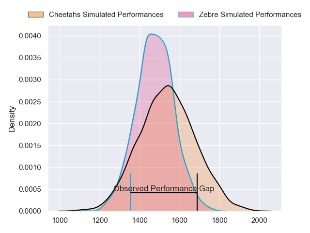
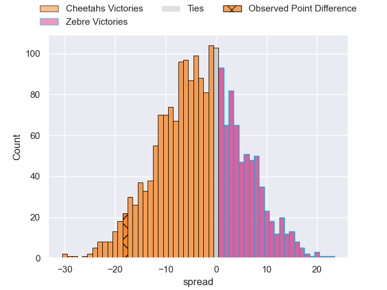
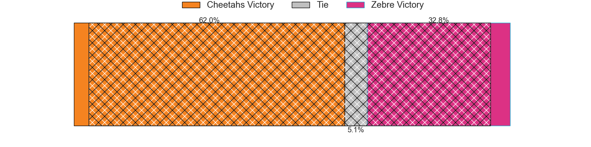
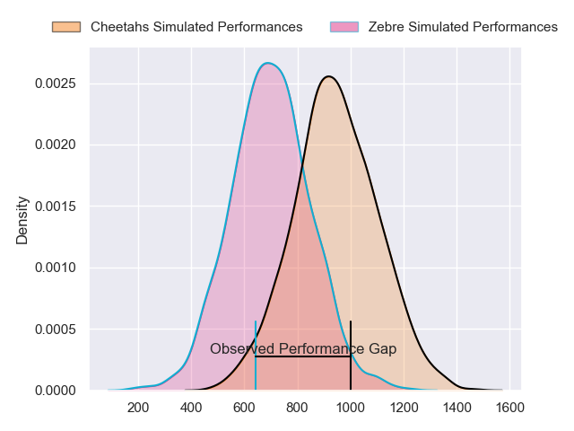
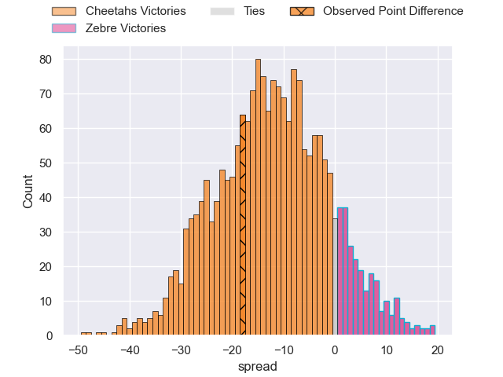
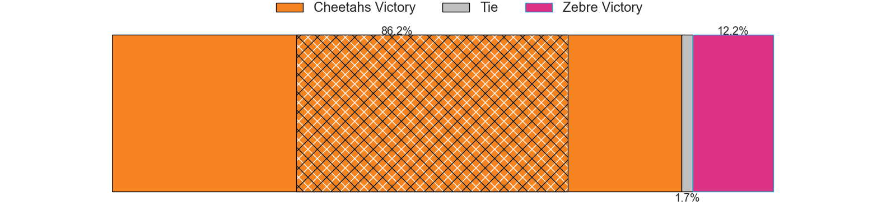
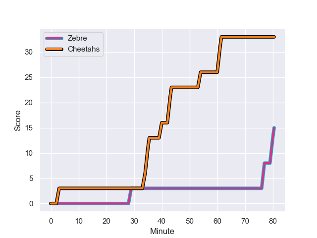
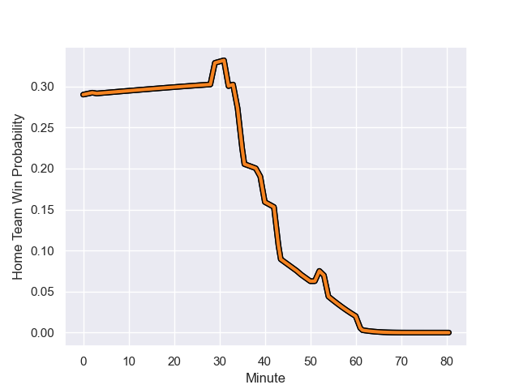

---  
layout: page  
title: Cheetahs at Zebre; 33-15  
date: 2023-12-09 18:00:00 -0500  
categories: "European Rugby Challenge Cup 2023" match review  
---
# Cheetahs at Zebre; 33-15

# Club Level Predictions

The first set of predictions treats a club as the smallest object, as the club develops its members, organizes a gameplan, and deploys its players as needed for each match. This club model has a prediction of 0.426, which translates to predicting Cheetahs to win by 2.8.

Each club has a rating and a rating deviation (similar to a Glicko rating), and expected performances can be generated. This allows for simulated matches and spreads like the ones below.
## Projected Performances - Club Model

## Projected Spreads - Club Model

## Projected Results - Club Model

# Player Level Predictions - Version 2

Treating teams instead as an entity made up of the currently active players, I have ratings for each player in an altogether different system. These can be combined to form team ratings once teamsheets are announced, weighting starters a bit higher than the reserves. After the match is played, players can be weighted by their minutes on the field, allowing for an accurate measure of the team's composition. With these compiled team ratings, we can make predictions, measure inaccuracy, and update the individual player ratings.
## Prediction with Player Minutes: Cheetahs by 9.9

Cheetahs by 13.6 on a neutral field
## Prediction without Player Minutes: Cheetahs by 10.0

Cheetahs by 13.8 on a neutral pitch

## Projected Performances - Player Model

## Projected Spreads - Player Model

## Projected Results - Player Model

## Scores over Time

## Win Probability over Time

There were 7 large changes in win probability in this match

|   Away Minutes | Away Player              |   Away elo |   Number |   Home elo | Home Player            |   Home Minutes |
|---------------:|:-------------------------|-----------:|---------:|-----------:|:-----------------------|---------------:|
|             32 | Schalk Ferreira          |      17.29 |        1 |      47.93 | Danilo Fischetti       |             48 |
|             52 | Marnus van der Merwe     |      69.13 |        2 |      49.77 | Luca Bigi              |             57 |
|             39 | Laurence Herbert Victor  |      37.56 |        3 |      41.64 | Juan Manuel Pitinari   |             54 |
|             80 | Rynier Bernardo          |      64.25 |        4 |      16.66 | Dave Sisi              |             54 |
|             69 | Victor Kutlwano Sekekete |      66.88 |        5 |      36.58 | Andrea Zambonin        |             80 |
|             62 | Gideon van der Merwe     |      80.88 |        6 |      47.85 | Giacomo Ferrari        |             80 |
|             62 | Friedle Olivier          |     105.27 |        7 |      12.85 | Iacopo Bianchi         |             48 |
|             80 | Jeandre Rudolph          |      57.82 |        8 |      43.26 | Giovanni Licata        |             48 |
|             62 | Ruan Pienaar             |     121.11 |        9 |      30.6  | Alessandro Fusco       |             80 |
|             80 | George Lourens           |      46.65 |       10 |      26.11 | Tiff Eden              |             51 |
|             80 | Cohen Jasper             |      65.5  |       11 |      15.06 | Simone Gesi            |             80 |
|             65 | Reinhardt Fortuin        |      81.06 |       12 |      41.97 | Franco Smith           |             62 |
|             80 | Evardi Boshoff           |      14.61 |       13 |      89.89 | Luca Morisi            |             80 |
|             80 | Sibabalwe Xamlashe       |      39.03 |       14 |      19.32 | Jacopo Trulla          |             80 |
|             80 | Tapiwa Lloyd Mafura      |      62.25 |       15 |      73.76 | Geronimo Prisciantelli |             80 |
|             48 | Alulutho Tshakweni       |      70.25 |       16 |      32.36 | Luca Rizzoli           |             32 |
|             28 | Louis van der Westhuizen |      63.67 |       17 |      36.97 | Giampietro Ribaldi     |             23 |
|             11 | Carl Wegner              |      39.52 |       18 |       6.56 | Matteo Nocera          |             26 |
|             18 | Daniel Johannes Maartens |      71.75 |       19 |      52.94 | Guido Volpi            |             26 |
|             18 | Sibabalo Qoma            |      64.31 |       20 |      50.34 | Jake Polledri          |             32 |
|             18 | Rewan Kruger             |      79    |       21 |      55.16 | Taina Fox-Matamua      |             32 |
|             15 | Ali Mgijima              |      44.07 |       22 |      26.67 | Gonzalo Jesus Garcia   |             29 |
|             41 | Hencus van Wyk           |      55.16 |       23 |      60.64 | Fetuli Paea            |             18 |

