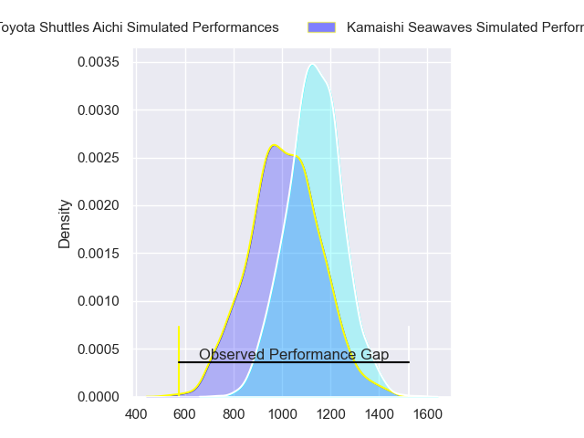
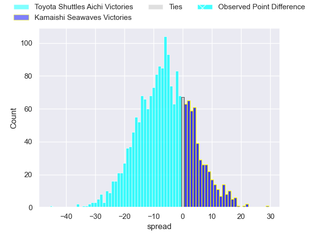
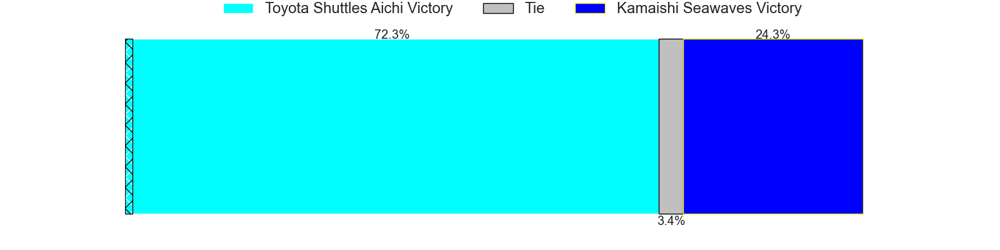
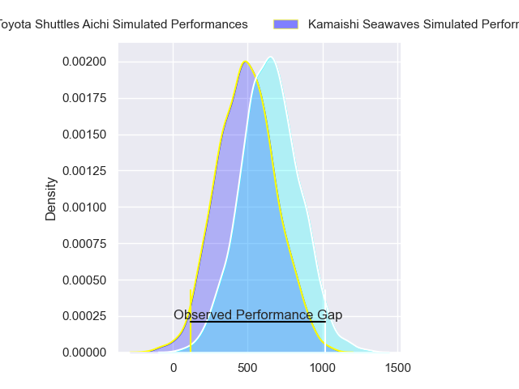
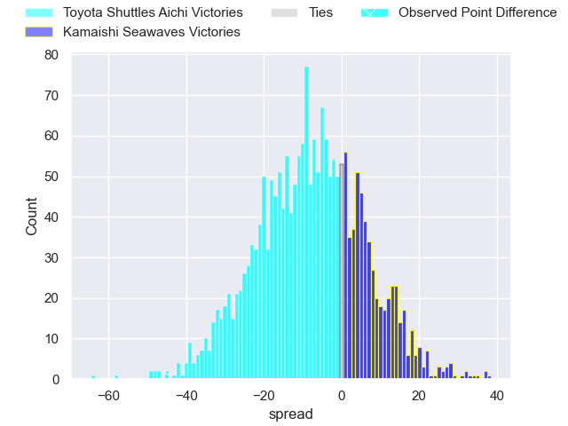
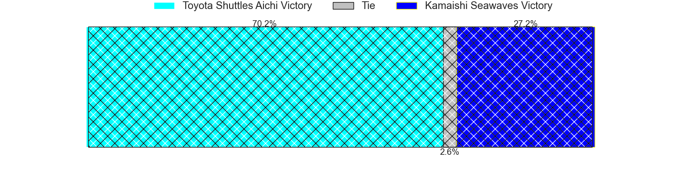

---  
layout: page  
title: Toyota Shuttles Aichi at Kamaishi Seawaves; 52-7  
date: 2023-12-10 18:00:00 -0500  
categories: "Japan Rugby League One D2 2023" match review  
---
# Toyota Shuttles Aichi at Kamaishi Seawaves; 52-7

# Club Level Predictions

The first set of predictions treats a club as the smallest object, as the club develops its members, organizes a gameplan, and deploys its players as needed for each match. This club model has a prediction of 0.341, which translates to predicting Toyota Shuttles Aichi to win by 6.1.

Each club has a rating and a rating deviation (similar to a Glicko rating), and expected performances can be generated. This allows for simulated matches and spreads like the ones below.
## Projected Performances - Club Model

## Projected Spreads - Club Model

## Projected Results - Club Model

# Player Level Predictions - Version 2

Treating teams instead as an entity made up of the currently active players, I have ratings for each player in an altogether different system. These can be combined to form team ratings once teamsheets are announced, weighting starters a bit higher than the reserves. After the match is played, players can be weighted by their minutes on the field, allowing for an accurate measure of the team's composition. With these compiled team ratings, we can make predictions, measure inaccuracy, and update the individual player ratings.
## Prediction with Player Minutes: Toyota Shuttles Aichi by 6.4

Toyota Shuttles Aichi by 9.5 on a neutral field
## Prediction without Player Minutes: Toyota Shuttles Aichi by 6.4

Toyota Shuttles Aichi by 9.5 on a neutral pitch

## Projected Performances - Player Model

## Projected Spreads - Player Model

## Projected Results - Player Model

|   Away Minutes | Away Player          |   Away elo |   Number |   Home elo | Home Player        |   Home Minutes |
|---------------:|:---------------------|-----------:|---------:|-----------:|:-------------------|---------------:|
|             80 | Tomoki Minami        |      47.54 |        1 |      48.22 | Yusuke Yamada      |             80 |
|             80 | Kei Sato             |      52.63 |        2 |      19.44 | Daiki Ito          |             80 |
|             80 | Ryota Fukamura       |      25.46 |        3 |      11.4  | Flyn Yates         |             80 |
|             80 | Seta Naivaluwaga     |      34.23 |        4 |      32.64 | Hamish Dalzell     |             80 |
|             80 | James Gaskell        |      36.31 |        5 |      31.67 | Ben Nee Nee        |             80 |
|             80 | Kavaia Tagivetaua    |      50.19 |        6 |      33.47 | Kohei Ishigaki     |             80 |
|             80 | Talifolofola Tangipa |      41.71 |        7 |      22.92 | Daisuke Musya      |             80 |
|             80 | Taleni Seu           |      66.83 |        8 |      22.27 | Sam Henwood        |             80 |
|             80 | Keita Fujiwara       |      65.02 |        9 |      35.17 | Atsushi Minami     |             80 |
|             80 | Freddie Burns        |      56.26 |       10 |      11.01 | Ryoma Nakamura     |             80 |
|             80 | Go Nakano            |      24.96 |       11 |      67.03 | Jamie Henry        |             80 |
|             80 | James Mollentze      |       6.38 |       12 |      36.47 | Mosese Tonga       |             80 |
|             80 | Hitoshi Matsumoto    |      51.24 |       13 |      10.09 | Osuka Lloyd Murata |             80 |
|             80 | Hiroto Ogasahara     |      46.65 |       14 |      -3.85 | Kodai Ono          |             80 |
|             80 | Takumi Suzuki        |      46.65 |       15 |      43.41 | Ryo Kikkawa        |             80 |

