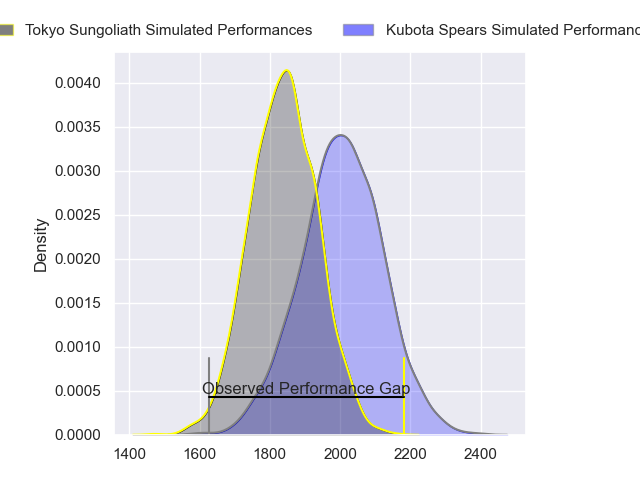
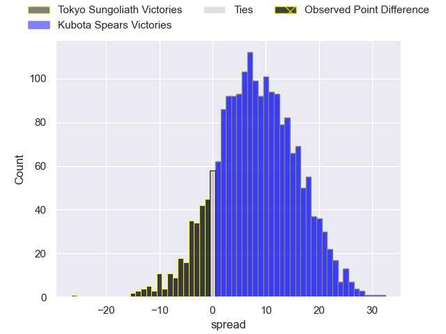
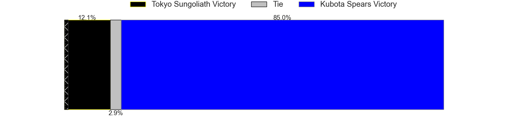
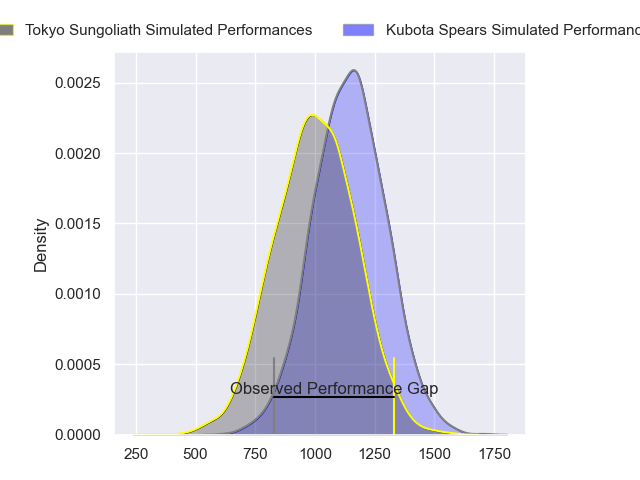
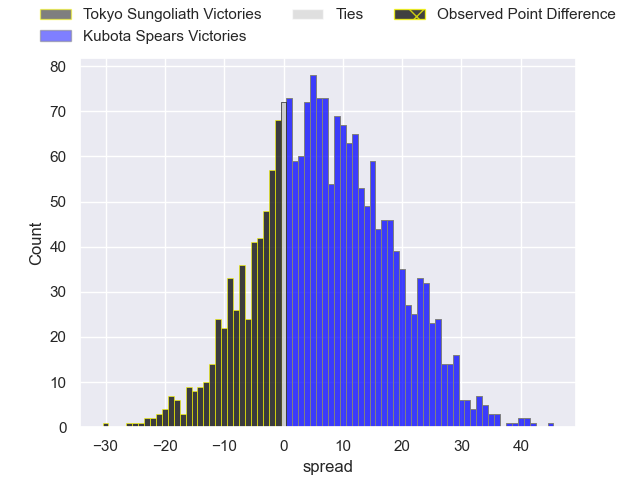
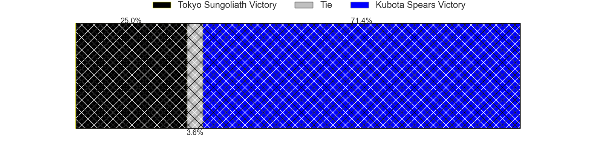
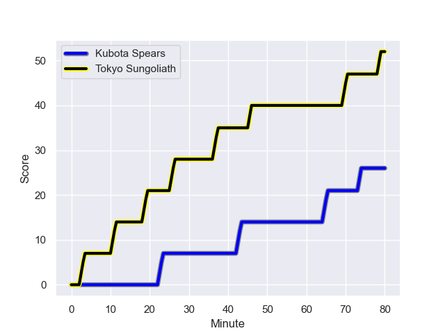
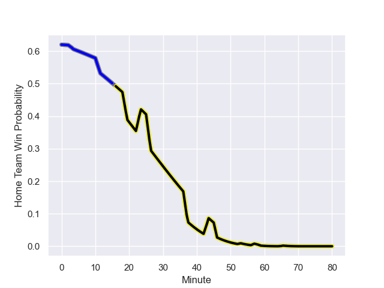

---  
layout: page  
title: Tokyo Sungoliath at Kubota Spears; 52-26  
date: 2023-12-10 18:00:00 -0500  
categories: "Japan Rugby League One 2023" match review  
---
# Tokyo Sungoliath at Kubota Spears; 52-26

# Club Level Predictions

The first set of predictions treats a club as the smallest object, as the club develops its members, organizes a gameplan, and deploys its players as needed for each match. This club model has a prediction of 0.718, which translates to predicting Kubota Spears to win by 8.5.

Each club has a rating and a rating deviation (similar to a Glicko rating), and expected performances can be generated. This allows for simulated matches and spreads like the ones below.
## Projected Performances - Club Model

## Projected Spreads - Club Model

## Projected Results - Club Model

# Player Level Predictions - Version 2

Treating teams instead as an entity made up of the currently active players, I have ratings for each player in an altogether different system. These can be combined to form team ratings once teamsheets are announced, weighting starters a bit higher than the reserves. After the match is played, players can be weighted by their minutes on the field, allowing for an accurate measure of the team's composition. With these compiled team ratings, we can make predictions, measure inaccuracy, and update the individual player ratings.
## Prediction with Player Minutes: Kubota Spears by 5.4

Kubota Spears by 2.4 on a neutral field
## Prediction without Player Minutes: Kubota Spears by 4.8

Kubota Spears by 1.8 on a neutral pitch

## Projected Performances - Player Model

## Projected Spreads - Player Model

## Projected Results - Player Model

## Scores over Time

## Win Probability over Time

There were 9 large changes in win probability in this match

|   Away Minutes | Away Player       |   Away elo |   Number |   Home elo | Home Player            |   Home Minutes |
|---------------:|:------------------|-----------:|---------:|-----------:|:-----------------------|---------------:|
|             80 | Kenta Kobayashi   |      45.19 |        1 |      52.38 | Yota Kaminori          |             53 |
|             70 | Kosuke Horikoshi  |      41.69 |        2 |      59    | Hiraoki Sugimoto       |             53 |
|             55 | Kan Nakano        |      40.23 |        3 |      61.6  | Opeti Helu             |             59 |
|             62 | Sam Jeffries      |      86.42 |        4 |      17.66 | JD Schickerling        |             80 |
|             80 | Harry Hockings    |     103.06 |        5 |      72.67 | David Bulbring         |             53 |
|             80 | Kanji Shimokawa   |      43.47 |        6 |      76.4  | Lappies Labuschagne    |             59 |
|             80 | Kai Yamamoto      |      35.42 |        7 |      69.28 | Takeo Suenaga          |             80 |
|             57 | Sam Cane          |     115.75 |        8 |      89.79 | Faulua Makisi          |             80 |
|             57 | Yutaka Nagare     |      71.45 |        9 |      54.99 | Shinobu Fujiwara       |             59 |
|             80 | Mikiya Takamoto   |      46.65 |       10 |     149.4  | Bernard Foley          |             80 |
|             80 | Kotaro Matsushima |      90.18 |       11 |      76.76 | Haruto Kida            |             80 |
|             70 | Keisuke Moriya    |      85.28 |       12 |      53.9  | Harumichi Tatekawa     |             80 |
|             79 | Taiga Ozaki       |      46.46 |       13 |      52.29 | Rikus Pretorius        |             53 |
|             80 | Seiya Ozaki       |      75.13 |       14 |      76.73 | Koga Nezuka            |             59 |
|             80 | Cheslin Kolbe     |     130.56 |       15 |      98.87 | Gerhard van den Heever |             80 |
|             25 | Kotaro Hosoki     |      46.8  |       16 |      52.73 | Schalk Erasmus         |             27 |
|             23 | Tamati Ioane      |      38.73 |       17 |      74.95 | Kota Kaishi            |             27 |
|             23 | Naoto Saito       |      27.95 |       18 |     123.81 | Ruan Botha             |             27 |
|             18 | Saimoni Vunilagi  |      46.65 |       19 |      54.79 | Sione Teaupa           |             27 |
|             10 | Kienori Go        |      47.36 |       20 |      55.56 | Kengo Kitagawa         |             21 |
|             10 | Isaiah Punivai    |      39.13 |       21 |      42.38 | Yuki Aoki              |             21 |
|              1 | Shota Emi         |      60.22 |       22 |      46.65 | Shunta Koga            |             21 |
|            nan | nan               |     nan    |       23 |      62.85 | Suryung Kim            |             21 |

