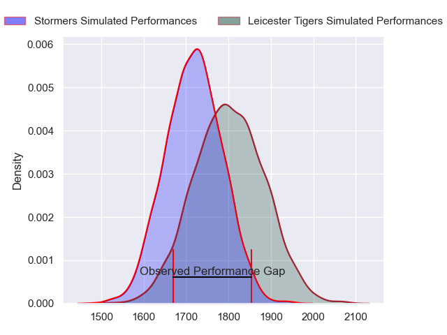
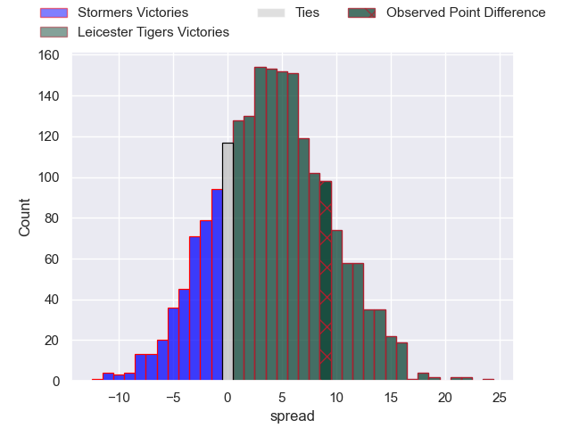
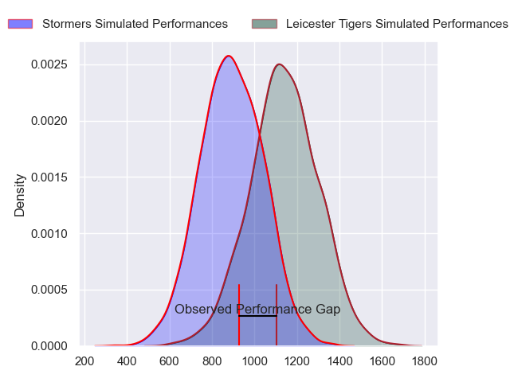
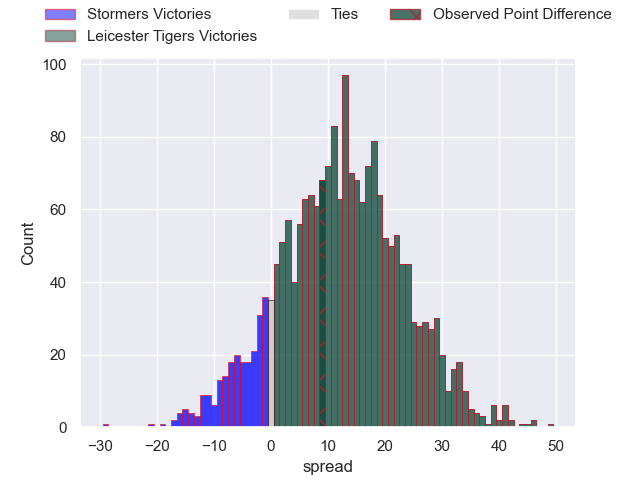
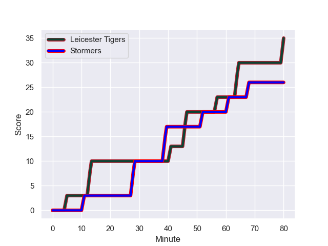
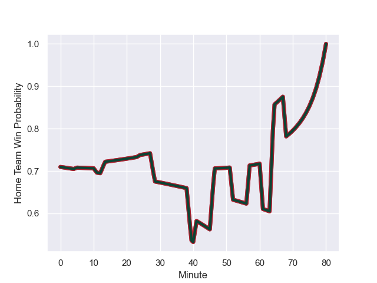

---  
layout: page  
title: Stormers at Leicester Tigers; 26-35  
date: 2023-12-10 18:00:00 -0500  
categories: "European Rugby Champions Cup 2023" match review  
---
# Stormers at Leicester Tigers; 26-35

# Club Level Predictions

The first set of predictions treats a club as the smallest object, as the club develops its members, organizes a gameplan, and deploys its players as needed for each match. This club model has a prediction of 0.618, which translates to predicting Leicester Tigers to win by 4.3.

Each club has a rating and a rating deviation (similar to a Glicko rating), and expected performances can be generated. This allows for simulated matches and spreads like the ones below.
## Projected Performances - Club Model

## Projected Spreads - Club Model

## Projected Results - Club Model

# Player Level Predictions - Version 2

Treating teams instead as an entity made up of the currently active players, I have ratings for each player in an altogether different system. These can be combined to form team ratings once teamsheets are announced, weighting starters a bit higher than the reserves. After the match is played, players can be weighted by their minutes on the field, allowing for an accurate measure of the team's composition. With these compiled team ratings, we can make predictions, measure inaccuracy, and update the individual player ratings.
## Prediction with Player Minutes: Leicester Tigers by 9.8

Leicester Tigers by 4.7 on a neutral field
## Prediction without Player Minutes: Leicester Tigers by 8.2

Leicester Tigers by 3.1 on a neutral pitch

## Projected Performances - Player Model

## Projected Spreads - Player Model

## Projected Results - Player Model

## Scores over Time

## Win Probability over Time

There were 15 large changes in win probability in this match

|   Away Minutes | Away Player                       |   Away elo |   Number |   Home elo | Home Player           |   Home Minutes |
|---------------:|:----------------------------------|-----------:|---------:|-----------:|:----------------------|---------------:|
|             57 | Sti Sithole                       |      50.66 |        1 |      54.92 | Francois van Wyk      |             50 |
|             48 | Scarra Ntubeni                    |      84.2  |        2 |      91.68 | Julian Montoya        |             80 |
|             57 | Brok Harris                       |     122.09 |        3 |      47.84 | Dan Cole              |             50 |
|             69 | Hendre Stassen                    |      32.89 |        4 |      58.66 | Cameron Henderson     |             24 |
|             80 | Connor Evans                      |      41.2  |        5 |      59.08 | Ollie Chessum         |             80 |
|             50 | Nama Xaba                         |      18.42 |        6 |      76.62 | Hanro Liebenberg      |             80 |
|             61 | Willie Engelbrecht                |      55.97 |        7 |      66.27 | Tommy Reffell         |             80 |
|             80 | Keke Morabe                       |      39.01 |        8 |      80.22 | Jasper Wiese          |             65 |
|             57 | Paul de Wet                       |      69.61 |        9 |      68.85 | Ben Youngs            |             71 |
|             80 | Jurie Matthee                     |      49.79 |       10 |     100.14 | Handre Pollard        |             80 |
|             80 | Ben Loader                        |      77.14 |       11 |      67.88 | Ollie Hassell-Collins |             80 |
|             65 | Jean-Luc du Plessis               |      58.06 |       12 |      45.67 | Solomone Kata         |             80 |
|             80 | Suleiman  Hartzenberg             |      55.06 |       13 |      71.31 | Matt Scott            |             34 |
|             80 | Courtnall Skosan                  |      95.89 |       14 |      70.71 | Josh Bassett          |             80 |
|             80 | Clayton Blommetjies               |      87    |       15 |      56.8  | Freddie Steward       |             79 |
|             23 | Kwenzokuhle Ndumiso Blose         |      46.36 |       16 |      72.41 | James Cronin          |             30 |
|             32 | JJ Kotze                          |      42.27 |       17 |      62.43 | Joe Heyes             |             30 |
|             23 | Lee-Marvin Lofty Siyanda Mazibuko |      58.3  |       18 |      63.23 | Harry Wells           |             56 |
|             11 | Dylan Sjoblom                     |      53.61 |       19 |       5.38 | Kyle Hatherell        |             15 |
|             30 | Junior Pokomela                   |      52.71 |       20 |      36.31 | Tom Whiteley          |              9 |
|             19 | Marcel Theunissen                 |      38.79 |       21 |      70.4  | Dan Kelly             |             46 |
|             23 | Stefan Ungerer                    |      32.23 |       22 |      28.58 | James Shillcock       |              1 |
|             15 | Cornel Smit                       |      43.47 |       23 |     nan    | nan                   |            nan |

