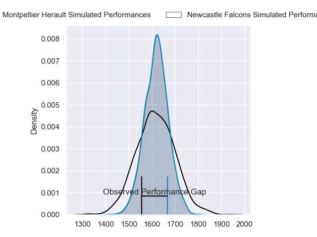
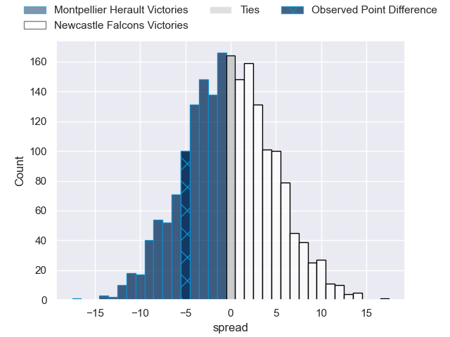
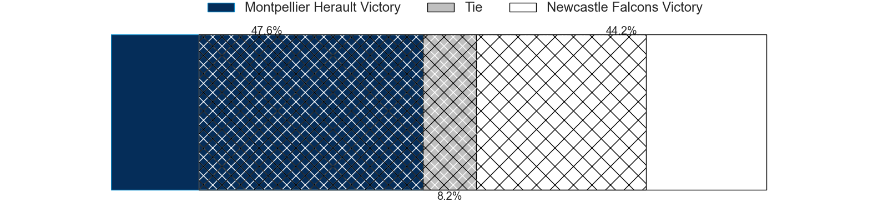
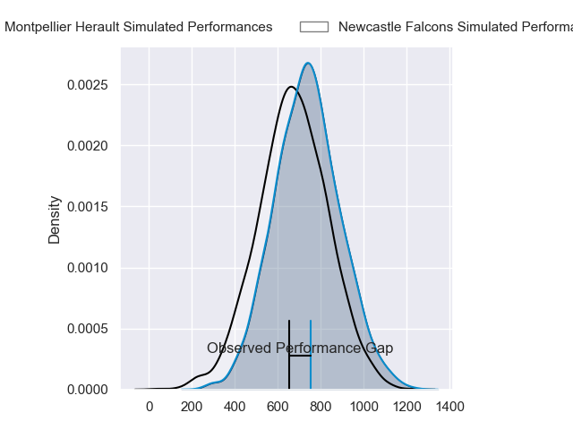
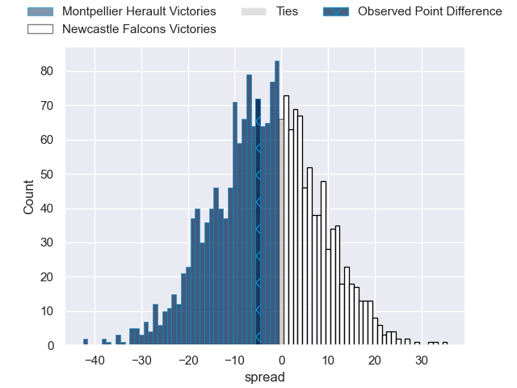
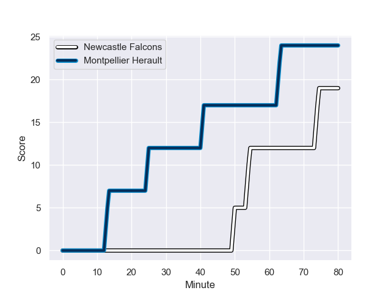
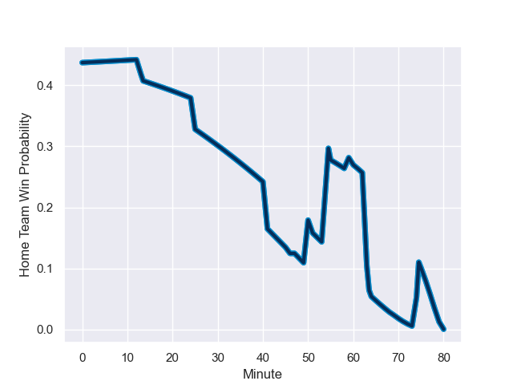

---  
layout: page  
title: Montpellier Herault at Newcastle Falcons; 24-19  
date: 2023-12-10 18:00:00 -0500  
categories: "European Rugby Challenge Cup 2023" match review  
---
# Montpellier Herault at Newcastle Falcons; 24-19

# Club Level Predictions

The first set of predictions treats a club as the smallest object, as the club develops its members, organizes a gameplan, and deploys its players as needed for each match. This club model has a prediction of 0.495, which translates to predicting Montpellier Herault to win by 0.2.

Each club has a rating and a rating deviation (similar to a Glicko rating), and expected performances can be generated. This allows for simulated matches and spreads like the ones below.
## Projected Performances - Club Model

## Projected Spreads - Club Model

## Projected Results - Club Model

# Player Level Predictions - Version 2

Treating teams instead as an entity made up of the currently active players, I have ratings for each player in an altogether different system. These can be combined to form team ratings once teamsheets are announced, weighting starters a bit higher than the reserves. After the match is played, players can be weighted by their minutes on the field, allowing for an accurate measure of the team's composition. With these compiled team ratings, we can make predictions, measure inaccuracy, and update the individual player ratings.
## Prediction with Player Minutes: Montpellier Herault by 2.8

Montpellier Herault by 7.4 on a neutral field
## Prediction without Player Minutes: Montpellier Herault by 2.5

Montpellier Herault by 7.1 on a neutral pitch

## Projected Performances - Player Model

## Projected Spreads - Player Model

## Projected Results - Player Model

## Scores over Time

## Win Probability over Time

There were 9 large changes in win probability in this match

|   Away Minutes | Away Player              |   Away elo |   Number |   Home elo | Home Player         |   Home Minutes |
|---------------:|:-------------------------|-----------:|---------:|-----------:|:--------------------|---------------:|
|             51 | Gregory Fichten          |      27.94 |        1 |      35.64 | Phil Brantingham    |             69 |
|             60 | Vano Karkadze            |      34.11 |        2 |      57.29 | Bryan Byrne         |             55 |
|             64 | Harry Williams           |      87.74 |        3 |      54.15 | Murray McCallum     |             69 |
|             80 | Marco Tauleigne          |      68.6  |        4 |      24.96 | John Hawkins        |             72 |
|             62 | Tyler Duguid             |      33.7  |        5 |      14.53 | Sebastian de Chaves |             80 |
|             51 | Clément Doumenc          |      32.21 |        6 |      40.75 | Freddie Lockwood    |             64 |
|             80 | Alexandre Becognee       |      30.12 |        7 |      39.34 | Sam Cross           |             80 |
|             80 | Sam Simmonds             |      51.69 |        8 |      31.26 | Callum Chick        |             80 |
|             68 | Léo Coly                 |      30.02 |        9 |     -10.92 | James Elliott       |             69 |
|             80 | Louis Carbonel           |      36.8  |       10 |      47.88 | Rory Jennings       |             80 |
|             59 | Ben Lam                  |     104.59 |       11 |      41.94 | Iwan Stephens       |             68 |
|             46 | Auguste Cadot            |      22.58 |       12 |      26.97 | Matias Orlando      |             47 |
|             80 | Thomas Darmon            |      16.64 |       13 |      46.12 | Oliver Spencer      |             80 |
|             80 | George Bridge            |      95.12 |       14 |      65.63 | Adam Radwan         |             80 |
|             80 | Anthony Bouthier         |      56.4  |       15 |      46.84 | Ben Redshaw         |             80 |
|             29 | Karl Tu'inukuafe         |      67.07 |       16 |      14.78 | Adam Brocklebank    |             11 |
|             20 | Adrien Sonzogni          |      45.46 |       17 |      27.25 | Jamie Blamire       |             25 |
|             16 | Lasha Macharashvili      |      42.01 |       18 |      26.67 | Mark Tampin         |             11 |
|             18 | Cantin Foguet            |      46.65 |       19 |      40.52 | Tim Cardall         |              8 |
|             29 | Bastien Chalureau        |      62.36 |       20 |      46.65 | Ollie Leatherbarrow |             16 |
|             12 | Louis Foursans-Bourdette |      37.81 |       21 |      40.99 | Hugh O'Sullivan     |             11 |
|             21 | Masivesi Dakuwaqa        |      59.74 |       22 |      36.02 | Zach Kerr           |             12 |
|             34 | Pierre Lucas             |      28.93 |       23 |      46.16 | Louie Johnson       |             33 |

