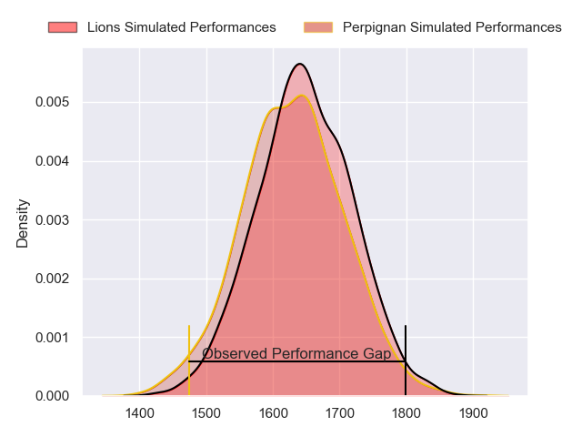
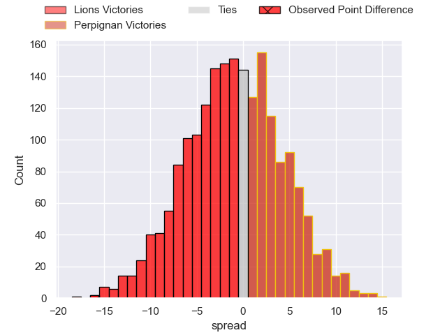
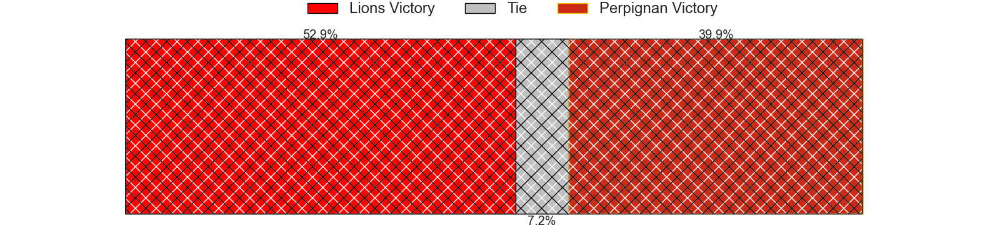
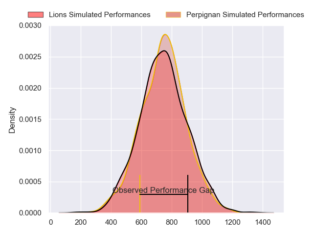
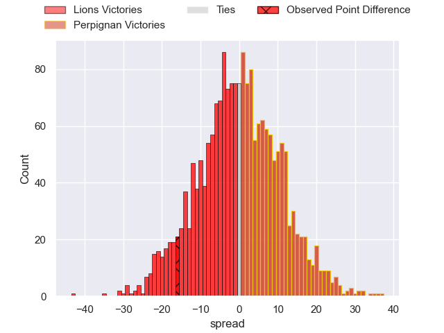
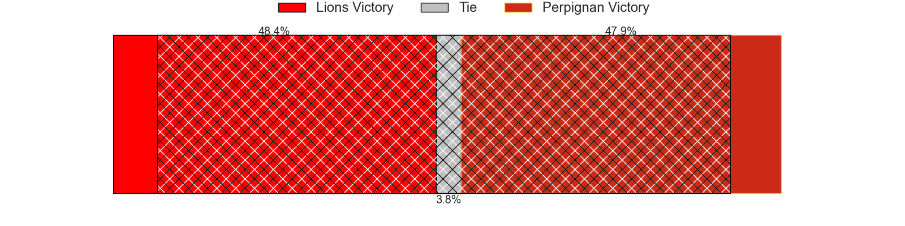
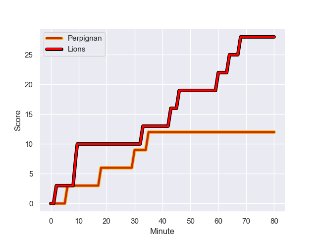
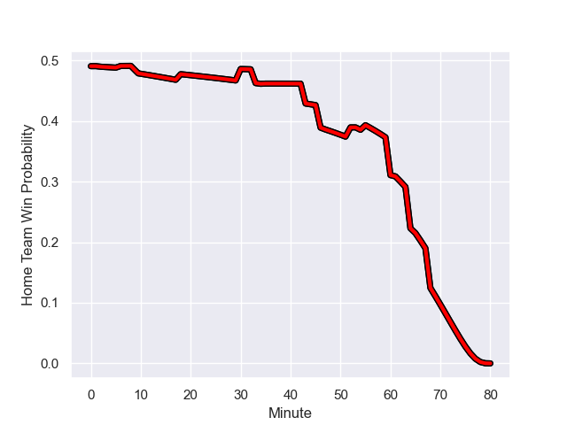

---  
layout: page  
title: Lions at Perpignan; 28-12  
date: 2023-12-10 18:00:00 -0500  
categories: "European Rugby Challenge Cup 2023" match review  
---
# Lions at Perpignan; 28-12

# Club Level Predictions

The first set of predictions treats a club as the smallest object, as the club develops its members, organizes a gameplan, and deploys its players as needed for each match. This club model has a prediction of 0.468, which translates to predicting Lions to win by 1.2.

Each club has a rating and a rating deviation (similar to a Glicko rating), and expected performances can be generated. This allows for simulated matches and spreads like the ones below.
## Projected Performances - Club Model

## Projected Spreads - Club Model

## Projected Results - Club Model

# Player Level Predictions - Version 2

Treating teams instead as an entity made up of the currently active players, I have ratings for each player in an altogether different system. These can be combined to form team ratings once teamsheets are announced, weighting starters a bit higher than the reserves. After the match is played, players can be weighted by their minutes on the field, allowing for an accurate measure of the team's composition. With these compiled team ratings, we can make predictions, measure inaccuracy, and update the individual player ratings.
## Prediction with Player Minutes: Lions by 0.4

Lions by 5.4 on a neutral field
## Prediction without Player Minutes: Lions by 1.3

Lions by 6.3 on a neutral pitch

## Projected Performances - Player Model

## Projected Spreads - Player Model

## Projected Results - Player Model

## Scores over Time

## Win Probability over Time

There were 5 large changes in win probability in this match

|   Away Minutes | Away Player           |   Away elo |   Number |   Home elo | Home Player           |   Home Minutes |
|---------------:|:----------------------|-----------:|---------:|-----------:|:----------------------|---------------:|
|             52 | Corne Fourie          |      82.46 |        1 |      55.16 | Sacha Lotrian         |             47 |
|             65 | Jaco Visagie          |      51.4  |        2 |      29.68 | Victor Montgaillard   |             47 |
|             52 | Ruan Smith            |      62.4  |        3 |      40.88 | Nemo Roelofse         |             64 |
|             53 | Etienne Oosthuizen    |      56.6  |        4 |      44.13 | Tristan Labouteley    |             80 |
|             80 | Raynard Roets         |      48.23 |        5 |      -0.53 | Shahn Eru             |             61 |
|             80 | Johannes JC Pretorius |      60.53 |        6 |      53.51 | Jacobus van Tonder    |             80 |
|             69 | Ruhan Straeuli        |      51.77 |        7 |      54.33 | Alan Brazo            |             80 |
|             80 | Hanru Sirgel          |      86.56 |        8 |      26.63 | Ewan Bertheau         |             55 |
|             65 | Nico Steyn            |      45.49 |        9 |      39.62 | Matteo Rodor          |             65 |
|             80 | Jordan Hendrikse      |      40.6  |       10 |      42.24 | Alexandre Perez       |             52 |
|             80 | Boldwin Hansen        |      17.45 |       11 |      55.9  | Louis Dupichot        |             80 |
|             61 | Zander du Plessis     |      42.79 |       12 |      25.16 | Alivereti Duguivalu   |             80 |
|             80 | Erich Cronje          |       2.13 |       13 |      69.47 | Afusipa Taumoepeau    |             80 |
|             80 | Rabz Maxwane          |      53    |       14 |      54.47 | Lucas Dubois          |             35 |
|             70 | Andries Coetzee       |      64.83 |       15 |      38.25 | Jean Pascal Barraque  |             80 |
|             28 | Morgan Naude          |      43.27 |       16 |      37.11 | Akato Fakatika        |             33 |
|             15 | Morné Brandon         |      38.16 |       17 |      46.51 | Vakhtang Jintcharadze |             33 |
|             28 | Conraad Van Vuuren    |      40.67 |       18 |      35.04 | Xavier Chiocci        |             16 |
|             27 | Izan Esterhuizen      |      45.14 |       19 |      43.15 | Valentin Moro         |             19 |
|             11 | Travis Gordon         |      35.85 |       20 |      63.25 | Lucas Bachelier       |             25 |
|             15 | Johan Mulder          |      60.97 |       21 |     -22.74 | Edward Sawailau       |             15 |
|             19 | Rynardt Jonker        |      64.01 |       22 |      57.98 | Tom Ecochard          |             28 |
|             10 | Gianni Lombard        |      72.26 |       23 |       2.71 | Boris Goutard         |             45 |

