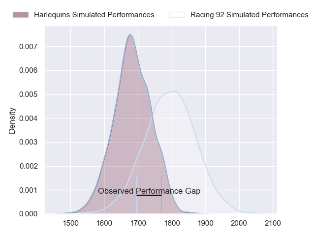
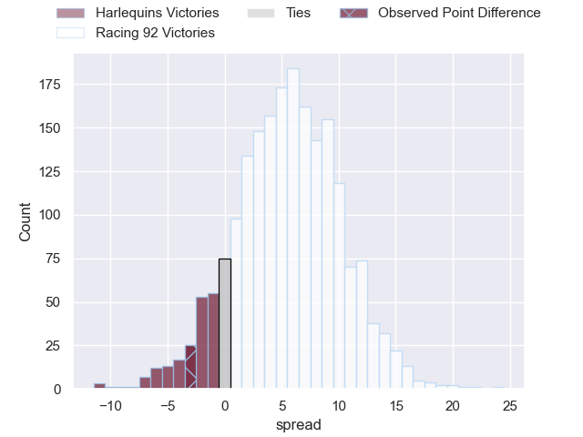
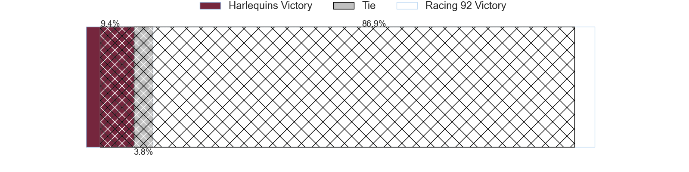
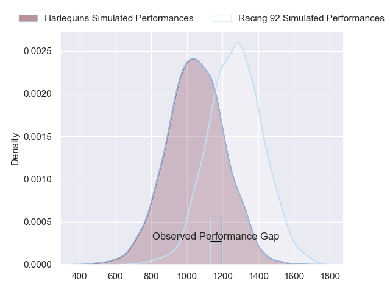
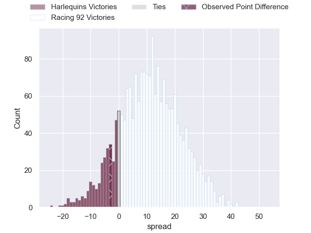
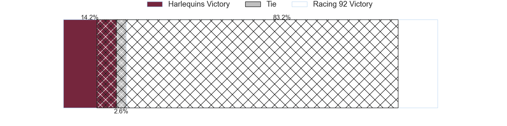
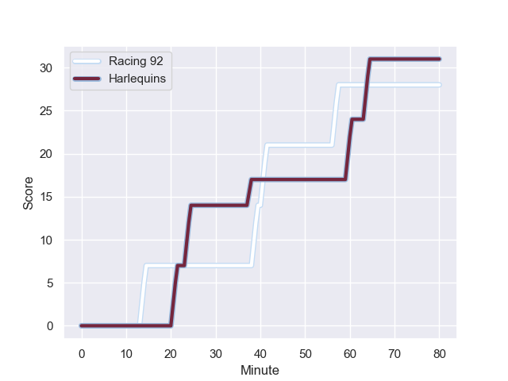
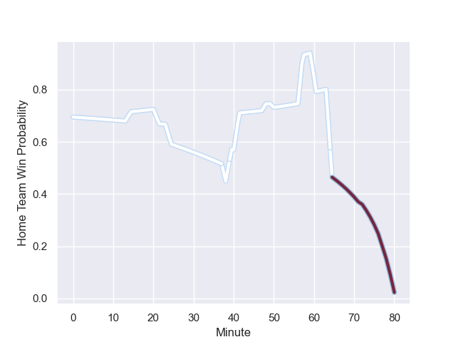

---  
layout: page  
title: Harlequins at Racing 92; 31-28  
date: 2023-12-10 18:00:00 -0500  
categories: "European Rugby Champions Cup 2023" match review  
---
# Harlequins at Racing 92; 31-28

# Club Level Predictions

The first set of predictions treats a club as the smallest object, as the club develops its members, organizes a gameplan, and deploys its players as needed for each match. This club model has a prediction of 0.648, which translates to predicting Racing 92 to win by 5.4.

Each club has a rating and a rating deviation (similar to a Glicko rating), and expected performances can be generated. This allows for simulated matches and spreads like the ones below.
## Projected Performances - Club Model

## Projected Spreads - Club Model

## Projected Results - Club Model

# Player Level Predictions - Version 2

Treating teams instead as an entity made up of the currently active players, I have ratings for each player in an altogether different system. These can be combined to form team ratings once teamsheets are announced, weighting starters a bit higher than the reserves. After the match is played, players can be weighted by their minutes on the field, allowing for an accurate measure of the team's composition. With these compiled team ratings, we can make predictions, measure inaccuracy, and update the individual player ratings.
## Prediction with Player Minutes: Racing 92 by 9.1

Racing 92 by 4.4 on a neutral field
## Prediction without Player Minutes: Racing 92 by 8.4

Racing 92 by 3.7 on a neutral pitch

## Projected Performances - Player Model

## Projected Spreads - Player Model

## Projected Results - Player Model

## Scores over Time

## Win Probability over Time

There were 21 large changes in win probability in this match

|   Away Minutes | Away Player               |   Away elo |   Number |   Home elo | Home Player         |   Home Minutes |
|---------------:|:--------------------------|-----------:|---------:|-----------:|:--------------------|---------------:|
|             57 | Joe Marler                |      98.23 |        1 |      51.85 | Guram Gogichashvili |             58 |
|             48 | Sam Riley                 |      48.52 |        2 |      57.1  | Janick Tarrit       |             59 |
|             80 | Dillon Lewis              |      80.55 |        3 |      64.68 | Thomas Laclayat     |             48 |
|             60 | Joe Launchbury            |     101.74 |        4 |      70.78 | Cameron Woki        |             80 |
|             80 | Dino Lamb                 |      73.96 |        5 |      74.95 | Boris Palu          |             48 |
|             50 | Chandler Cunningham-South |      50.01 |        6 |      38.02 | Ibrahim Diallo      |             80 |
|             80 | Will Evans                |      51.86 |        7 |     113.65 | Siya Kolisi         |             80 |
|             80 | Alex Dombrandt            |      68.18 |        8 |     111.31 | Wenceslas Lauret    |             66 |
|             72 | Danny Care                |     133.74 |        9 |      69.93 | Nolann Le Garrec    |             80 |
|             80 | Marcus Smith              |      72.99 |       10 |      79.02 | Antoine Gibert      |             80 |
|             39 | Cadan Murley              |      38.73 |       11 |     126.29 | Juan Imhoff         |             80 |
|             80 | Andre Esterhuizen         |     102.29 |       12 |      46.24 | Francis Saili       |             58 |
|             80 | Will Joseph               |      57.52 |       13 |     112.12 | Gael Fickou         |             80 |
|             80 | Nick David                |      36.04 |       14 |      54.22 | Vinaya Habosi       |             48 |
|             80 | Tyrone Green              |      62.94 |       15 |      51.77 | Henry Arundell      |             80 |
|             23 | Fin Baxter                |      32.86 |       16 |      56.98 | Trevor Nyakane      |             22 |
|             32 | Jack Walker               |      31.31 |       17 |     100.06 | Eddy Ben Arous      |             21 |
|             20 | Irne Herbst               |      57.77 |       18 |      59.2  | Cedate Gomes Sa     |             32 |
|             30 | James Chisholm            |      75.64 |       19 |      77.79 | Baptiste Chouzenoux |             32 |
|              8 | Will Porter               |      36.48 |       20 |      64.83 | Jordan Joseph       |             14 |
|             38 | Oscar Beard               |      50.73 |       21 |     118.1  | Henry Chavancy      |             22 |
|              3 | Jarrod Evans              |      82.91 |       22 |      74.82 | Tristan Tedder      |             32 |

