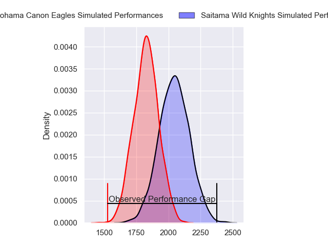
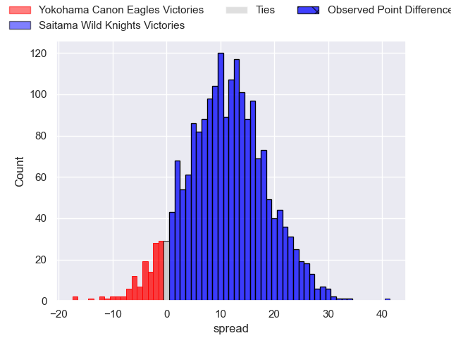
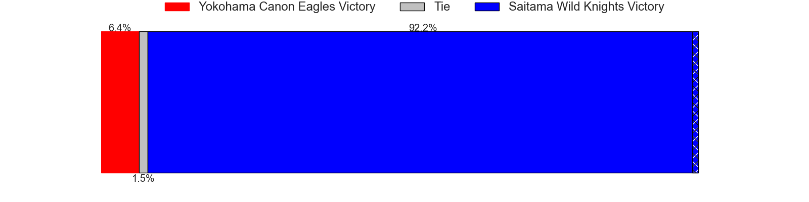
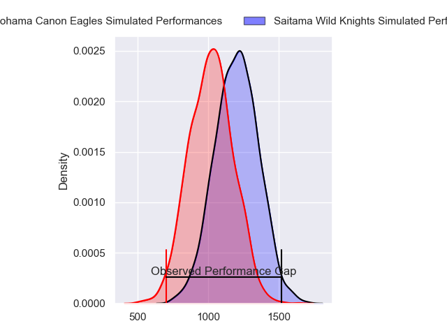
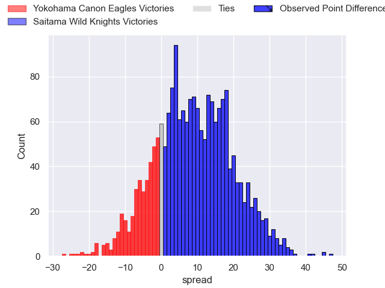
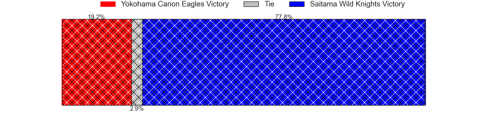
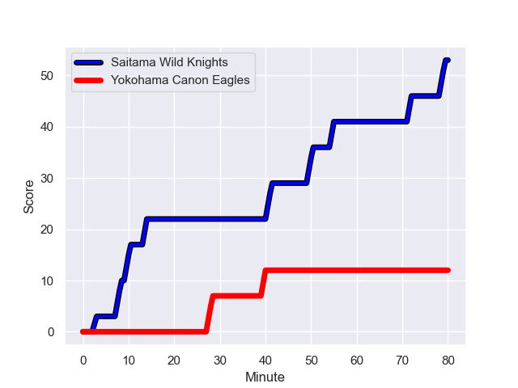
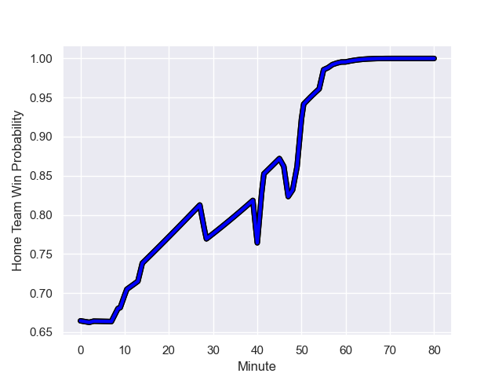

---  
layout: page  
title: Yokohama Canon Eagles at Saitama Wild Knights; 12-53  
date: 2023-12-10 18:00:00 -0500  
categories: "Japan Rugby League One 2023" match review  
---
# Yokohama Canon Eagles at Saitama Wild Knights; 12-53

# Club Level Predictions

The first set of predictions treats a club as the smallest object, as the club develops its members, organizes a gameplan, and deploys its players as needed for each match. This club model has a prediction of 0.774, which translates to predicting Saitama Wild Knights to win by 11.1.

Each club has a rating and a rating deviation (similar to a Glicko rating), and expected performances can be generated. This allows for simulated matches and spreads like the ones below.
## Projected Performances - Club Model

## Projected Spreads - Club Model

## Projected Results - Club Model

# Player Level Predictions - Version 2

Treating teams instead as an entity made up of the currently active players, I have ratings for each player in an altogether different system. These can be combined to form team ratings once teamsheets are announced, weighting starters a bit higher than the reserves. After the match is played, players can be weighted by their minutes on the field, allowing for an accurate measure of the team's composition. With these compiled team ratings, we can make predictions, measure inaccuracy, and update the individual player ratings.
## Prediction with Player Minutes: Saitama Wild Knights by 7.5

Saitama Wild Knights by 4.1 on a neutral field
## Prediction without Player Minutes: Saitama Wild Knights by 8.0

Saitama Wild Knights by 4.6 on a neutral pitch

## Projected Performances - Player Model

## Projected Spreads - Player Model

## Projected Results - Player Model

## Scores over Time

## Win Probability over Time

There were 6 large changes in win probability in this match

|   Away Minutes | Away Player        |   Away elo |   Number |   Home elo | Home Player       |   Home Minutes |
|---------------:|:-------------------|-----------:|---------:|-----------:|:------------------|---------------:|
|             57 | Takato Okabe       |      88.71 |        1 |      83.11 | Keita Inagaki     |             46 |
|             49 | Shunta Nakamura    |      60.65 |        2 |      50.37 | Atsushi Sakate    |             57 |
|             49 | Ryosuke Iwaihara   |      53.22 |        3 |      51.52 | Taiki Fujii       |             46 |
|             47 | Matt Philip        |      43.25 |        4 |      14.17 | Liam Mitchell     |             80 |
|             80 | Liaki Moli         |      18.63 |        5 |      53.98 | Esei Ha'angana    |             57 |
|             80 | Kobus Van Dyk      |      67.19 |        6 |      93.26 | Ben Gunter        |             58 |
|             60 | Naoto Shimada      |      45.02 |        7 |      84.89 | Lachlan Boshier   |             80 |
|             57 | Sione Halasili     |      65.09 |        8 |      73.93 | Jack Cornelsen    |             80 |
|             80 | Faf de Klerk       |     104.49 |        9 |      66.46 | Taiki Koyama      |             67 |
|             77 | Yu Tamura          |      28.33 |       10 |     100.66 | Rikiya Matsuda    |             60 |
|             60 | Chihito Matsui     |      62.37 |       11 |      97.44 | Ryuji Noguchi     |             57 |
|             80 | Yusuke Kajimura    |      94.63 |       12 |      82.75 | Damian de Allende |             80 |
|             80 | Jesse Kriel        |     129.16 |       13 |      91.88 | Dylan Riley       |             80 |
|             80 | Inoke Burua        |      78.01 |       14 |      93.45 | Koki Takeyama     |             80 |
|             80 | Jumpei Ogura       |      97.21 |       15 |      86.48 | Takuya Yamasawa   |             80 |
|             31 | Tatsuro Sugimoto   |      19.58 |       16 |      37.74 | Craig Millar      |             34 |
|             33 | Max Douglas        |      66.37 |       17 |      77.19 | Asaeli Ai Valu    |             34 |
|             31 | Yusuke Niwai       |      35.47 |       18 |      83.17 | Shota Horie       |             23 |
|             23 | Chang Ho Ahn       |      51.24 |       19 |      73.77 | Itsuki Onishi     |             23 |
|             23 | Amanaki Mafi       |      76.65 |       20 |      69.81 | Marika Koroibete  |             23 |
|             20 | Masayoshi Takezawa |      33.69 |       21 |      29.71 | Tomoki Osada      |             20 |
|             20 | Sioeli Vakalahi    |      71.59 |       22 |     105.08 | Ryota Hasegawa    |             22 |
|              3 | Viliame Takayawa   |      89.87 |       23 |     116.06 | Keisuke Uchida    |             13 |

