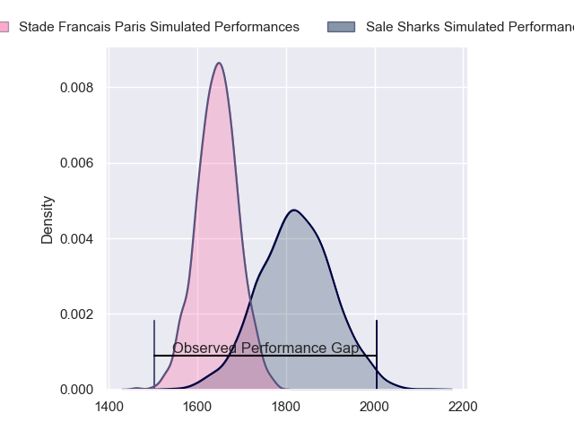
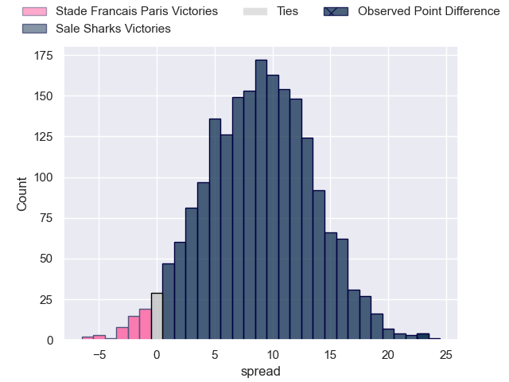
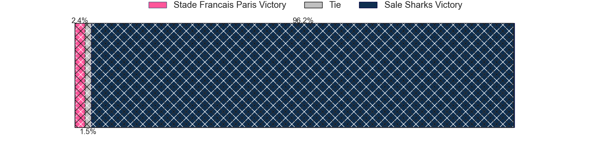
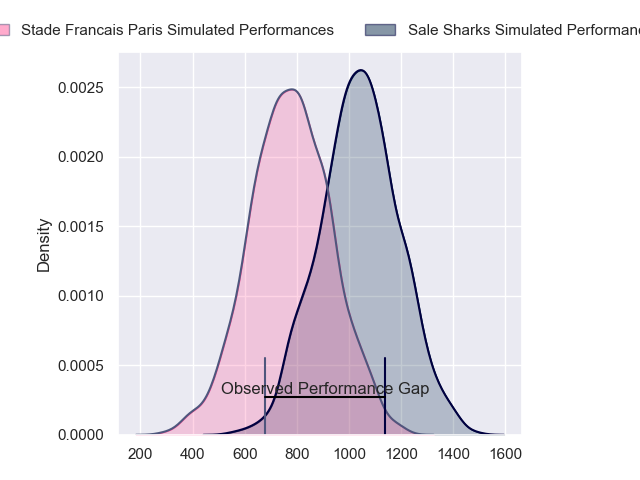
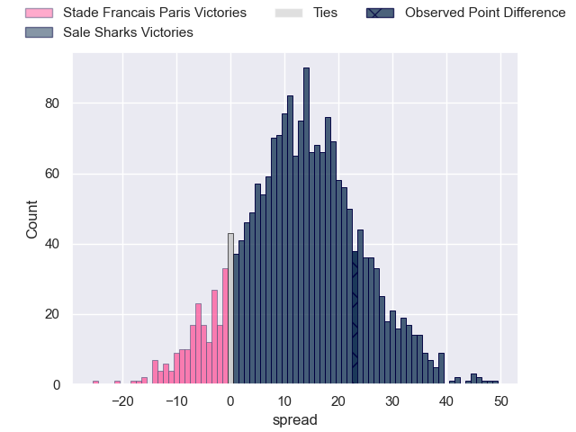
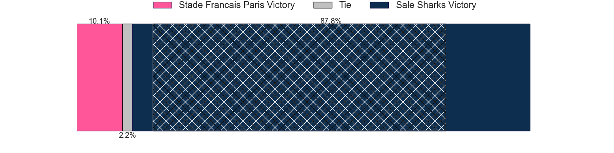
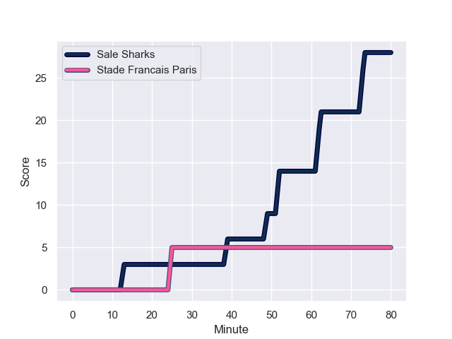
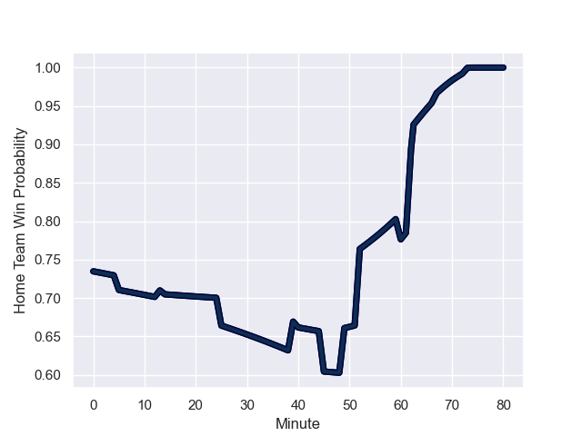

---  
layout: page  
title: Stade Francais Paris at Sale Sharks; 5-28  
date: 2023-12-10 18:00:00 -0500  
categories: "European Rugby Champions Cup 2023" match review  
---
# Stade Francais Paris at Sale Sharks; 5-28

# Club Level Predictions

The first set of predictions treats a club as the smallest object, as the club develops its members, organizes a gameplan, and deploys its players as needed for each match. This club model has a prediction of 0.73, which translates to predicting Sale Sharks to win by 8.7.

Each club has a rating and a rating deviation (similar to a Glicko rating), and expected performances can be generated. This allows for simulated matches and spreads like the ones below.
## Projected Performances - Club Model

## Projected Spreads - Club Model

## Projected Results - Club Model

# Player Level Predictions - Version 2

Treating teams instead as an entity made up of the currently active players, I have ratings for each player in an altogether different system. These can be combined to form team ratings once teamsheets are announced, weighting starters a bit higher than the reserves. After the match is played, players can be weighted by their minutes on the field, allowing for an accurate measure of the team's composition. With these compiled team ratings, we can make predictions, measure inaccuracy, and update the individual player ratings.
## Prediction with Player Minutes: Sale Sharks by 11.2

Sale Sharks by 6.3 on a neutral field
## Prediction without Player Minutes: Sale Sharks by 11.6

Sale Sharks by 6.7 on a neutral pitch

## Projected Performances - Player Model

## Projected Spreads - Player Model

## Projected Results - Player Model

## Scores over Time

## Win Probability over Time

There were 8 large changes in win probability in this match

|   Away Minutes | Away Player            |   Away elo |   Number |   Home elo | Home Player     |   Home Minutes |
|---------------:|:-----------------------|-----------:|---------:|-----------:|:----------------|---------------:|
|             45 | Clement Castets        |      44.8  |        1 |      77    | Simon McIntyre  |             14 |
|             67 | Lucas Peyresblanques   |      41.2  |        2 |      28.55 | Tommy Taylor    |             46 |
|             40 | Paul Alo-Emile         |      73.25 |        3 |      29.6  | Nic Schonert    |             45 |
|             72 | Pierre-Henri Azagoh    |      49.15 |        4 |      47.37 | Ben Bamber      |             60 |
|             52 | JJ van der Mescht      |      74.91 |        5 |      44.19 | Jonny Hill      |             80 |
|             14 | Julien Ory             |      47.67 |        6 |      40.02 | Sam Dugdale     |             80 |
|             80 | Ryan Chapuis           |      15.65 |        7 |      53.09 | Ben Curry       |             80 |
|             80 | Mathieu Hirigoyen      |      31.06 |        8 |      87.32 | Daniel du Preez |              5 |
|             60 | Hugo Zabalza           |      34.63 |        9 |      44.73 | Gus Warr        |             46 |
|             80 | Joris Segonds          |      59.57 |       10 |     103    | George Ford     |             60 |
|             14 | Peniasi Dakuwaqa       |      38.01 |       11 |      76.8  | Tom O'Flaherty  |             80 |
|             80 | Pierre Boudehent       |      54.17 |       12 |     105.61 | Manu Tuilagi    |             80 |
|             80 | Jeremy Ward            |      90.24 |       13 |      91.07 | Sam James       |             67 |
|             80 | Kylan Hamdaoui         |      40.64 |       14 |      57.38 | Tom Roebuck     |             80 |
|             80 | Leo Barre              |      63.79 |       15 |      36.01 | Joe Carpenter   |             80 |
|             35 | Sergo Abramishvili     |      61.85 |       16 |      72.93 | Ross Harrison   |             66 |
|             13 | Mamoudou Meite         |      29.87 |       17 |      96.1  | Agustin Creevy  |             34 |
|             40 | Francisco Gomez Kodela |      84.2  |       18 |      46.9  | Asher Opoku     |             35 |
|              8 | Paul Gabrillagues      |      66.03 |       19 |      73.56 | Cobus Wiese     |             20 |
|             28 | Baptiste Pesenti       |      69.78 |       20 |      62.91 | Josh Beaumont   |             75 |
|             66 | Tanginoa Halaifonua    |      25.02 |       21 |      50.32 | Raffi Quirke    |             34 |
|             20 | Jules Gimbert          |      35.61 |       22 |      66.14 | Tom Curry       |             20 |
|             66 | Lester Etien           |      63.24 |       23 |      54.9  | Connor Doherty  |             13 |

