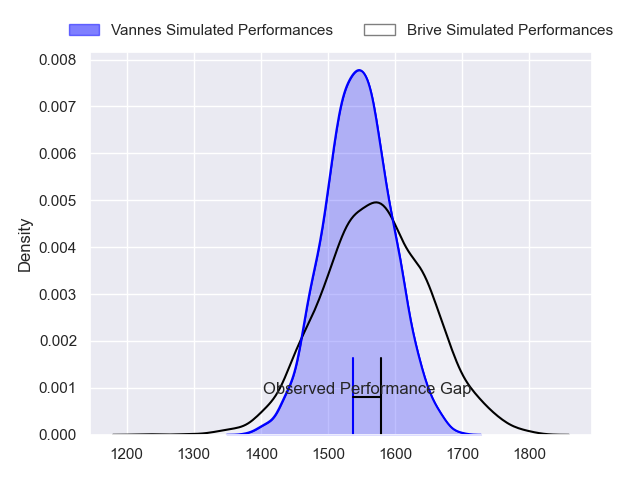
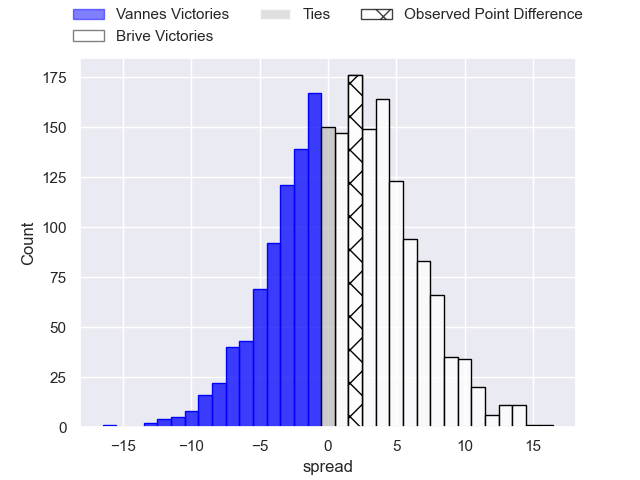
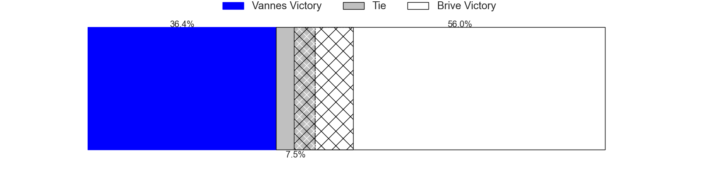
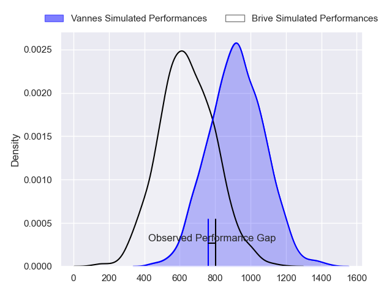
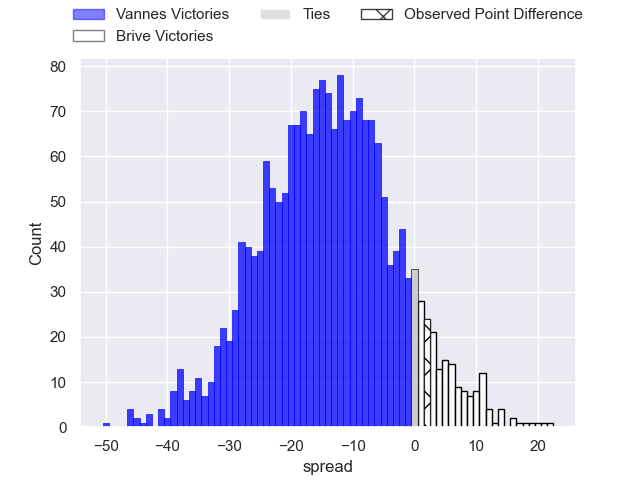
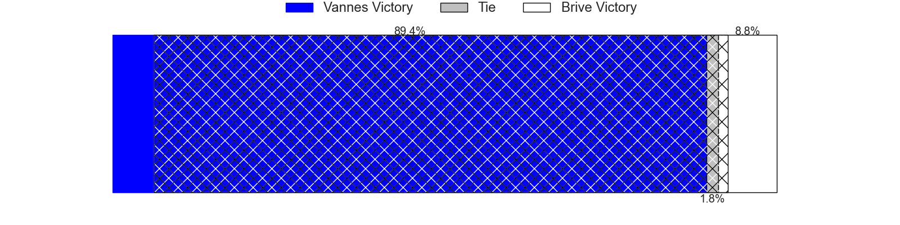
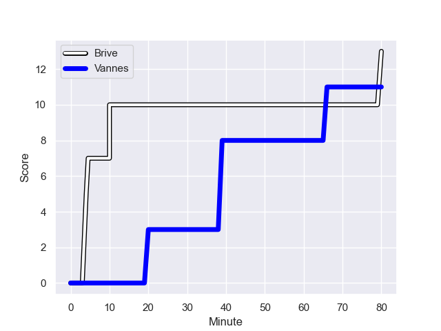
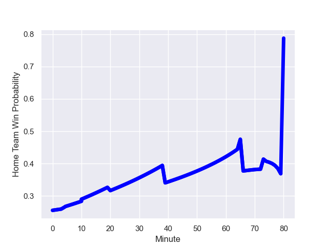

---  
layout: page  
title: Vannes at Brive; 11-13  
date: 2023-12-14 18:00:00 -0500  
categories: "Pro D2 2023" match review  
---
# Vannes at Brive; 11-13

# Club Level Predictions

The first set of predictions treats a club as the smallest object, as the club develops its members, organizes a gameplan, and deploys its players as needed for each match. This club model has a prediction of 0.534, which translates to predicting Brive to win by 1.2.

Each club has a rating and a rating deviation (similar to a Glicko rating), and expected performances can be generated. This allows for simulated matches and spreads like the ones below.
## Projected Performances - Club Model

## Projected Spreads - Club Model

## Projected Results - Club Model

# Player Level Predictions - Version 2

Treating teams instead as an entity made up of the currently active players, I have ratings for each player in an altogether different system. These can be combined to form team ratings once teamsheets are announced, weighting starters a bit higher than the reserves. After the match is played, players can be weighted by their minutes on the field, allowing for an accurate measure of the team's composition. With these compiled team ratings, we can make predictions, measure inaccuracy, and update the individual player ratings.
## Prediction with Player Minutes: Vannes by 11.8

Vannes by 16.6 on a neutral field
## Prediction without Player Minutes: Vannes by 11.5

Vannes by 16.4 on a neutral pitch

## Projected Performances - Player Model

## Projected Spreads - Player Model

## Projected Results - Player Model

## Scores over Time

## Win Probability over Time

There were 5 large changes in win probability in this match

|   Away Minutes | Away Player         |   Away elo |   Number |   Home elo | Home Player               |   Home Minutes |
|---------------:|:--------------------|-----------:|---------:|-----------:|:--------------------------|---------------:|
|             66 | Andy Bordelai       |      66.34 |        1 |      45.96 | Hugo Reilhes              |             53 |
|             53 | Pat Leafa           |      73.81 |        2 |      25.69 | Lucas da Silva            |             53 |
|             53 | Paga Tafili         |      73.52 |        3 |      23    | Marcel van der Merwe      |             53 |
|             53 | Hamish Bain         |      57.62 |        4 |      33.71 | Renger Van Eerten         |             53 |
|             66 | Anton Bresler       |      59.15 |        5 |      36.35 | Tevita Ratuva             |             79 |
|             65 | Léon Boulier        |      46.26 |        6 |      23.14 | Sasha Gue                 |             80 |
|             80 | Francisco Gorrissen |     116.04 |        7 |      74.56 | Ross Moriarty             |             10 |
|             80 | Sione Kalamafoni    |      52.79 |        8 |      41.26 | Taniela Sadrugu           |             45 |
|             63 | Michael Ruru        |      89.2  |        9 |       2.37 | Leo Carbonneau            |             80 |
|             74 | Massimo Ortolan     |      24.39 |       10 |      22.78 | Tom Raffy                 |             80 |
|             80 | Romaric Camou       |      50.08 |       11 |      24.99 | Mathis Ferté              |             80 |
|             80 | Andres Vilaseca     |      17.81 |       12 |      31.91 | Guillaume Galletier       |             80 |
|             80 | Sacha Valleau       |      77    |       13 |      23.02 | Sammy Arnold              |             73 |
|             80 | Martin Alonso Munoz |      38.8  |       14 |      37.99 | Arthur Bonneval           |             80 |
|             80 | Gwenaël Duplenne    |     122.02 |       15 |      60.45 | Stuart Olding             |             80 |
|             27 | Phil Kite           |      69.16 |       16 |      77.3  | Said Hireche              |             70 |
|             27 | Eric Marks          |      17.34 |       17 |      41.75 | Rahboni Warren-Vosayaco   |             35 |
|             27 | Théo Beziat         |      49.2  |       18 |      43.27 | Nathan Fraissenon         |             27 |
|             17 | Jules Le Bail       |      49.94 |       19 |      52.65 | Issam Hamel               |             27 |
|             15 | Gregoire Bazin      |      42.09 |       20 |      30.8  | Francisco Coria Marchetti |             27 |
|             14 | Mattéo Desjeux      |      42.01 |       21 |      36.99 | Retief Marais             |             27 |
|             14 | Ximun Bessonart     |      36.43 |       22 |      38.11 | Vasil Lobzhanidze         |              7 |
|              6 | Jean Cotarmanac'h   |      45.44 |       23 |      46.65 | Teun Karst                |              1 |

