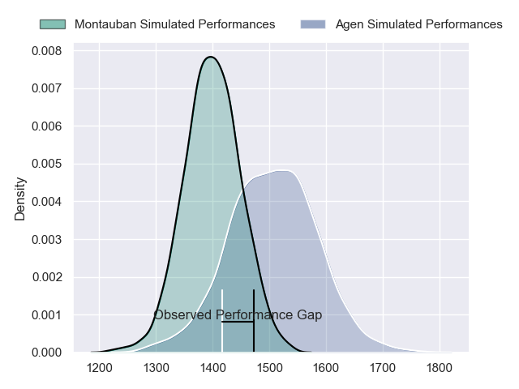
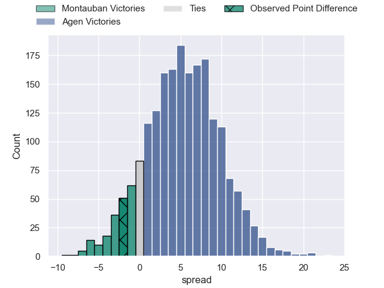
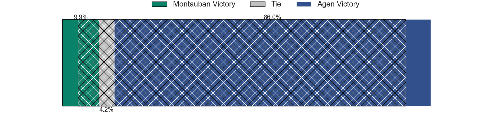
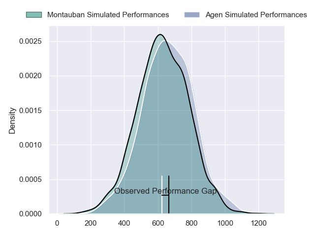
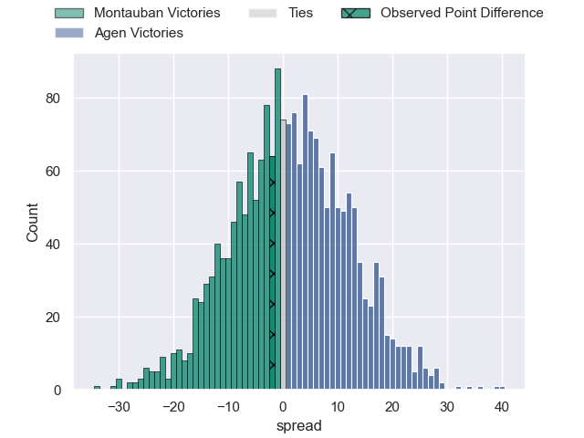
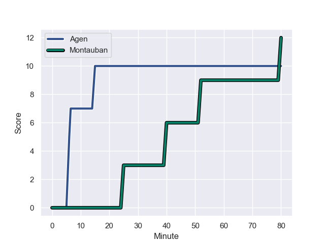
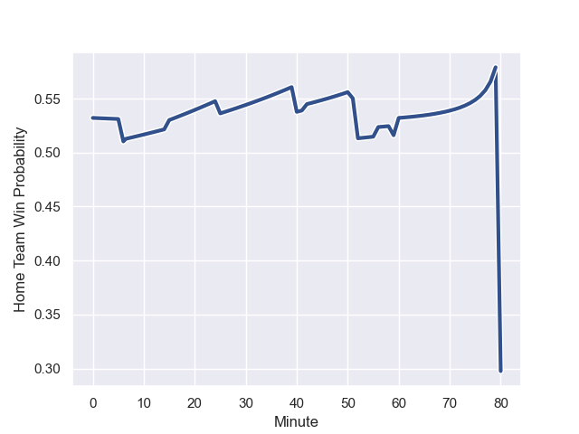

---  
layout: page  
title: Montauban at Agen; 12-10  
date: 2023-12-15 18:00:00 -0500  
categories: "Pro D2 2023" match review  
---
# Montauban at Agen; 12-10

# Club Level Predictions

The first set of predictions treats a club as the smallest object, as the club develops its members, organizes a gameplan, and deploys its players as needed for each match. This club model has a prediction of 0.65, which translates to predicting Agen to win by 5.4.

Each club has a rating and a rating deviation (similar to a Glicko rating), and expected performances can be generated. This allows for simulated matches and spreads like the ones below.
## Projected Performances - Club Model

## Projected Spreads - Club Model

## Projected Results - Club Model

# Player Level Predictions - Version 2

Treating teams instead as an entity made up of the currently active players, I have ratings for each player in an altogether different system. These can be combined to form team ratings once teamsheets are announced, weighting starters a bit higher than the reserves. After the match is played, players can be weighted by their minutes on the field, allowing for an accurate measure of the team's composition. With these compiled team ratings, we can make predictions, measure inaccuracy, and update the individual player ratings.
## Prediction with Player Minutes: Agen by 1.4

Montauban by 3.4 on a neutral field
## Prediction without Player Minutes: Agen by 2.1

Montauban by 2.7 on a neutral pitch

## Projected Performances - Player Model

## Projected Spreads - Player Model

## Projected Results - Player Model

## Scores over Time

## Win Probability over Time

There were 2 large changes in win probability in this match

|   Away Minutes | Away Player       |   Away elo |   Number |   Home elo | Home Player          |   Home Minutes |
|---------------:|:------------------|-----------:|---------:|-----------:|:---------------------|---------------:|
|             59 | Lucas Seyrolle    |      33.64 |        1 |      47.86 | Hans Lombard-Buret   |             51 |
|             59 | Kevin Firmin      |      23.53 |        2 |       0.19 | Mike Sosene-Feagai   |             51 |
|             80 | Mirian Burduli    |       8.82 |        3 |      37.88 | Malik Hamadache      |             51 |
|             80 | Frank Bradshaw    |      61.62 |        4 |      20.4  | Joe Maksymiw         |             60 |
|             52 | Dimitri Vaotoa    |      55.51 |        5 |      -5.2  | Evan Olmstead        |             80 |
|             42 | Karl Wilkins      |      52.59 |        6 |      90.17 | Antoine Erbani       |              6 |
|             80 | Noa Kanika        |      45.6  |        7 |      33.36 | Julien Lebian        |             80 |
|             56 | Tyrone Viiga      |      21.18 |        8 |      30.63 | Fotu Lokotui         |             80 |
|             60 | Alexis Bernadet   |      60.22 |        9 |      13.33 | Sonatane Takulua     |             56 |
|             80 | Jérôme Bosviel    |      76.74 |       10 |      38.55 | Ben Volavola         |             56 |
|             80 | Bastien Guillemin |      30.99 |       11 |      61.55 | Tevita Railevu       |             80 |
|             60 | Dan Goggin        |      76.41 |       12 |      51.47 | Clement Garrigues    |             80 |
|             80 | Yvan Reilhac      |      54.49 |       13 |      36.08 | Theo Belan           |             56 |
|             80 | Josua Vici        |      11.89 |       14 |      78.91 | George Tilsley       |             80 |
|             80 | Segundo Tuculet   |      26.96 |       15 |      52.19 | Jean-Marcelin Buttin |             80 |
|             38 | Quentin Witt      |      38.88 |       16 |      37.75 | Martin Devergie      |             74 |
|             24 | Otar Giorgadze    |      59.91 |       17 |      23.22 | Florent Guion        |             29 |
|             28 | Kevin Gimeno      |      11.4  |       18 |      38.39 | Clement Martinez     |             29 |
|             21 | Thomas Bue        |      48.32 |       19 |      43.7  | Théo Sauzaret        |             29 |
|             21 | Ru-Hann Greyling  |      42.99 |       20 |      42.53 | Dorian Bellot        |             24 |
|             20 | Yoan Cottin       |      58.93 |       21 |      43.46 | Emile Dayral         |             24 |
|             20 | Maxime Mathy      |      36.1  |       22 |     -14.92 | Loris Tolot          |             24 |
|            nan | nan               |     nan    |       23 |      39.06 | Corentin Vernet      |             20 |

