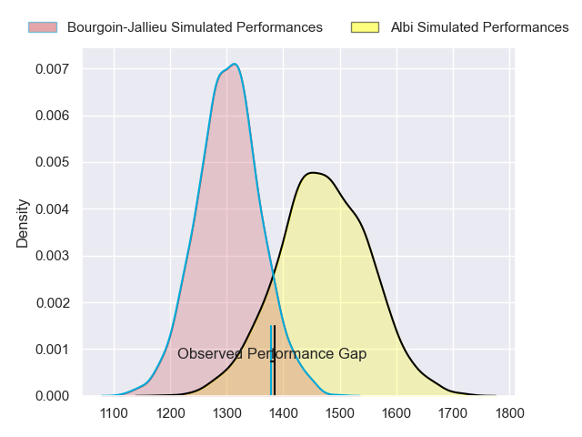
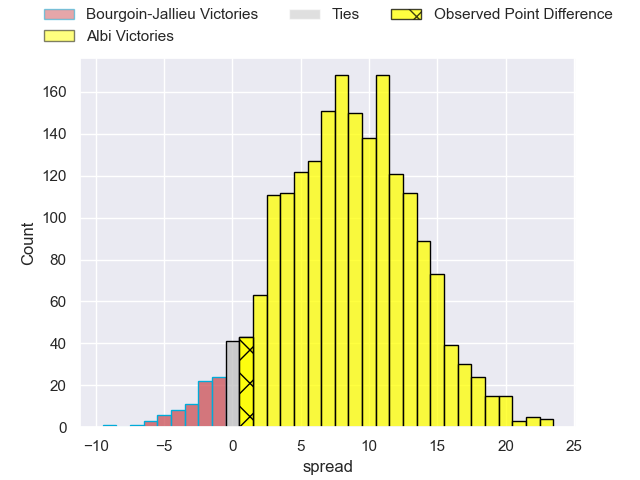
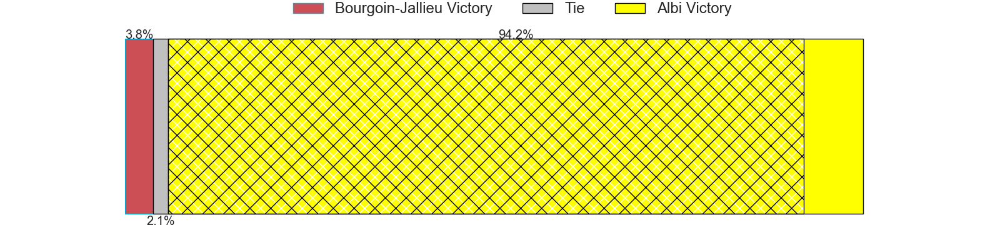
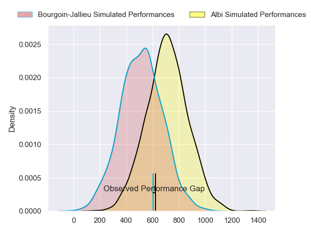
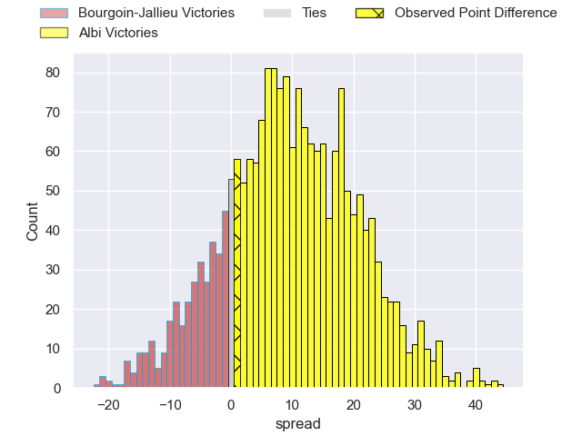
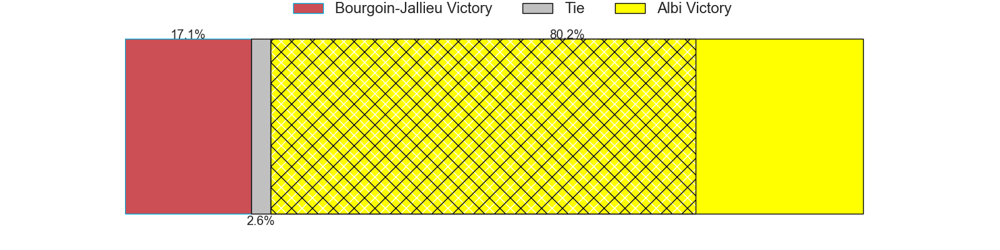
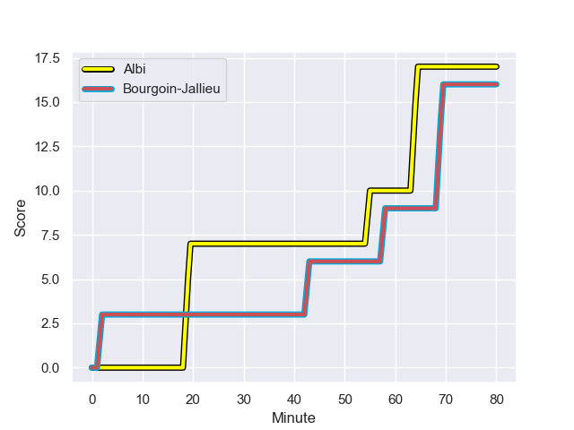
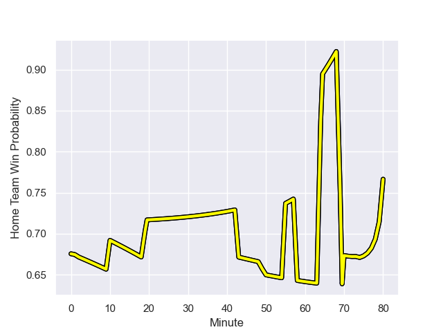

---  
layout: page  
title: Bourgoin-Jallieu at Albi; 16-17  
date: 2023-12-15 18:00:00 -0500  
categories: "Nationale 2023" match review  
---
# Bourgoin-Jallieu at Albi; 16-17

# Club Level Predictions

The first set of predictions treats a club as the smallest object, as the club develops its members, organizes a gameplan, and deploys its players as needed for each match. This club model has a prediction of 0.726, which translates to predicting Albi to win by 8.6.

Each club has a rating and a rating deviation (similar to a Glicko rating), and expected performances can be generated. This allows for simulated matches and spreads like the ones below.
## Projected Performances - Club Model

## Projected Spreads - Club Model

## Projected Results - Club Model

# Player Level Predictions - Version 2

Treating teams instead as an entity made up of the currently active players, I have ratings for each player in an altogether different system. These can be combined to form team ratings once teamsheets are announced, weighting starters a bit higher than the reserves. After the match is played, players can be weighted by their minutes on the field, allowing for an accurate measure of the team's composition. With these compiled team ratings, we can make predictions, measure inaccuracy, and update the individual player ratings.
## Prediction with Player Minutes: Albi by 8.1

Albi by 3.7 on a neutral field
## Prediction without Player Minutes: Albi by 6.7

Albi by 2.2 on a neutral pitch

## Projected Performances - Player Model

## Projected Spreads - Player Model

## Projected Results - Player Model

## Scores over Time

## Win Probability over Time

There were 11 large changes in win probability in this match

|   Away Minutes | Away Player              |   Away elo |   Number |   Home elo | Home Player             |   Home Minutes |
|---------------:|:-------------------------|-----------:|---------:|-----------:|:------------------------|---------------:|
|             50 | Romain Favaretto         |      38.03 |        1 |      49.45 | Antoine Soave           |             59 |
|             10 | Maxime Castant           |      58.84 |        2 |      32.97 | Reinach Venter          |             49 |
|             56 | Rossouw De Klerk         |      37.98 |        3 |      49.45 | Jean Baptiste De Clercq |             50 |
|             80 | Léandre Cotte            |       3.67 |        4 |      65.34 | Mohsen Essid            |             80 |
|             60 | Jonathan Kpoku           |      43.15 |        5 |       7.38 | Jacques Engelbrecht     |             80 |
|             80 | Theophile Cotte          |      34.59 |        6 |      15.89 | Pierre Roussel          |             80 |
|             74 | Kevin Chaudouard         |      37.35 |        7 |      56.56 | Simon Meka              |             49 |
|             56 | Poutasi Luafutu          |      33.81 |        8 |      55.99 | Camille Jarreau         |             80 |
|             80 | Tomas Munilla lo Duca    |      56.08 |        9 |      62.01 | Gilen Queheille         |             49 |
|             76 | Nicolas Vuillemin        |      49.55 |       10 |      28.98 | James Haydn Tedder      |             80 |
|             80 | Quentin Lefort           |      18.38 |       11 |      66.51 | Tim Giresse             |             80 |
|             66 | Isaiah Leota             |      51.95 |       12 |      23.83 | Jarrod Poi              |             70 |
|             80 | Christopher Bosch        |      27.03 |       13 |      18.38 | Sean Robinson           |             80 |
|             80 | Paul-Hugo Champ          |      33.85 |       14 |       3.2  | Téo Dospital            |             56 |
|             80 | Remi Bouet               |      17.59 |       15 |      50.82 | Enzo Marzocca           |             80 |
|             30 | Oktay Yilmaz             |      47.56 |       16 |      46.65 | Lucas Pindor            |             21 |
|             70 | Mohamed Khribache        |      21.88 |       17 |      54.92 | Arthur Castant          |             31 |
|             24 | Osman Dimen              |      37.58 |       18 |      63.11 | Dimitri Tchapnga        |             30 |
|             20 | Robin Gascou             |      38.82 |       19 |      36.48 | Mattéo Coustalat        |             31 |
|             24 | Kevin Rivoire            |      57.71 |       20 |      49.34 | Titouan Pouzoullic      |             31 |
|              6 | Matteo Broeders          |      43.44 |       21 |      32.39 | Francois Fontaine       |             10 |
|              4 | Jeremy Gondrand          |      52.68 |       22 |      56.16 | Simon Hartmann          |             24 |
|             14 | Brieuc Plessis-Couillaud |      23.77 |       23 |     nan    | nan                     |            nan |

