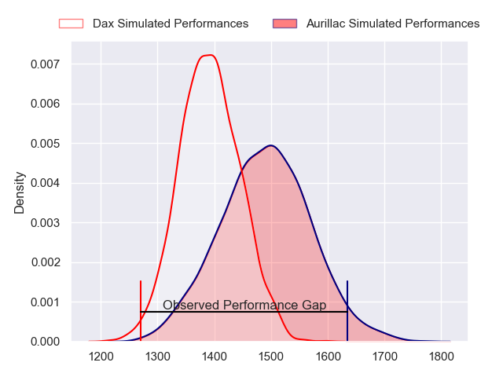
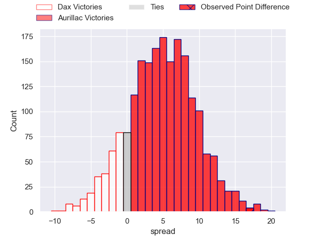
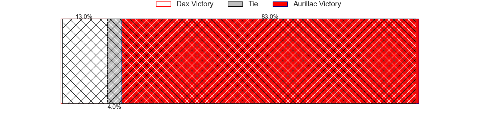
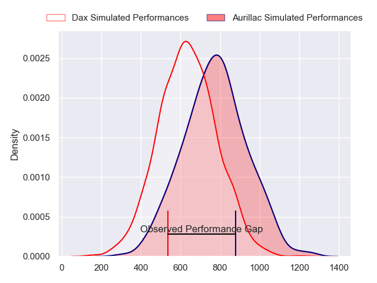
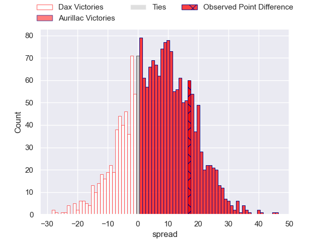
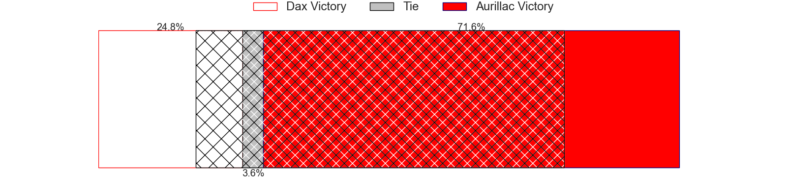
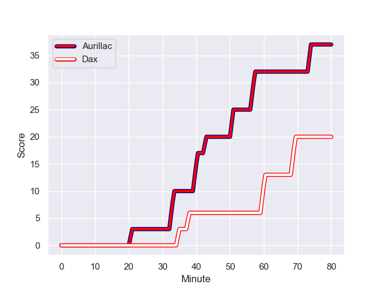
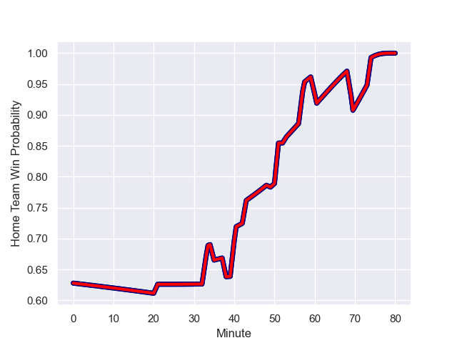

---  
layout: page  
title: Dax at Aurillac; 20-37  
date: 2023-12-15 18:00:00 -0500  
categories: "Pro D2 2023" match review  
---
# Dax at Aurillac; 20-37

# Club Level Predictions

The first set of predictions treats a club as the smallest object, as the club develops its members, organizes a gameplan, and deploys its players as needed for each match. This club model has a prediction of 0.631, which translates to predicting Aurillac to win by 4.7.

Each club has a rating and a rating deviation (similar to a Glicko rating), and expected performances can be generated. This allows for simulated matches and spreads like the ones below.
## Projected Performances - Club Model

## Projected Spreads - Club Model

## Projected Results - Club Model

# Player Level Predictions - Version 2

Treating teams instead as an entity made up of the currently active players, I have ratings for each player in an altogether different system. These can be combined to form team ratings once teamsheets are announced, weighting starters a bit higher than the reserves. After the match is played, players can be weighted by their minutes on the field, allowing for an accurate measure of the team's composition. With these compiled team ratings, we can make predictions, measure inaccuracy, and update the individual player ratings.
## Prediction with Player Minutes: Aurillac by 5.7

Aurillac by 1.0 on a neutral field
## Prediction without Player Minutes: Aurillac by 5.8

Aurillac by 1.1 on a neutral pitch

## Projected Performances - Player Model

## Projected Spreads - Player Model

## Projected Results - Player Model

## Scores over Time

## Win Probability over Time

There were 10 large changes in win probability in this match

|   Away Minutes | Away Player           |   Away elo |   Number |   Home elo | Home Player           |   Home Minutes |
|---------------:|:----------------------|-----------:|---------:|-----------:|:----------------------|---------------:|
|             52 | David Lolohea         |      26.82 |        1 |      28.07 | Robert Rodgers        |             64 |
|             52 | Louis Barrere         |      31.56 |        2 |      28.97 | Luka Nioradze         |             68 |
|             52 | Nephi Leatigaga       |      31.04 |        3 |      47.05 | Giorgi Kartvelishvili |             68 |
|             80 | Josh Furno            |      20.9  |        4 |      39.01 | Martial Rolland       |             56 |
|             55 | Jean-Baptiste Singer  |      17.25 |        5 |      52.85 | Cam Dodson            |             68 |
|             52 | Arnaud Aletti         |      53.84 |        6 |      64.42 | Eoghan Masterson      |             80 |
|             80 | Paul Arnaud Ausset    |      63.44 |        7 |      53.66 | Hugo Huurman          |             80 |
|             55 | Brice Ferrer          |      46.31 |        8 |      49.69 | Didier Tison          |             64 |
|             80 | Sylvère Reteau        |      50.25 |        9 |      35.44 | Mikheil Alania        |             64 |
|             53 | Hugo Cerisier         |      53.22 |       10 |      34.84 | Antoine Aucagne       |             64 |
|             49 | Jope Naceava          |      46.46 |       11 |      60.62 | AJ Coertzen           |             80 |
|             80 | Theo Dachary          |      20.82 |       12 |      21.27 | Christa Powell        |             80 |
|             80 | Bastien Daguerre      |      57.48 |       13 |      57.16 | Ofa Manuofetoa        |             80 |
|             80 | Alexandre Pilati      |      26.49 |       14 |      50.94 | Juun Pieters          |             80 |
|             80 | Théo Duprat           |      52.39 |       15 |      35.7  | Marc Palmier          |             80 |
|             31 | Hugo Fourquet         |      70.61 |       16 |      63.2  | Heath Backhouse       |             24 |
|             28 | Maxime Delonca        |      48.19 |       17 |      48.52 | Irakli Mtchedlidze    |             16 |
|             28 | Louis Mary            |      55.67 |       18 |      -6.18 | Latuka Maituku        |             16 |
|             28 | Jean-Baptiste Barrère |      35.09 |       19 |      39.63 | David Delarue         |             16 |
|             28 | Diogo Hasse Ferreira  |      30.91 |       20 |      27.41 | Simeli Yabaki         |             16 |
|             27 | Romuald Séguy         |      40.19 |       21 |      44.98 | Mehdi Slamani         |             12 |
|             25 | Genesis Mamea Lemalu  |      82.45 |       22 |      42.37 | Ronan Loughnane       |             12 |
|             25 | Mat Luamanu           |      49.76 |       23 |      37.42 | Tim Daniel-Meissen    |             12 |

