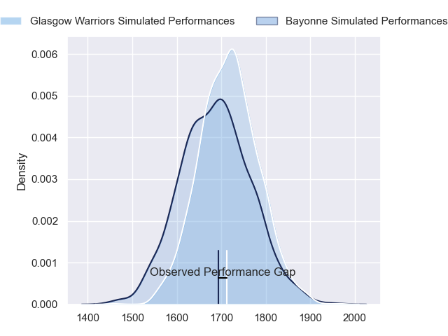
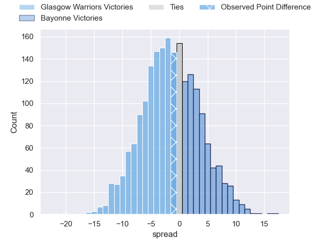
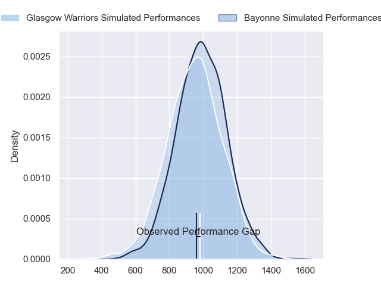
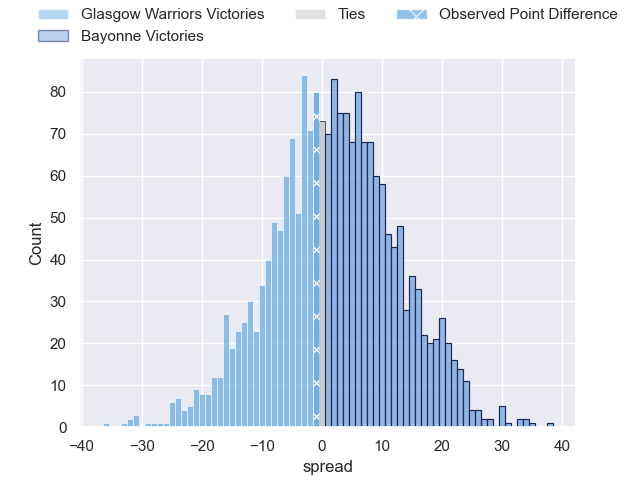
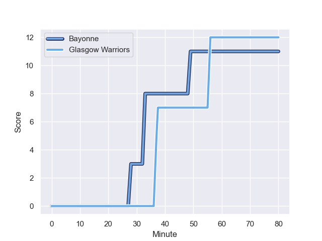
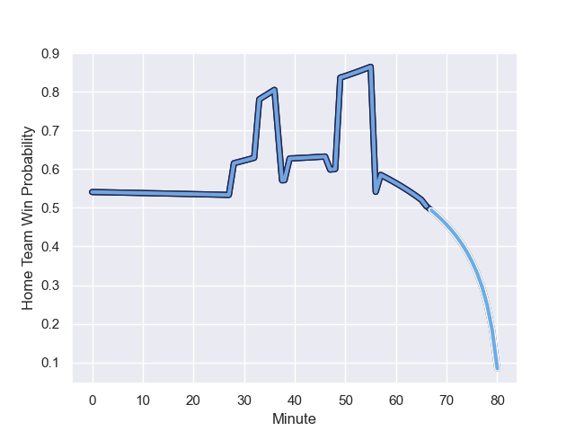

---  
layout: page  
title: Glasgow Warriors at Bayonne; 12-11  
date: 2023-12-15 18:00:00 -0500  
categories: "European Rugby Champions Cup 2023" match review  
---
# Glasgow Warriors at Bayonne; 12-11

# Club Level Predictions

The first set of predictions treats a club as the smallest object, as the club develops its members, organizes a gameplan, and deploys its players as needed for each match. This club model has a prediction of 0.455, which translates to predicting Glasgow Warriors to win by 1.6.

Each club has a rating and a rating deviation (similar to a Glicko rating), and expected performances can be generated. This allows for simulated matches and spreads like the ones below.
## Projected Performances - Club Model

## Projected Spreads - Club Model

## Projected Results - Club Model

# Player Level Predictions - Version 2

Treating teams instead as an entity made up of the currently active players, I have ratings for each player in an altogether different system. These can be combined to form team ratings once teamsheets are announced, weighting starters a bit higher than the reserves. After the match is played, players can be weighted by their minutes on the field, allowing for an accurate measure of the team's composition. With these compiled team ratings, we can make predictions, measure inaccuracy, and update the individual player ratings.
## Prediction with Player Minutes: Bayonne by 1.8

Glasgow Warriors by 3.0 on a neutral field
## Prediction without Player Minutes: Bayonne by 0.7

Glasgow Warriors by 4.1 on a neutral pitch

## Projected Performances - Player Model

## Projected Spreads - Player Model

## Projected Results - Player Model

## Scores over Time

## Win Probability over Time

There were 14 large changes in win probability in this match

|   Away Minutes | Away Player     |   Away elo |   Number |   Home elo | Home Player         |   Home Minutes |
|---------------:|:----------------|-----------:|---------:|-----------:|:--------------------|---------------:|
|             57 | Jamie Bhatti    |      88.98 |        1 |      46.68 | Swan Cormenier      |             57 |
|             57 | George Turner   |     116.1  |        2 |      69.3  | Facundo Bosch       |             47 |
|             57 | Zander Fagerson |     112.8  |        3 |      47.99 | Luke Tagi           |             57 |
|             66 | Greg Peterson   |      20.22 |        4 |      98.74 | Denis Marchois      |             66 |
|             57 | Alex Samuel     |      48.78 |        5 |      19.71 | Manuel Leindekar    |             80 |
|             80 | Gregor Brown    |      47.25 |        6 |      83.99 | Remi Bourdeau       |             80 |
|             80 | Tom Gordon      |      87.34 |        7 |      65.85 | Baptiste Heguy      |             47 |
|             80 | Ally Miller     |      20.36 |        8 |     101.47 | Rodrigo Bruni       |             80 |
|             80 | George Horne    |     129.49 |        9 |      49.59 | Gela Aprasidze      |             49 |
|             80 | Ross Thompson   |      47.13 |       10 |     101.44 | Camille Lopez       |             57 |
|             39 | Ollie Smith     |      79.25 |       11 |      68.77 | Nadir Megdoud       |             80 |
|             80 | Sione Tuipulotu |      53.43 |       12 |      28.5  | Guillaume Martocq   |             80 |
|             80 | Huw Jones       |      42.7  |       13 |      29.72 | Cheikh Tiberghien   |             49 |
|             80 | Kyle Rowe       |      60.06 |       14 |      58.25 | Aurelien Callandret |             80 |
|             80 | Josh McKay      |      45.79 |       15 |      28.01 | Tom Spring          |             80 |
|             23 | Nathan McBeth   |      47.92 |       16 |      38.96 | Matis Perchaud      |             23 |
|             23 | Angus Fraser    |      45.97 |       17 |      42.1  | Tevita Tatafu       |             23 |
|             23 | Oli Kebble      |      89.49 |       18 |      29.94 | Vincent Giudicelli  |             33 |
|             14 | Richie Gray     |      63.46 |       19 |      40.52 | Thomas Ceyte        |             14 |
|             23 | Max Williamson  |      40.63 |       20 |      84.5  | Arthur Iturria      |             33 |
|             41 | Tom Jordan      |      50.19 |       21 |      64.38 | Maxime Machenaud    |             31 |
|            nan | nan             |     nan    |       22 |      32.98 | Thomas Dolhagaray   |             23 |
|            nan | nan             |     nan    |       23 |      73.13 | Reece Hodge         |             31 |

