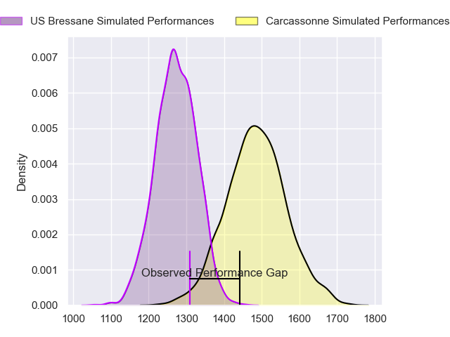
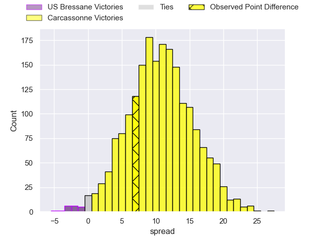
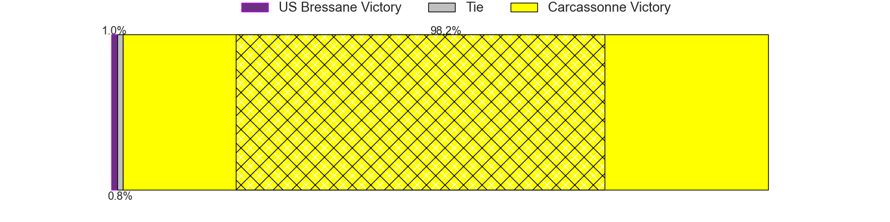
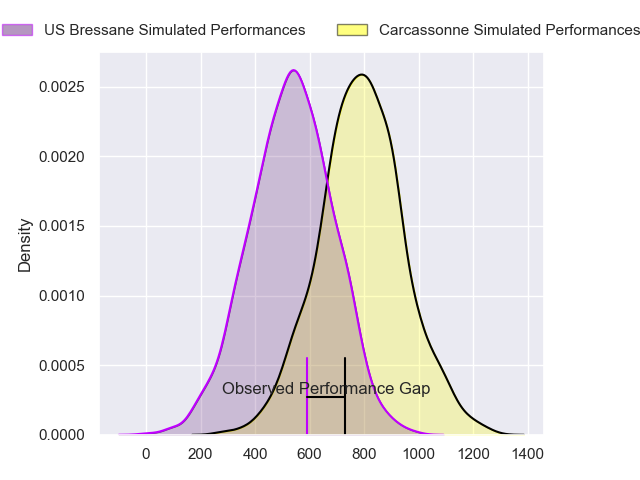
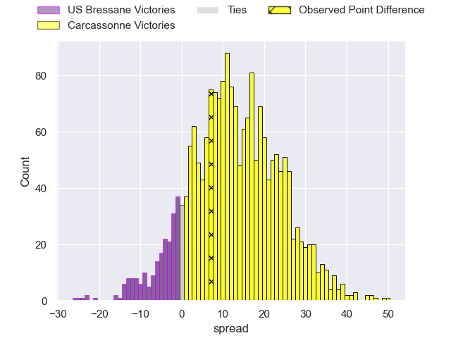
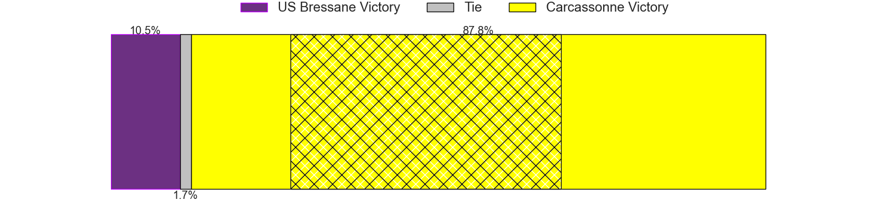
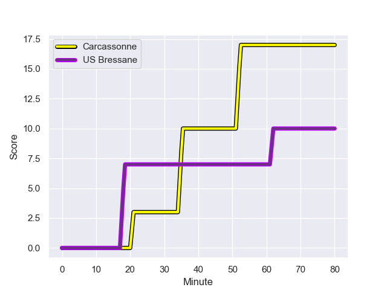
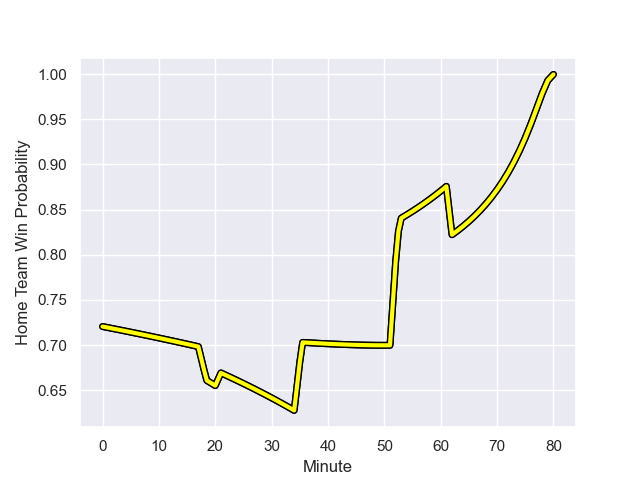

---  
layout: page  
title: US Bressane at Carcassonne; 10-17  
date: 2023-12-15 18:00:00 -0500  
categories: "Nationale 2023" match review  
---
# US Bressane at Carcassonne; 10-17

# Club Level Predictions

The first set of predictions treats a club as the smallest object, as the club develops its members, organizes a gameplan, and deploys its players as needed for each match. This club model has a prediction of 0.767, which translates to predicting Carcassonne to win by 10.5.

Each club has a rating and a rating deviation (similar to a Glicko rating), and expected performances can be generated. This allows for simulated matches and spreads like the ones below.
## Projected Performances - Club Model

## Projected Spreads - Club Model

## Projected Results - Club Model

# Player Level Predictions - Version 2

Treating teams instead as an entity made up of the currently active players, I have ratings for each player in an altogether different system. These can be combined to form team ratings once teamsheets are announced, weighting starters a bit higher than the reserves. After the match is played, players can be weighted by their minutes on the field, allowing for an accurate measure of the team's composition. With these compiled team ratings, we can make predictions, measure inaccuracy, and update the individual player ratings.
## Prediction with Player Minutes: Carcassonne by 10.4

Carcassonne by 6.2 on a neutral field
## Prediction without Player Minutes: Carcassonne by 10.3

Carcassonne by 6.1 on a neutral pitch

## Projected Performances - Player Model

## Projected Spreads - Player Model

## Projected Results - Player Model

## Scores over Time

## Win Probability over Time

There were 5 large changes in win probability in this match

|   Away Minutes | Away Player               |   Away elo |   Number |   Home elo | Home Player           |   Home Minutes |
|---------------:|:--------------------------|-----------:|---------:|-----------:|:----------------------|---------------:|
|             44 | Teo Bordenave             |      41.52 |        1 |      44.22 | Florent Lorenzon      |             53 |
|             23 | Arnaud Feltrin            |      41.59 |        2 |      51.83 | Luka Petriashvili     |             53 |
|             59 | Atonio Ulutuipalelei      |      22.76 |        3 |      22.21 | Vakhtangi Akhobadze   |             68 |
|             80 | Thomas Déliance           |      45.14 |        4 |      28.59 | Romain Manchia        |             68 |
|             52 | Maselino Paulino          |     -10.84 |        5 |      24.81 | Marius Iftimiciuc     |             53 |
|             80 | Pierre Reynaud            |      41.92 |        6 |      51.16 | Bilal Fadli           |             53 |
|             52 | Lucas Lyons               |      56.24 |        7 |      47.72 | Etienne Herjean       |             80 |
|             80 | Loic Baradel              |      41.6  |        8 |      46.39 | Romain Guyot          |             80 |
|             58 | Robin Graulle             |      34.74 |        9 |      32.81 | Gaetan Pichon         |             68 |
|             80 | Thibault Olender          |      48.74 |       10 |      62.28 | Gabin Michet          |             80 |
|             80 | Élie De Fleurian          |      37.11 |       11 |      83.31 | Léo Darrelatour       |             80 |
|             80 | Parataiso Silafai-Lea'ana |       8.24 |       12 |      27    | Jordan Puletua        |             80 |
|             59 | Maile Mamao               |      27.44 |       13 |      48.71 | Tutuila Vaea          |             80 |
|             80 | Thibaut Perrette          |      28.57 |       14 |      35.82 | Sakiusa Bureitakiyaca |             68 |
|             80 | Florent Massip            |      50.74 |       15 |      66.84 | Maxime Gianet         |             80 |
|             36 | Vazha Kapanadze           |      43.22 |       16 |      57.66 | Andrei Ursache        |             27 |
|             57 | Clement Jullien           |      47.76 |       17 |      55.13 | Raphael Carbou        |             27 |
|             21 | Ma'afu Fia                |      54.65 |       18 |      47.75 | Yan Arnold            |             12 |
|             28 | Josh Peters               |      37.26 |       19 |      49.88 | Valentin Sese         |             12 |
|             28 | Nail Ait Naceur           |      47.8  |       20 |      37.97 | Clément Fontaine      |             27 |
|             22 | Nicolas Faure             |      -5.77 |       21 |      46.85 | Ferdinand Dreno       |             27 |
|             21 | Joseph Penitito           |      53.79 |       22 |      -2.18 | Martin Landajo        |             12 |
|            nan | nan                       |     nan    |       23 |      61.68 | Clement Egiziano      |             12 |

