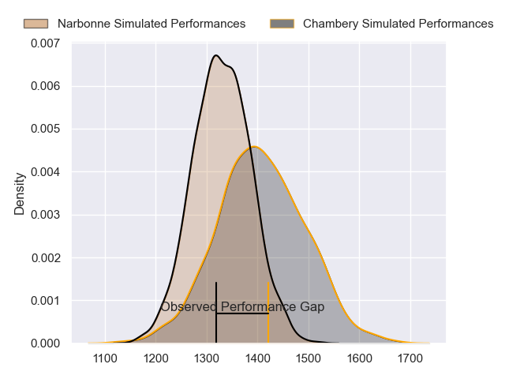
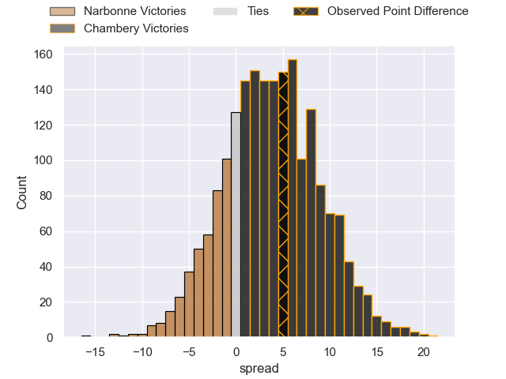
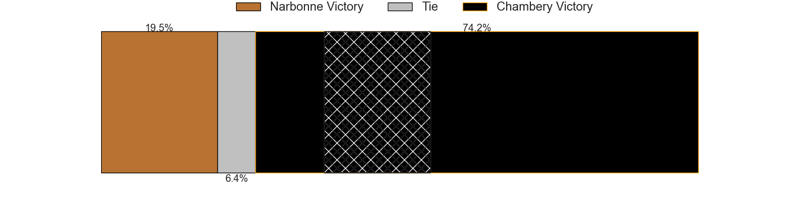
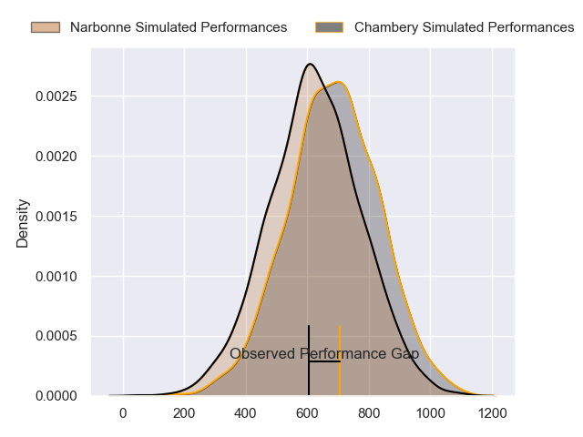
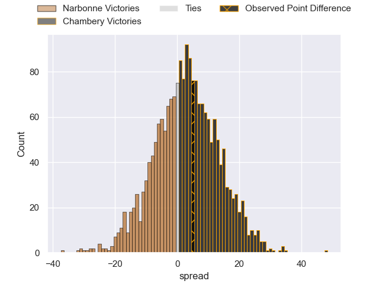
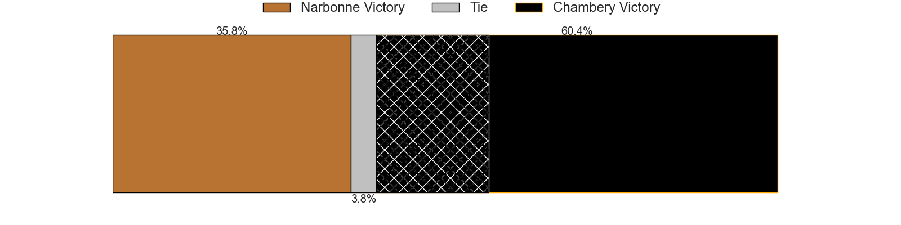
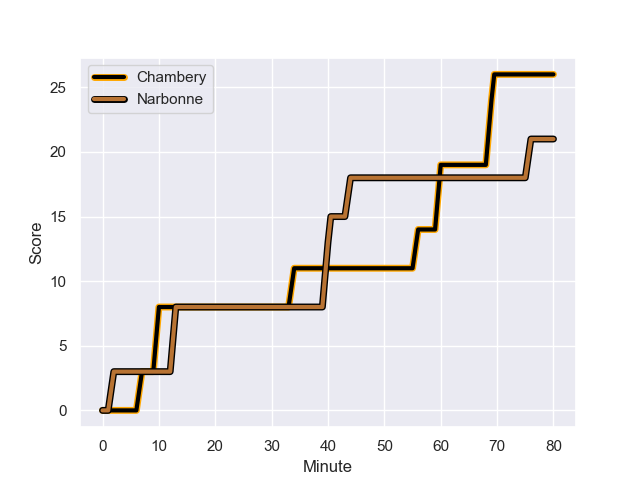
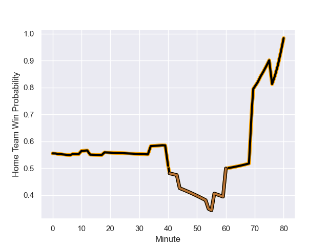

---  
layout: page  
title: Narbonne at Chambery; 21-26  
date: 2023-12-15 18:00:00 -0500  
categories: "Nationale 2023" match review  
---
# Narbonne at Chambery; 21-26

# Club Level Predictions

The first set of predictions treats a club as the smallest object, as the club develops its members, organizes a gameplan, and deploys its players as needed for each match. This club model has a prediction of 0.602, which translates to predicting Chambery to win by 3.7.

Each club has a rating and a rating deviation (similar to a Glicko rating), and expected performances can be generated. This allows for simulated matches and spreads like the ones below.
## Projected Performances - Club Model

## Projected Spreads - Club Model

## Projected Results - Club Model

# Player Level Predictions - Version 2

Treating teams instead as an entity made up of the currently active players, I have ratings for each player in an altogether different system. These can be combined to form team ratings once teamsheets are announced, weighting starters a bit higher than the reserves. After the match is played, players can be weighted by their minutes on the field, allowing for an accurate measure of the team's composition. With these compiled team ratings, we can make predictions, measure inaccuracy, and update the individual player ratings.
## Prediction with Player Minutes: Chambery by 2.4

Narbonne by 0.8 on a neutral field
## Prediction without Player Minutes: Chambery by 2.2

Narbonne by 1.0 on a neutral pitch

## Projected Performances - Player Model

## Projected Spreads - Player Model

## Projected Results - Player Model

## Scores over Time

## Win Probability over Time

There were 14 large changes in win probability in this match

|   Away Minutes | Away Player            |   Away elo |   Number |   Home elo | Home Player                  |   Home Minutes |
|---------------:|:-----------------------|-----------:|---------:|-----------:|:-----------------------------|---------------:|
|             51 | Sylvain Abadie         |      31.85 |        1 |      44.5  | Enzo Segui                   |             49 |
|             57 | Mehdi Boundjema        |      52.62 |        2 |      48.62 | Gauthier Brute de Remur      |             49 |
|             60 | Levi Tikoipau          |      45.72 |        3 |      47.74 | Giorgi Pertaia               |             39 |
|             60 | Marius Antonescu       |      46.99 |        4 |      40.29 | Fabien Witz                  |             80 |
|             80 | Dennis Visser          |      32.18 |        5 |      43.59 | Taniela Matakaiongo          |             57 |
|             80 | Thibault Clauzade      |      52.51 |        6 |      34.87 | Colin Lebian                 |             80 |
|             80 | Arthur Christienne     |      48.9  |        7 |      49.21 | Ahmed Tidiane Kane           |             49 |
|             57 | Baptiste Abescat-Leroy |      37.7  |        8 |      52    | Tui Uru                      |             80 |
|             60 | Josh Valentine         |      78.64 |        9 |      28.45 | Thibault Dufau               |             72 |
|             80 | Gilles Bosch           |       5.43 |       10 |      32.26 | Victor Pisano                |             54 |
|             80 | Ambrose Curtis         |      28.59 |       11 |      26.92 | Paul Baptiste Florent Altier |             72 |
|             80 | Sébastien Giorgis      |      31.04 |       12 |      48.17 | Bastien Reymond              |             80 |
|             18 | Pierre Nueno           |      48.62 |       13 |      45.57 | Emmanuel Vaitulukina         |             80 |
|             40 | Pierre-Hugo Ducom      |      34.84 |       14 |      36.46 | Maewen Sao                   |             80 |
|             80 | James Kane             |      49.95 |       15 |      38.51 | Jean-Luc Alewyn Cilliers     |             80 |
|             29 | Théo Castinel          |      49.97 |       16 |      52.61 | Nugzar Somkhishvili          |             31 |
|             23 | Christophe David       |      55.14 |       17 |      42.91 | Julien Primault              |             31 |
|             20 | Mohammed Loukia        |      38.04 |       18 |      45.38 | Nail Audoire                 |             41 |
|             20 | Mohamed Kbaier         |      43.37 |       19 |      35.91 | Steevy Cerqueira             |             23 |
|             23 | Luke Nakobukobua       |      66.3  |       20 |      40.57 | Thomas Coignat               |             31 |
|             20 | Pierrick Nova          |      45.03 |       21 |      32.85 | Hugo Deschaux                |              8 |
|             62 | Théo Mias              |      33.87 |       22 |      16.07 | Vereniki Goneva              |             26 |
|             40 | Paul Auradou           |      53.56 |       23 |      48.07 | Jules Dorrival               |              8 |

