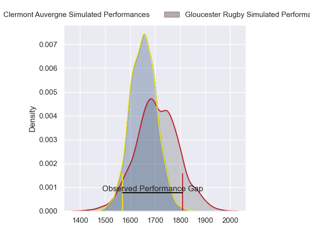
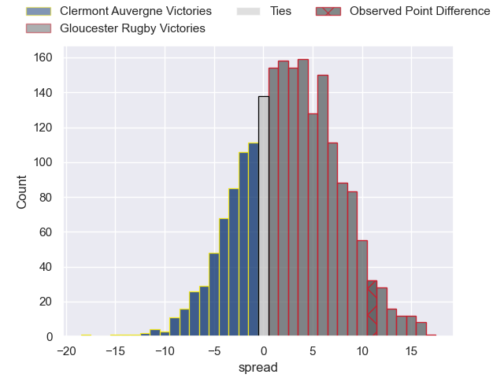
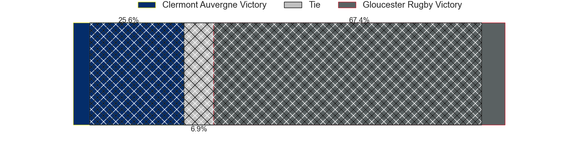
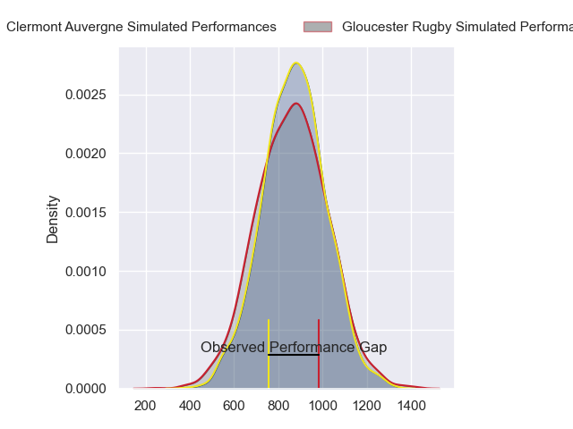
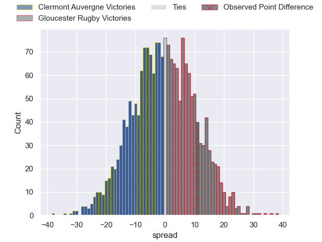
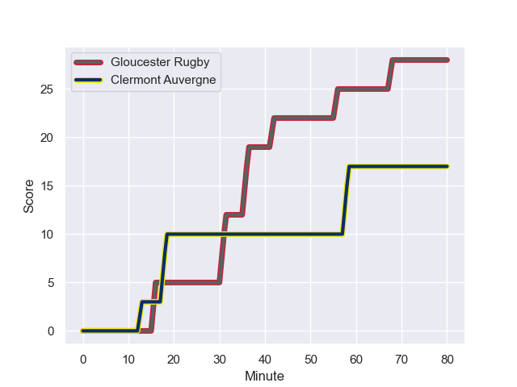
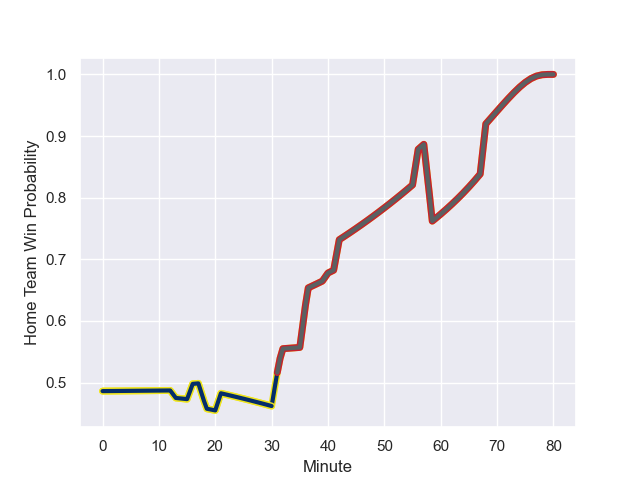

---  
layout: page  
title: Clermont Auvergne at Gloucester Rugby; 17-28  
date: 2023-12-15 18:00:00 -0500  
categories: "European Rugby Challenge Cup 2023" match review  
---
# Clermont Auvergne at Gloucester Rugby; 17-28

# Club Level Predictions

The first set of predictions treats a club as the smallest object, as the club develops its members, organizes a gameplan, and deploys its players as needed for each match. This club model has a prediction of 0.576, which translates to predicting Gloucester Rugby to win by 2.7.

Each club has a rating and a rating deviation (similar to a Glicko rating), and expected performances can be generated. This allows for simulated matches and spreads like the ones below.
## Projected Performances - Club Model

## Projected Spreads - Club Model

## Projected Results - Club Model

# Player Level Predictions - Version 2

Treating teams instead as an entity made up of the currently active players, I have ratings for each player in an altogether different system. These can be combined to form team ratings once teamsheets are announced, weighting starters a bit higher than the reserves. After the match is played, players can be weighted by their minutes on the field, allowing for an accurate measure of the team's composition. With these compiled team ratings, we can make predictions, measure inaccuracy, and update the individual player ratings.
## Prediction with Player Minutes: Clermont Auvergne by 0.6

Clermont Auvergne by 5.6 on a neutral field
## Prediction without Player Minutes: Clermont Auvergne by 1.6

Clermont Auvergne by 6.6 on a neutral pitch

## Projected Performances - Player Model

## Projected Spreads - Player Model

## Projected Results - Player Model

## Scores over Time

## Win Probability over Time

There were 10 large changes in win probability in this match

|   Away Minutes | Away Player        |   Away elo |   Number |   Home elo | Home Player         |   Home Minutes |
|---------------:|:-------------------|-----------:|---------:|-----------:|:--------------------|---------------:|
|             40 | Daniel Bibi Biziwu |      45.35 |        1 |      34.04 | Harry Elrington     |             54 |
|             40 | Yohan Beheregaray  |      44.81 |        2 |      45.5  | Santiago Socino     |             56 |
|             40 | Rabah Slimani      |      63.54 |        3 |      37.45 | Fraser Balmain      |             40 |
|             57 | Thibaud Lanen      |      56.06 |        4 |      24.57 | Freddie Clarke      |             80 |
|             80 | Tomas Lavanini     |      69.36 |        5 |      52.72 | Matias Alemanno     |             80 |
|             80 | Pita Gus Sowakula  |      86.22 |        6 |      32.43 | Jack Clement        |             80 |
|             80 | Marcos Kremer      |      50.62 |        7 |      33.73 | Lewis Ludlow        |             80 |
|             21 | Fritz Lee          |      82.34 |        8 |      50.45 | Zach Mercer         |             80 |
|             40 | Baptiste Jauneau   |      33.87 |        9 |      23.43 | Stephen Varney      |             80 |
|             57 | Jules Plisson      |      79.4  |       10 |      72.01 | Santiago Carreras   |             80 |
|             80 | Thomas Roziere     |      31.65 |       11 |      68    | Ollie Thorley       |             80 |
|             48 | Leon Darricarrere  |      45.77 |       12 |      73.47 | Max Llewellyn       |             80 |
|             80 | Pierre Fouyssac    |      37.23 |       13 |      62.64 | Chris Harris        |             80 |
|             80 | Bautista Delguy    |      70.9  |       14 |      36.5  | Jonny May           |             32 |
|             80 | Alex Newsome       |      66.95 |       15 |      81.33 | Louis Rees-Zammit   |             80 |
|             40 | Etienne Falgoux    |      59.2  |       16 |      11.07 | Jamal Ford-Robinson |             26 |
|             40 | Henzo Kiteau       |      37.4  |       17 |      47.95 | George McGuigan     |             24 |
|             40 | Etienne Fourcade   |      37.22 |       18 |      50.46 | Kirill Gotovtsev    |             40 |
|             23 | Rob Simmons        |      90.69 |       19 |      57.03 | Lloyd Evans         |             48 |
|             59 | Killian Tixeront   |      46.59 |       20 |     nan    | nan                 |            nan |
|             40 | Sebastien Bezy     |      79.41 |       21 |     nan    | nan                 |            nan |
|             23 | Anthony Belleau    |      68.49 |       22 |     nan    | nan                 |            nan |
|             32 | George Moala       |      93.53 |       23 |     nan    | nan                 |            nan |

