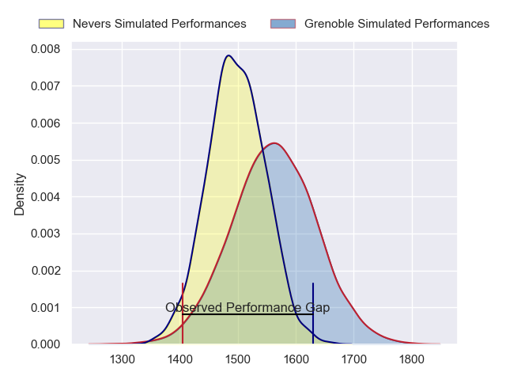
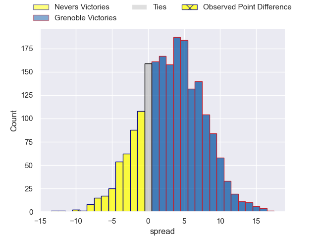
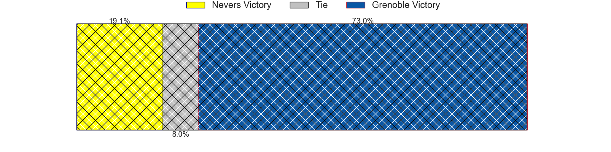
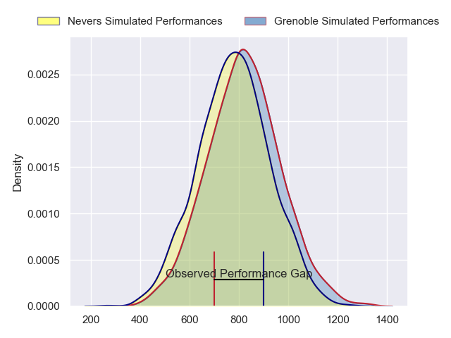
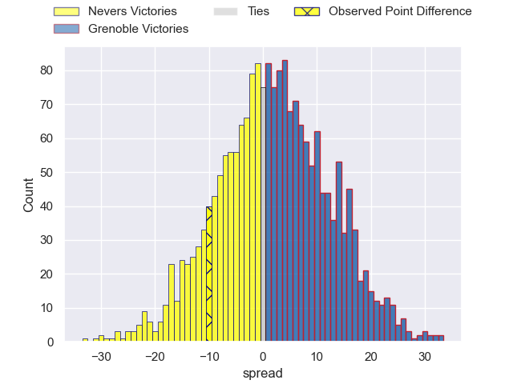
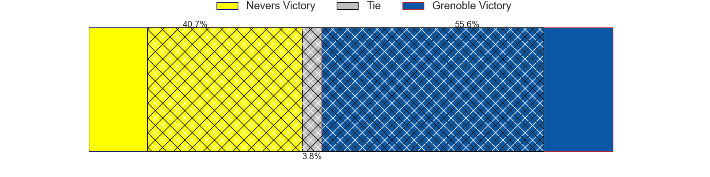
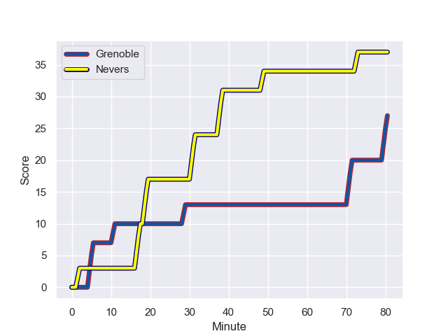
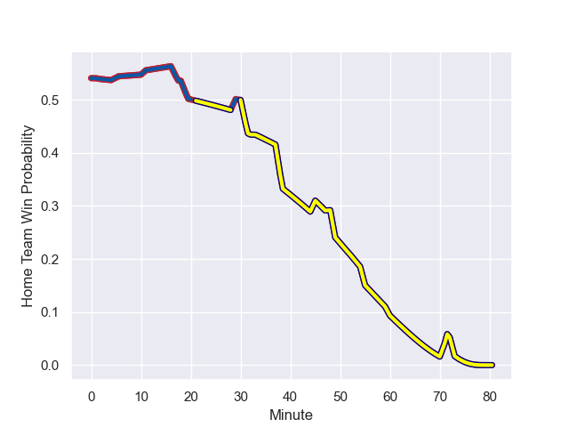

---  
layout: page  
title: Nevers at Grenoble; 37-27  
date: 2023-12-15 18:00:00 -0500  
categories: "Pro D2 2023" match review  
---
# Nevers at Grenoble; 37-27

# Club Level Predictions

The first set of predictions treats a club as the smallest object, as the club develops its members, organizes a gameplan, and deploys its players as needed for each match. This club model has a prediction of 0.593, which translates to predicting Grenoble to win by 3.3.

Each club has a rating and a rating deviation (similar to a Glicko rating), and expected performances can be generated. This allows for simulated matches and spreads like the ones below.
## Projected Performances - Club Model

## Projected Spreads - Club Model

## Projected Results - Club Model

# Player Level Predictions - Version 2

Treating teams instead as an entity made up of the currently active players, I have ratings for each player in an altogether different system. These can be combined to form team ratings once teamsheets are announced, weighting starters a bit higher than the reserves. After the match is played, players can be weighted by their minutes on the field, allowing for an accurate measure of the team's composition. With these compiled team ratings, we can make predictions, measure inaccuracy, and update the individual player ratings.
## Prediction with Player Minutes: Grenoble by 1.8

Nevers by 3.1 on a neutral field
## Prediction without Player Minutes: Grenoble by 2.1

Nevers by 2.7 on a neutral pitch

## Projected Performances - Player Model

## Projected Spreads - Player Model

## Projected Results - Player Model

## Scores over Time

## Win Probability over Time

There were 6 large changes in win probability in this match

|   Away Minutes | Away Player              |   Away elo |   Number |   Home elo | Home Player         |   Home Minutes |
|---------------:|:-------------------------|-----------:|---------:|-----------:|:--------------------|---------------:|
|             48 | Kamaliele Tufele         |      46.99 |        1 |      42.16 | Luka Goginava       |             48 |
|             70 | Elia Elia                |      47.18 |        2 |      43.1  | Lilian Rossi        |             45 |
|             52 | Ilia Kaikatsishvili      |      50.48 |        3 |      54.25 | Irakli Aptsiauri    |             65 |
|             80 | Christiaan van der Merwe |       7.36 |        4 |      78.57 | Jose Madeira        |             41 |
|             51 | Will Skelton             |      93.45 |        5 |      45.44 | Pierce Phillips     |             80 |
|             65 | Luka Plataret            |      49.43 |        6 |      25.64 | Antonin Berruyer    |             80 |
|             80 | Julien Kazubek           |      65.55 |        7 |      32.63 | Steeve Blanc-Mappaz |             80 |
|             55 | Jason-Colin Fraser       |      86.62 |        8 |      38.91 | Pio Muarua          |             60 |
|             45 | Hugo Bouyssou            |      24.09 |        9 |      58.06 | Eric Escande        |             52 |
|             80 | Yohan Le Bourhis         |      51.67 |       10 |      59.74 | Sam Davies          |             80 |
|             80 | Arthur Mathiron          |      54.07 |       11 |      39.39 | Geoffrey Cros       |             80 |
|             33 | Leonard Paris            |      67.82 |       12 |      51.43 | Romain Trouilloud   |             54 |
|             80 | Alifereti Loaloa         |      70.43 |       13 |      34.05 | Romain Fusier       |             80 |
|             80 | Thomas Zenon             |      23.69 |       14 |      53.06 | Wilfried Hulleu     |             80 |
|             80 | Kylian Jaminet           |      70.68 |       15 |      92.2  | Julien Farnoux      |             60 |
|             47 | Rudy Derrieux            |      60.27 |       16 |      53.07 | Georgi Javakhia     |             39 |
|             35 | Guillaume Manevy         |      34.61 |       17 |      35.5  | Mathis Sarragallet  |             35 |
|             32 | Tornike Mataradze        |      58.64 |       18 |      55.88 | Zack Gauthier       |             32 |
|             29 | Makatuki Polutele        |      34.87 |       19 |      21.31 | Barnabe Couilloud   |             28 |
|             28 | Aselo Ikahehegi          |      48.94 |       20 |      29.21 | Romain Barthelemy   |             26 |
|             25 | Kevin Noah               |      43.42 |       21 |      45.45 | Erwan Dridi         |             20 |
|             15 | Robin Dione              |      43.11 |       22 |      37.56 | Tala Gray           |             20 |
|             10 | Quentin Beaudaux         |      51.46 |       23 |      44.32 | Vincent Vial        |             15 |

