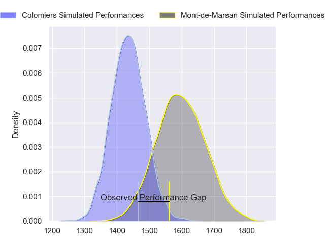
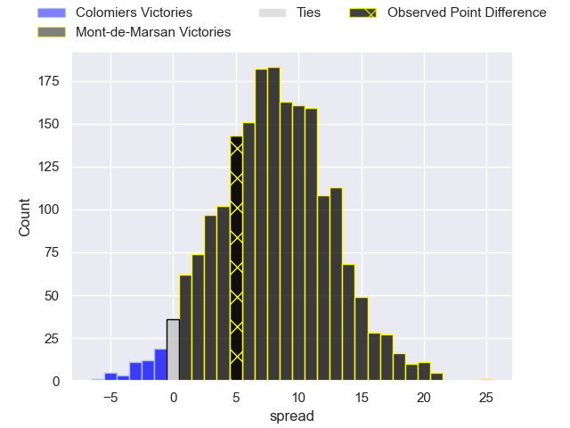
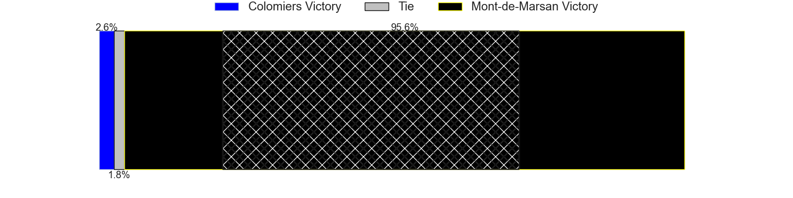
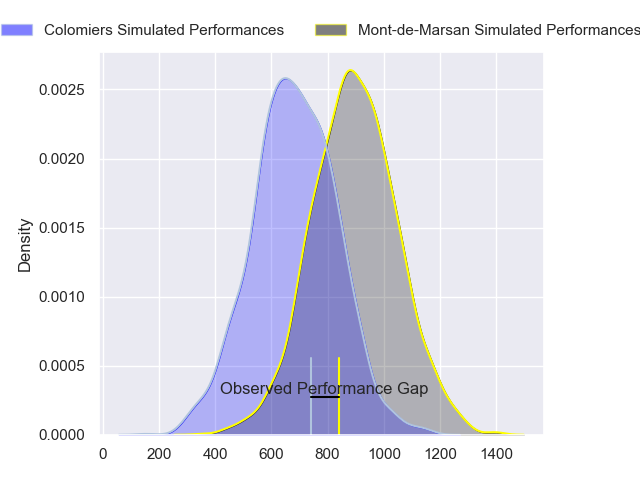
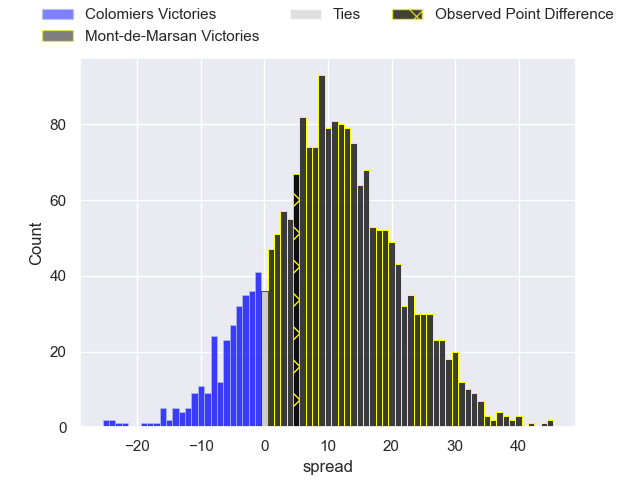
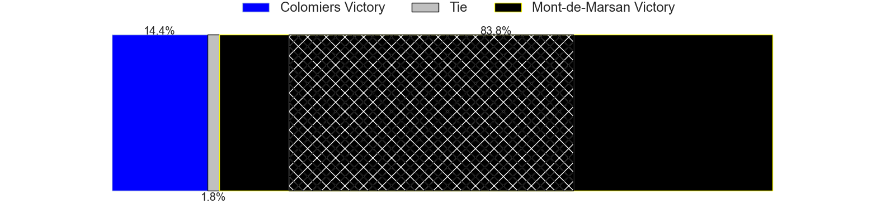
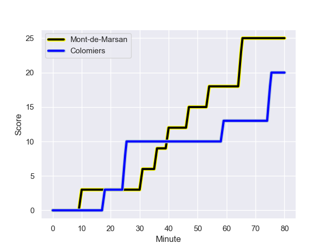
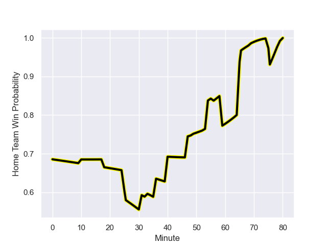

---  
layout: page  
title: Colomiers at Mont-de-Marsan; 20-25  
date: 2023-12-15 18:00:00 -0500  
categories: "Pro D2 2023" match review  
---
# Colomiers at Mont-de-Marsan; 20-25

# Club Level Predictions

The first set of predictions treats a club as the smallest object, as the club develops its members, organizes a gameplan, and deploys its players as needed for each match. This club model has a prediction of 0.714, which translates to predicting Mont-de-Marsan to win by 8.1.

Each club has a rating and a rating deviation (similar to a Glicko rating), and expected performances can be generated. This allows for simulated matches and spreads like the ones below.
## Projected Performances - Club Model

## Projected Spreads - Club Model

## Projected Results - Club Model

# Player Level Predictions - Version 2

Treating teams instead as an entity made up of the currently active players, I have ratings for each player in an altogether different system. These can be combined to form team ratings once teamsheets are announced, weighting starters a bit higher than the reserves. After the match is played, players can be weighted by their minutes on the field, allowing for an accurate measure of the team's composition. With these compiled team ratings, we can make predictions, measure inaccuracy, and update the individual player ratings.
## Prediction with Player Minutes: Mont-de-Marsan by 8.5

Mont-de-Marsan by 3.7 on a neutral field
## Prediction without Player Minutes: Mont-de-Marsan by 7.7

Mont-de-Marsan by 2.8 on a neutral pitch

## Projected Performances - Player Model

## Projected Spreads - Player Model

## Projected Results - Player Model

## Scores over Time

## Win Probability over Time

There were 11 large changes in win probability in this match

|   Away Minutes | Away Player        |   Away elo |   Number |   Home elo | Home Player           |   Home Minutes |
|---------------:|:-------------------|-----------:|---------:|-----------:|:----------------------|---------------:|
|             53 | Hugo Djehi         |      51.05 |        1 |      49.79 | Dino Casadei          |             54 |
|             49 | Pablo Dimcheff     |      38.73 |        2 |      41.53 | Simon Labouyrie       |             54 |
|             53 | Michael Simutoga   |      65.91 |        3 |      33.15 | Anthony Alves         |             54 |
|             56 | Jean Thomas        |      49.28 |        4 |      50.56 | Nicolas Garrault      |             80 |
|             80 | Janse Roux         |      39.02 |        5 |      46.25 | Andrei Ostrikov       |             40 |
|             80 | Anthony Coletta    |      32.19 |        6 |      49.38 | Aurélien Lisena       |             80 |
|             80 | Waël Ponpon        |      41.08 |        7 |      73.42 | Léo Banos             |             80 |
|             33 | Aldric Lescure     |      64.8  |        8 |      46.44 | Enzo Prosper          |             34 |
|             56 | Ugo Seguela        |      42.37 |        9 |      38.11 | Christophe Loustalot  |             56 |
|             56 | Maxime Javaux      |      28.6  |       10 |      36.32 | Joris Pialot          |             69 |
|             80 | Rodrigo Marta      |      93.58 |       11 |      57.95 | Pierre Sayerse        |             80 |
|             80 | Ray Nu'u           |      51.51 |       12 |      47.59 | Gatien Masse          |             80 |
|             47 | Paul Pimienta      |      53.29 |       13 |      83.54 | Nacani Wakaya         |             56 |
|             80 | Martin Dulon       |      16.13 |       14 |      46.1  | Simao Broeiro Bento   |             80 |
|             80 | Thomas Girard      |      36.17 |       15 |      43.12 | Yoann Laousse Azpiazu |             80 |
|             47 | Joseva Tamani      |      52.49 |       16 |      47.25 | Yann Brethous         |             46 |
|             33 | Vincent Pinto      |      72.61 |       17 |      58.11 | Romain Durand         |             40 |
|             31 | Andrew Ready       |      35.21 |       18 |      35.25 | Jean-Luc Innocente    |             26 |
|             27 | Hugo Pirlet        |      48.62 |       19 |      66.27 | Gheorghe Gajion       |             26 |
|             27 | Marco Fepulea'i    |      14.4  |       20 |     101.66 | Torsten van Jaarsveld |             26 |
|             24 | Brett Herron       |       4.29 |       21 |      58.66 | Jules Even            |             24 |
|             24 | Mathis Galthié     |      52.5  |       22 |      48.96 | Kevin Viallard        |             24 |
|             24 | Maxime Granouillet |      74.82 |       23 |      81.74 | Willie du Plessis     |             11 |

