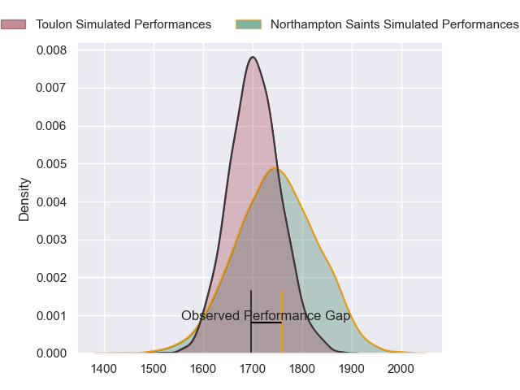
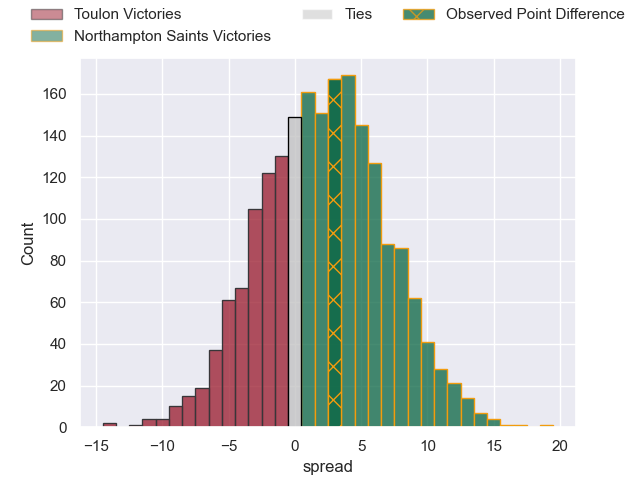
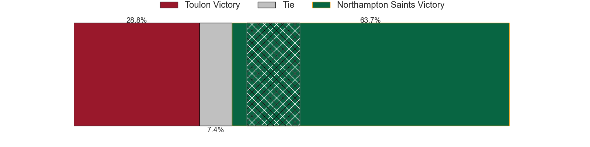
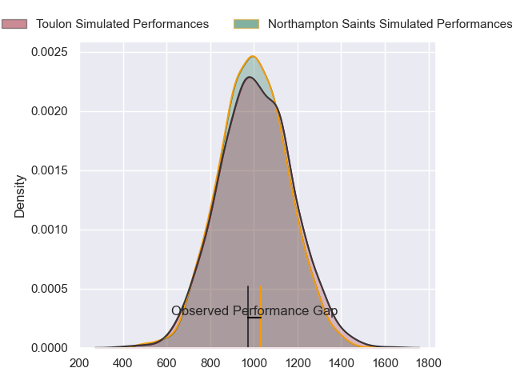
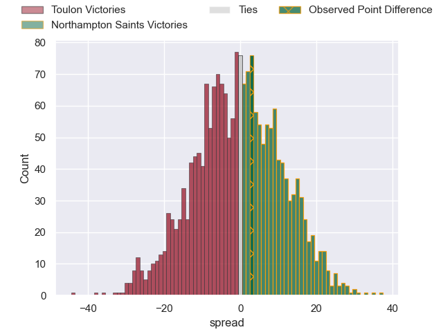
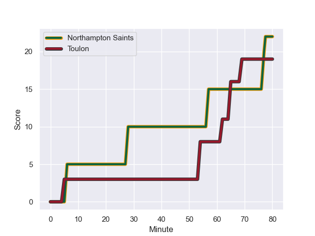
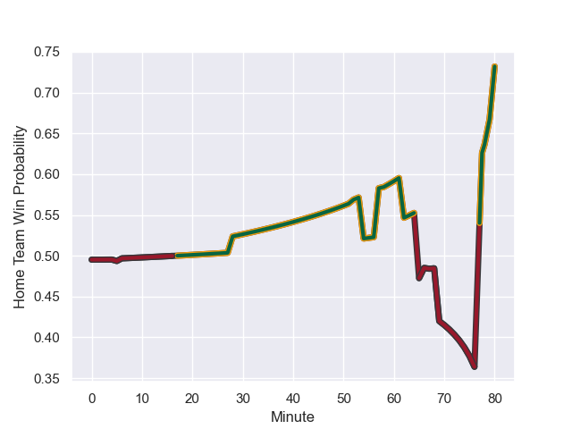

---  
layout: page  
title: Toulon at Northampton Saints; 19-22  
date: 2023-12-15 18:00:00 -0500  
categories: "European Rugby Champions Cup 2023" match review  
---
# Toulon at Northampton Saints; 19-22

# Club Level Predictions

The first set of predictions treats a club as the smallest object, as the club develops its members, organizes a gameplan, and deploys its players as needed for each match. This club model has a prediction of 0.557, which translates to predicting Northampton Saints to win by 2.0.

Each club has a rating and a rating deviation (similar to a Glicko rating), and expected performances can be generated. This allows for simulated matches and spreads like the ones below.
## Projected Performances - Club Model

## Projected Spreads - Club Model

## Projected Results - Club Model

# Player Level Predictions - Version 2

Treating teams instead as an entity made up of the currently active players, I have ratings for each player in an altogether different system. These can be combined to form team ratings once teamsheets are announced, weighting starters a bit higher than the reserves. After the match is played, players can be weighted by their minutes on the field, allowing for an accurate measure of the team's composition. With these compiled team ratings, we can make predictions, measure inaccuracy, and update the individual player ratings.
## Prediction with Player Minutes: Toulon by 0.2

Toulon by 5.1 on a neutral field
## Prediction without Player Minutes: Toulon by 0.8

Toulon by 5.7 on a neutral pitch

## Projected Performances - Player Model

## Projected Spreads - Player Model

## Projected Results - Player Model

## Scores over Time

## Win Probability over Time

There were 9 large changes in win probability in this match

|   Away Minutes | Away Player            |   Away elo |   Number |   Home elo | Home Player        |   Home Minutes |
|---------------:|:-----------------------|-----------:|---------:|-----------:|:-------------------|---------------:|
|             44 | Dany Priso             |      75.06 |        1 |      64.29 | Ethan Waller       |             69 |
|             44 | Jack Singleton         |      82.85 |        2 |      55.87 | Curtis Langdon     |             58 |
|             62 | Kieran Brookes         |      40.38 |        3 |      11.78 | Trevor Davison     |             66 |
|             68 | Matthias Halagahu      |      45.95 |        4 |      66.09 | Temo Mayanavanua   |             58 |
|             80 | David Ribbans          |      75.51 |        5 |      77.2  | Alex Moon          |             80 |
|             80 | Esteban Abadie         |      42.53 |        6 |      88.9  | Courtney Lawes     |             80 |
|             80 | Charles Ollivon        |     113.3  |        7 |      81.02 | Tom Pearson        |             62 |
|             50 | Selevasio Tolofua      |      81.7  |        8 |      81.12 | Sam Graham         |             80 |
|             80 | Ben White              |      64.98 |        9 |      67.84 | Alex Mitchell      |             80 |
|             80 | Enzo Herve             |      66.3  |       10 |      43.68 | Fin Smith          |             80 |
|             80 | Gabin Villiere         |      76.91 |       11 |      61.31 | George Hendy       |             25 |
|             80 | Jérémy Sinzelle        |      43.4  |       12 |      52.96 | Tom Litchfield     |             80 |
|             80 | Seta Tuicuvu           |      47.12 |       13 |      66.04 | Tommy Freeman      |             80 |
|             80 | Leicester Fainga'anuku |      86.45 |       14 |      -2.58 | Tom Seabrook       |             42 |
|             80 | Melvyn Jaminet         |      65.5  |       15 |      62.26 | George Furbank     |             80 |
|             36 | Christopher Tolofua    |      83.79 |       16 |      46.65 | Tarek Haffar       |             11 |
|             36 | Jean-Baptiste Gros     |      86.39 |       17 |      91.08 | Paul Hill          |             14 |
|             18 | Emerick Setiano        |      70.4  |       18 |      57.25 | Sam Matavesi       |             22 |
|             12 | Adrien Warion          |      35.64 |       19 |      47.11 | Tom Lockett        |             22 |
|             30 | Mattéo Le Corvec       |      46.75 |       20 |      50.77 | Juarno Augustus    |             18 |
|            nan | nan                    |     nan    |       21 |      73.99 | Ollie Sleightholme |             27 |
|            nan | nan                    |     nan    |       22 |      35.85 | Charlie Savala     |             38 |
|            nan | nan                    |     nan    |       23 |      11.74 | Tom James          |             28 |

