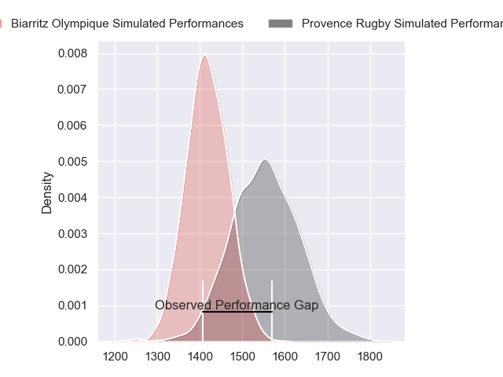
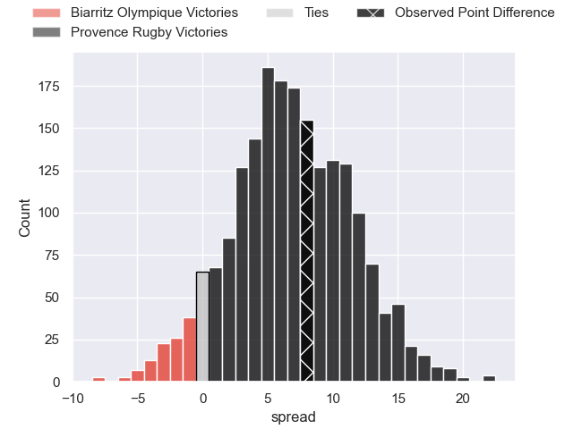
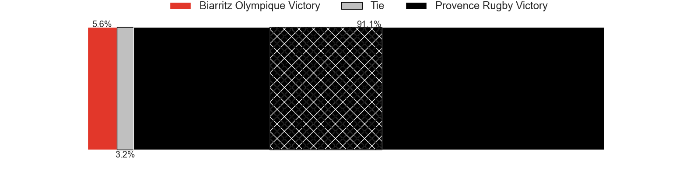
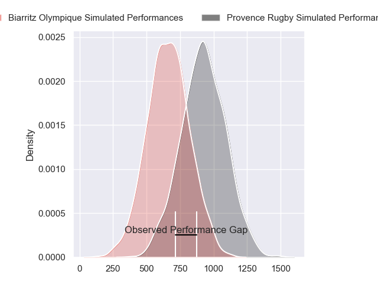
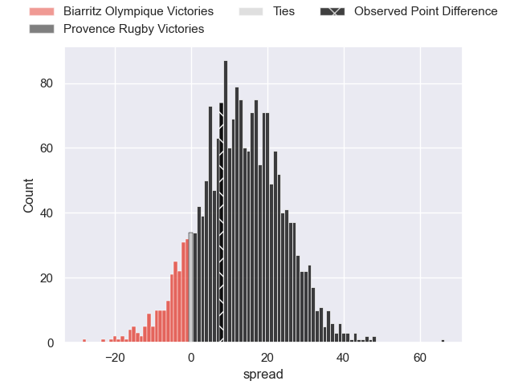
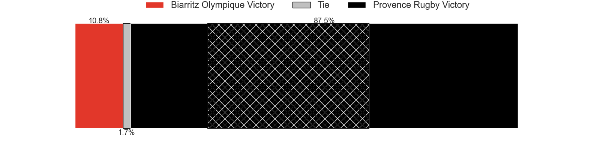
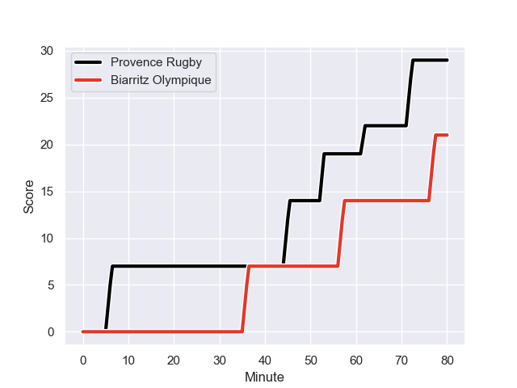
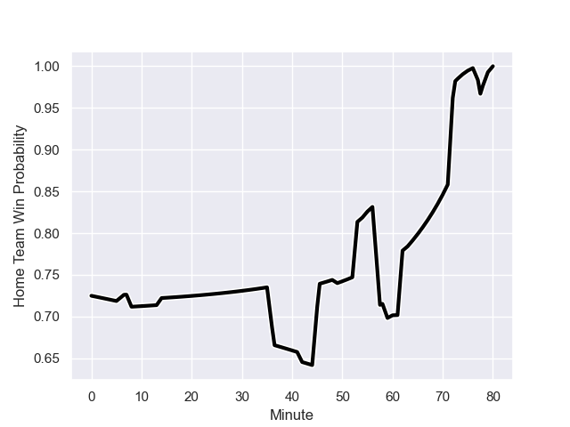

---  
layout: page  
title: Biarritz Olympique at Provence Rugby; 21-29  
date: 2023-12-15 18:00:00 -0500  
categories: "Pro D2 2023" match review  
---
# Biarritz Olympique at Provence Rugby; 21-29

# Club Level Predictions

The first set of predictions treats a club as the smallest object, as the club develops its members, organizes a gameplan, and deploys its players as needed for each match. This club model has a prediction of 0.683, which translates to predicting Provence Rugby to win by 6.7.

Each club has a rating and a rating deviation (similar to a Glicko rating), and expected performances can be generated. This allows for simulated matches and spreads like the ones below.
## Projected Performances - Club Model

## Projected Spreads - Club Model

## Projected Results - Club Model

# Player Level Predictions - Version 2

Treating teams instead as an entity made up of the currently active players, I have ratings for each player in an altogether different system. These can be combined to form team ratings once teamsheets are announced, weighting starters a bit higher than the reserves. After the match is played, players can be weighted by their minutes on the field, allowing for an accurate measure of the team's composition. With these compiled team ratings, we can make predictions, measure inaccuracy, and update the individual player ratings.
## Prediction with Player Minutes: Provence Rugby by 10.7

Provence Rugby by 6.6 on a neutral field
## Prediction without Player Minutes: Provence Rugby by 11.8

Provence Rugby by 7.7 on a neutral pitch

## Projected Performances - Player Model

## Projected Spreads - Player Model

## Projected Results - Player Model

## Scores over Time

## Win Probability over Time

There were 8 large changes in win probability in this match

|   Away Minutes | Away Player         |   Away elo |   Number |   Home elo | Home Player           |   Home Minutes |
|---------------:|:--------------------|-----------:|---------:|-----------:|:----------------------|---------------:|
|             63 | Giorgi Nutsubidze   |      34.72 |        1 |      47.4  | Federico Wegrzyn      |             69 |
|             63 | Thomas Sauveterre   |      53.36 |        2 |      65.7  | Lucas Martin          |             63 |
|             42 | Alfie Petch         |      32.35 |        3 |     105.19 | Tomas Francis         |             59 |
|             80 | Charlie Matthews    |      67.8  |        4 |      15.82 | Theo Hannoyer         |             80 |
|             53 | Adrian Motoc        |       1.3  |        5 |      52.45 | Josh Tyrell           |             80 |
|             80 | Temo Matiu          |      46.75 |        6 |      64.76 | Teimana Harrison      |              8 |
|             49 | Charlie Francoz     |      26.75 |        7 |      74.39 | Bilel Taieb           |             80 |
|             80 | Tornike Jalagonia   |      31.57 |        8 |      44.43 | Malohi Suta           |             80 |
|             53 | Kerman Aurrekoetxea |      46.83 |        9 |      48.66 | Arthur Coville        |             61 |
|             80 | Billy Searle        |      18.64 |       10 |      64.69 | Jimmy Gopperth        |             80 |
|             80 | Baptiste Fariscot   |      50.13 |       11 |      45.53 | Eto Bainivalu         |             80 |
|             57 | Yann David          |      81.76 |       12 |      88.29 | Kaveinga Finau        |             80 |
|             80 | Jonathan Joseph     |      73.81 |       13 |      48.36 | Louis Marrou          |             55 |
|             80 | Zach Kibirige       |      29.9  |       14 |      60.91 | Sione Tui             |             70 |
|             80 | Joe Jonas           |      57.26 |       15 |      29.78 | Adrien Lapegue-Lafaye |             80 |
|             38 | Mohamed Haouas      |      52.3  |       16 |      41.63 | Nicolas Mousties      |              6 |
|             31 | Simon Augry         |      41.26 |       17 |      54.83 | Clément Chartier      |             66 |
|             27 | Imanol Biscay       |      44.23 |       18 |      54.45 | Atila Septar          |             25 |
|             27 | Johnny Dyer         |      13.05 |       19 |      50.42 | Paul Mallez           |             21 |
|             23 | Tyler Morgan        |      68.79 |       20 |      38.99 | Joris Cazenave        |             19 |
|             17 | Killian Taofifenua  |      40.28 |       21 |      43.91 | Jean Charles Orioli   |             17 |
|             17 | Brendan Lebrun      |      36.95 |       22 |      44.22 | Thomas Vernet         |             11 |
|            nan | nan                 |     nan    |       23 |      50.1  | Enzo Selponi          |             10 |

