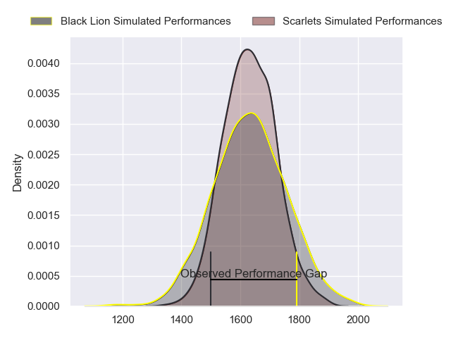
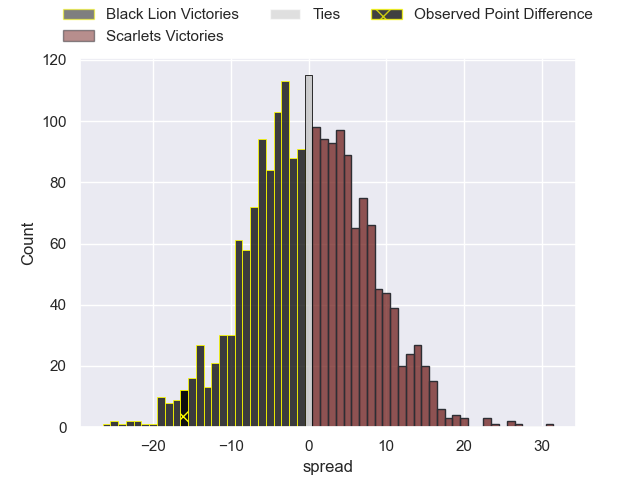
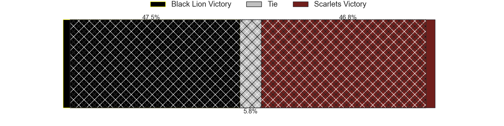
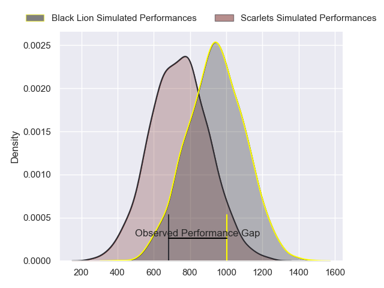
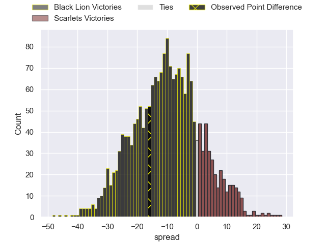
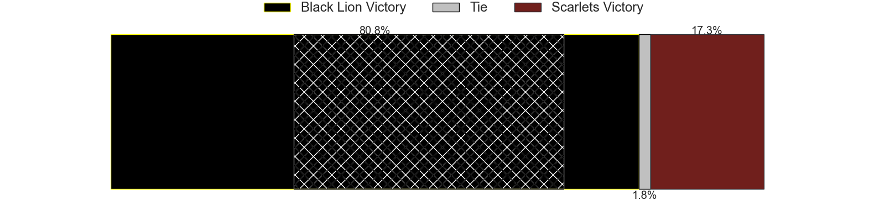
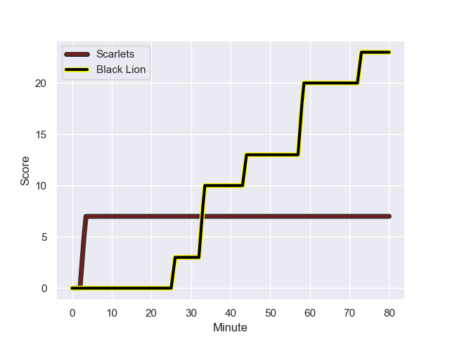
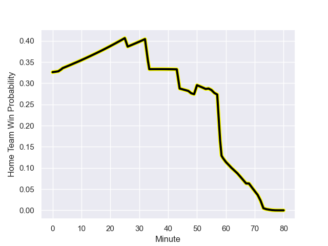

---  
layout: page  
title: Black Lion at Scarlets; 23-7  
date: 2023-12-15 18:00:00 -0500  
categories: "European Rugby Challenge Cup 2023" match review  
---
# Black Lion at Scarlets; 23-7

# Club Level Predictions

The first set of predictions treats a club as the smallest object, as the club develops its members, organizes a gameplan, and deploys its players as needed for each match. This club model has a prediction of 0.495, which translates to predicting Black Lion to win by 0.2.

Each club has a rating and a rating deviation (similar to a Glicko rating), and expected performances can be generated. This allows for simulated matches and spreads like the ones below.
## Projected Performances - Club Model

## Projected Spreads - Club Model

## Projected Results - Club Model

# Player Level Predictions - Version 2

Treating teams instead as an entity made up of the currently active players, I have ratings for each player in an altogether different system. These can be combined to form team ratings once teamsheets are announced, weighting starters a bit higher than the reserves. After the match is played, players can be weighted by their minutes on the field, allowing for an accurate measure of the team's composition. With these compiled team ratings, we can make predictions, measure inaccuracy, and update the individual player ratings.
## Prediction with Player Minutes: Black Lion by 8.0

Black Lion by 12.3 on a neutral field
## Prediction without Player Minutes: Black Lion by 7.4

Black Lion by 11.6 on a neutral pitch

## Projected Performances - Player Model

## Projected Spreads - Player Model

## Projected Results - Player Model

## Scores over Time

## Win Probability over Time

There were 4 large changes in win probability in this match

|   Away Minutes | Away Player             |   Away elo |   Number |   Home elo | Home Player         |   Home Minutes |
|---------------:|:------------------------|-----------:|---------:|-----------:|:--------------------|---------------:|
|             63 | Dato Abdushelishvili    |      52.51 |        1 |      37.09 | Steffan Thomas      |             68 |
|             60 | Beka Mamrikishvili      |      36.4  |        2 |      22.66 | Shaun Evans         |             50 |
|             56 | Giorgi Chkhartishvili   |      50.14 |        3 |      34.78 | Joe Jones           |             48 |
|             80 | Nodar Cheishvili        |     114.29 |        4 |      31.72 | Alex Craig          |             80 |
|             56 | Grigor Kerdikoshvili    |      35.45 |        5 |      19.19 | Jac Price           |             59 |
|             68 | Giorgi Kervalishvili    |      44.67 |        6 |      39.31 | Ben Williams        |             80 |
|             80 | Sandro Mamamtavrishvili |      73.4  |        7 |      38.2  | Teddy Leatherbarrow |             80 |
|             80 | Luka Ivanishvili        |      65.84 |        8 |     104.97 | Vaea Fifita         |             72 |
|             75 | Tengiz Peranidze        |      64.92 |        9 |      34.6  | Gareth Davies       |             64 |
|             80 | Luka Matkava            |      77.76 |       10 |      19.82 | Ioan Lloyd          |             80 |
|             54 | Otar Lashki             |      56.45 |       11 |      40.92 | Ryan Conbeer        |             68 |
|             80 | Merab Sharikadze        |      62.25 |       12 |      50.18 | Eddie James         |             80 |
|             80 | Tornike Kakhoidze       |      53.25 |       13 |      65.33 | Johnny Williams     |             68 |
|             80 | Aka Tabutsadze          |      78.6  |       14 |      65.48 | Steffan Evans       |             80 |
|             72 | Mirian Modebadze        |      81.06 |       15 |      35.06 | Tom Rogers          |             80 |
|             17 | Aliko Shamilishvili     |      46.65 |       16 |      47.99 | Sam O'Connor        |             12 |
|             24 | Bachuki Tchumbadze      |      46.65 |       17 |      27.52 | Harri O'Connor      |             32 |
|             20 | Gela Makharashvili      |      46.65 |       18 |      73.42 | Eduan Swart         |             30 |
|             24 | Demuri Epremidze        |      46.65 |       19 |       9.88 | Morgan Jones        |             21 |
|             12 | Saba Kurtanidze         |      46.65 |       20 |      39.07 | Ed Scragg           |              8 |
|              5 | Giorgi Margalitadze     |      52.19 |       21 |      42.11 | Archie Hughes       |             16 |
|             26 | Luka Tsirekidze         |      46.65 |       22 |      42.1  | Charlie Titcombe    |             12 |
|              8 | Giorgi Jobava           |      46.65 |       23 |      45.89 | Ioan Nicholas       |             12 |

