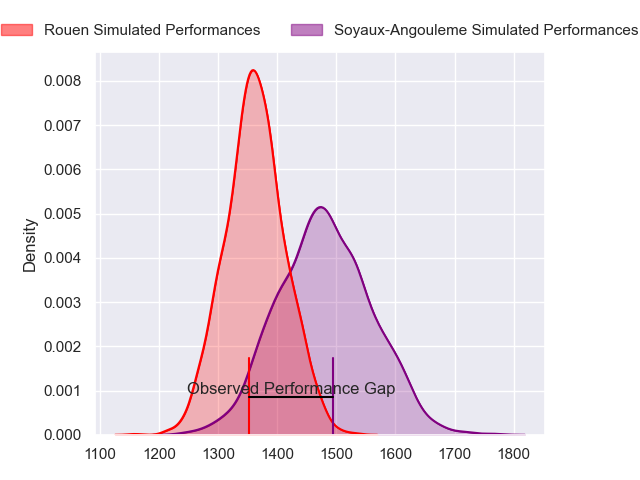
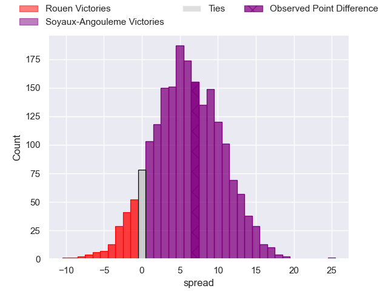
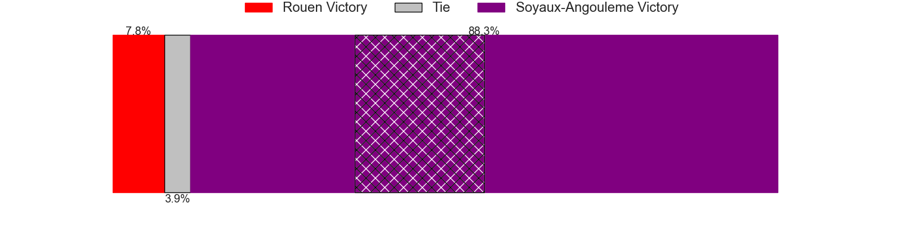
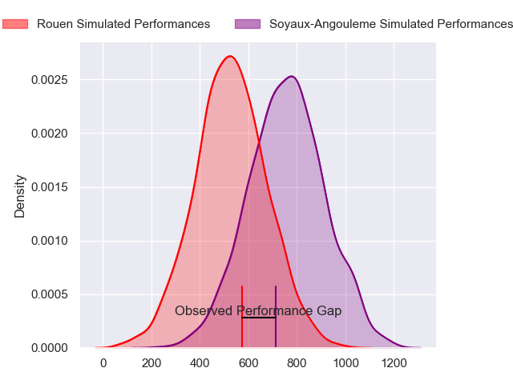
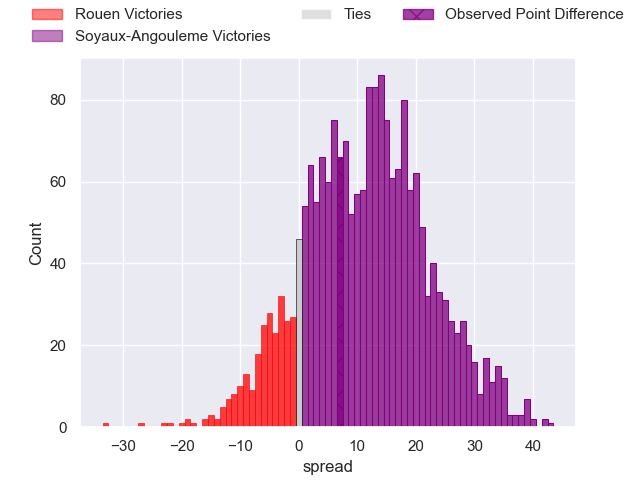
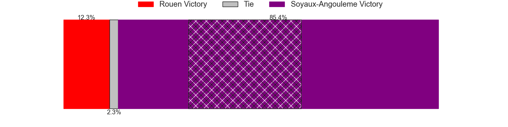
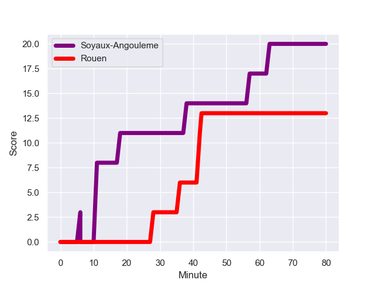
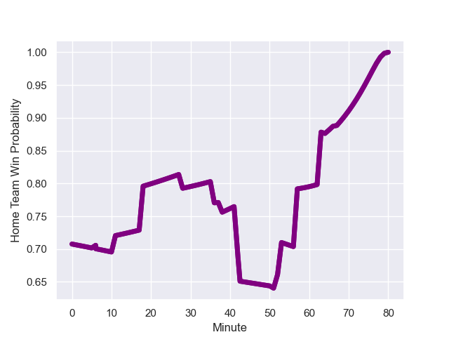

---  
layout: page  
title: Rouen at Soyaux-Angouleme; 13-20  
date: 2023-12-15 18:00:00 -0500  
categories: "Pro D2 2023" match review  
---
# Rouen at Soyaux-Angouleme; 13-20

# Club Level Predictions

The first set of predictions treats a club as the smallest object, as the club develops its members, organizes a gameplan, and deploys its players as needed for each match. This club model has a prediction of 0.663, which translates to predicting Soyaux-Angouleme to win by 6.0.

Each club has a rating and a rating deviation (similar to a Glicko rating), and expected performances can be generated. This allows for simulated matches and spreads like the ones below.
## Projected Performances - Club Model

## Projected Spreads - Club Model

## Projected Results - Club Model

# Player Level Predictions - Version 2

Treating teams instead as an entity made up of the currently active players, I have ratings for each player in an altogether different system. These can be combined to form team ratings once teamsheets are announced, weighting starters a bit higher than the reserves. After the match is played, players can be weighted by their minutes on the field, allowing for an accurate measure of the team's composition. With these compiled team ratings, we can make predictions, measure inaccuracy, and update the individual player ratings.
## Prediction with Player Minutes: Soyaux-Angouleme by 9.7

Soyaux-Angouleme by 6.0 on a neutral field
## Prediction without Player Minutes: Soyaux-Angouleme by 8.6

Soyaux-Angouleme by 4.9 on a neutral pitch

## Projected Performances - Player Model

## Projected Spreads - Player Model

## Projected Results - Player Model

## Scores over Time

## Win Probability over Time

There were 7 large changes in win probability in this match

|   Away Minutes | Away Player        |   Away elo |   Number |   Home elo | Home Player            |   Home Minutes |
|---------------:|:-------------------|-----------:|---------:|-----------:|:-----------------------|---------------:|
|             52 | Elias El Ansari    |      27.92 |        1 |      53.4  | Omar Odishvili         |             51 |
|             52 | Mathieu Bonnot     |      48.37 |        2 |      45.27 | Patxi Bidart           |             57 |
|             52 | Soso Bekoshvili    |      57.84 |        3 |      20.21 | Yassine Boutemane      |             53 |
|             80 | Will Witty         |      21.51 |        4 |      46.04 | Ian Kitwanga           |             80 |
|             53 | Jimi Maximin       |      35.02 |        5 |      52.36 | Sikeli Nabou           |             53 |
|             80 | Tienie Burger      |      46.67 |        6 |      57    | Germain Burgaud        |             80 |
|             80 | Samuel Maximin     |      25.82 |        7 |      48.64 | Hubert Texier          |             80 |
|             66 | Tino Mapapalangi   |      15.85 |        8 |      42.94 | Alexander Masibaka     |             57 |
|             67 | Florent Campeggia  |      33.12 |        9 |      11.71 | Adrien Bau             |             80 |
|             80 | Franck Pourteau    |      58.58 |       10 |      56.36 | Ben Botica             |             78 |
|             80 | Paul Vallee        |      45.5  |       11 |      52.41 | Matthys Gratien        |             80 |
|             80 | JT Jackson         |      21.8  |       12 |      33.2  | Mathis Lafon           |             53 |
|             38 | Opetera Peleseuma  |     -25.44 |       13 |      61.16 | Akuila Joeli Tabualevu |             64 |
|             18 | Kevin Bly          |      80.86 |       14 |      34.51 | Pierre Lafitte         |             80 |
|             80 | Baptiste Mouchous  |      53.36 |       15 |      45.08 | Rémi Brosset           |             80 |
|             62 | Alex Luatua        |      12.15 |       16 |      49.38 | Luca Tabarot           |             29 |
|             42 | Taylor Gontineac   |      63.92 |       17 |      32.23 | Matt Beukeboom         |             27 |
|             28 | Jeremie Maurouard  |       3.11 |       18 |      58.83 | Nasoni Naqiri Kunavore |             27 |
|             28 | Cody Thomas        |      39.19 |       19 |      48.29 | Omar Dahir             |             27 |
|             28 | Antoine Fournier   |      30.97 |       20 |      48.2  | German Kessler         |             23 |
|             27 | John-Charles Astle |      17.31 |       21 |      60.24 | Nicolas Martins        |             23 |
|             14 | Lucas Costa        |      55.64 |       22 |      34.94 | Corentin Glenat        |             16 |
|             13 | Maxime Sidobre     |      58.81 |       23 |      34.55 | Alexis Levron          |              2 |

