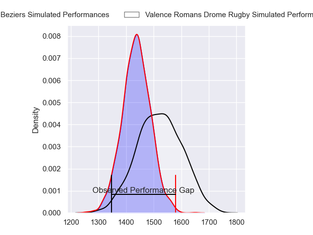
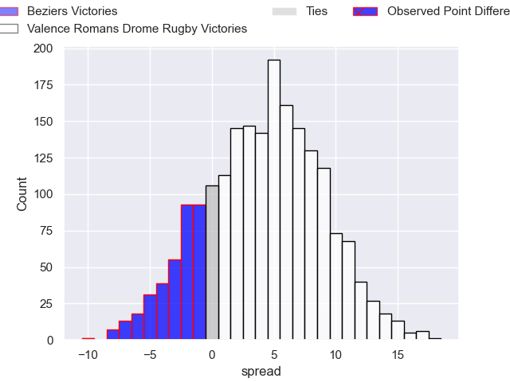
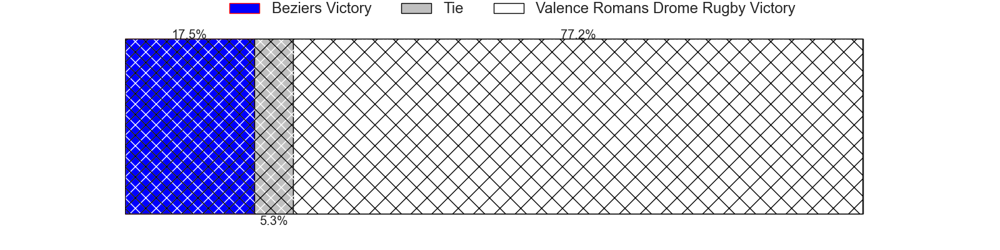
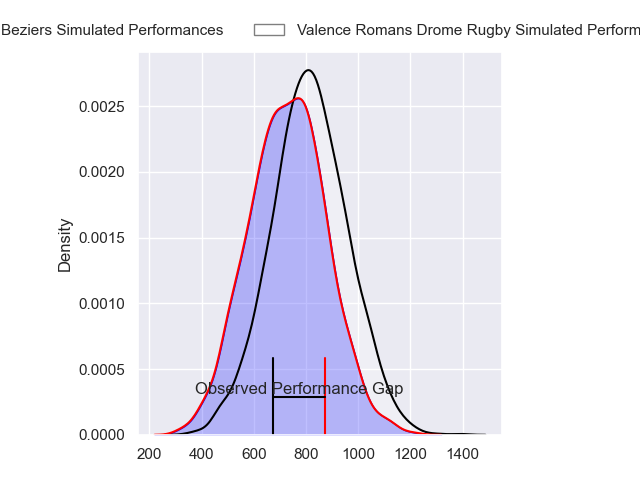
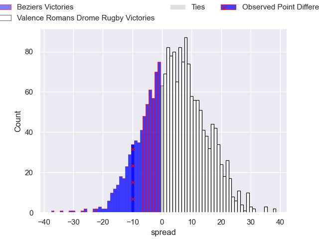
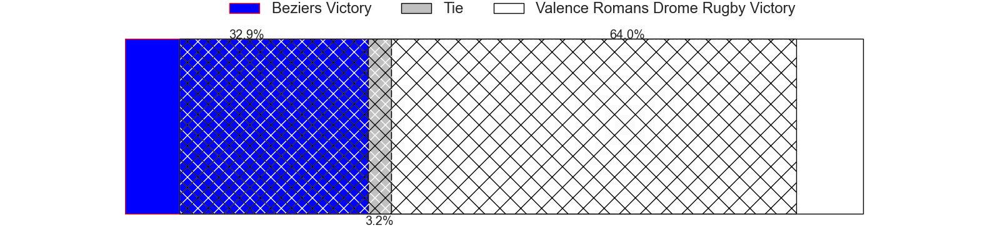
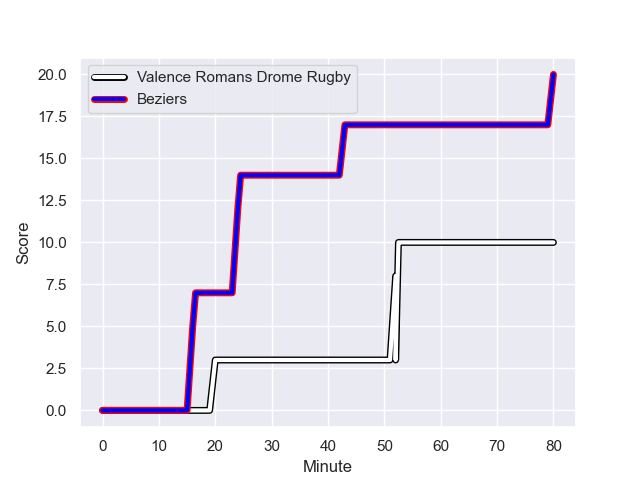
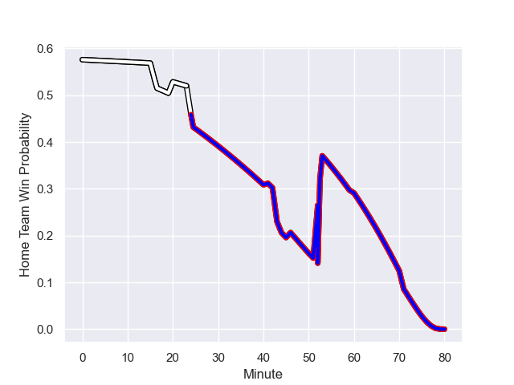

---  
layout: page  
title: Beziers at Valence Romans Drome Rugby; 20-10  
date: 2023-12-15 18:00:00 -0500  
categories: "Pro D2 2023" match review  
---
# Beziers at Valence Romans Drome Rugby; 20-10

# Club Level Predictions

The first set of predictions treats a club as the smallest object, as the club develops its members, organizes a gameplan, and deploys its players as needed for each match. This club model has a prediction of 0.615, which translates to predicting Valence Romans Drome Rugby to win by 4.1.

Each club has a rating and a rating deviation (similar to a Glicko rating), and expected performances can be generated. This allows for simulated matches and spreads like the ones below.
## Projected Performances - Club Model

## Projected Spreads - Club Model

## Projected Results - Club Model

# Player Level Predictions - Version 2

Treating teams instead as an entity made up of the currently active players, I have ratings for each player in an altogether different system. These can be combined to form team ratings once teamsheets are announced, weighting starters a bit higher than the reserves. After the match is played, players can be weighted by their minutes on the field, allowing for an accurate measure of the team's composition. With these compiled team ratings, we can make predictions, measure inaccuracy, and update the individual player ratings.
## Prediction with Player Minutes: Valence Romans Drome Rugby by 3.4

Beziers by 0.1 on a neutral field
## Prediction without Player Minutes: Valence Romans Drome Rugby by 2.9

Beziers by 0.4 on a neutral pitch

## Projected Performances - Player Model

## Projected Spreads - Player Model

## Projected Results - Player Model

## Scores over Time

## Win Probability over Time

There were 9 large changes in win probability in this match

|   Away Minutes | Away Player        |   Away elo |   Number |   Home elo | Home Player         |   Home Minutes |
|---------------:|:-------------------|-----------:|---------:|-----------:|:--------------------|---------------:|
|             41 | Marco Trauth       |      52.75 |        1 |      35.55 | Anthony Aléo        |             46 |
|             60 | Wilmar Arnoldi     |      49.69 |        2 |      52.68 | Dorian Marco Pena   |             46 |
|             53 | Yannick Arroyo     |      50.65 |        3 |      42.74 | Gareth Milasinovich |             46 |
|             53 | Hans N'kinsi       |       5.95 |        4 |      24.25 | Ryan McCauley       |             80 |
|             80 | John Madigan       |      21.62 |        5 |      39.27 | Yassine Maamry      |             46 |
|             53 | Gillian Benoy      |      22.8  |        6 |      12.03 | Éloi Massot         |             53 |
|             80 | Clement Ancely     |      34.48 |        7 |      41.96 | Loan Real           |             71 |
|             80 | Otonuku Jr Pauta   |      55.16 |        8 |      64.52 | Ioane Iashagashvili |             80 |
|             80 | Samuel Marques     |      67.49 |        9 |      63.48 | Thomas Lhusero      |             51 |
|             80 | Charly Malie       |      54.66 |       10 |      20.79 | Lucas Meret         |             80 |
|             53 | Maxime Espeut      |      40.28 |       11 |      59.86 | Mosese Mawalu       |             80 |
|             80 | Taleta Tupuola     |      53.79 |       12 |      55.16 | Ben Neiceru         |             80 |
|             44 | Paul Recor         |      58.55 |       13 |      14.92 | Mathieu Guillomot   |             46 |
|             80 | Raffaele Storti    |      81.25 |       14 |      87.88 | Adam Vargas         |             80 |
|             80 | Gabin Lorre        |      73.53 |       15 |      83.76 | Charles Bouldoire   |             80 |
|             39 | Youssef Amrouni    |      38.65 |       16 |      51.53 | Andrea Pontanier    |             34 |
|             36 | Watisoni Votu      |      78.08 |       17 |       0.1  | Cyril Deligny       |             34 |
|             27 | William van Bost   |      43.05 |       18 |      49.86 | Florian Goumat      |             34 |
|             27 | Pierrick Gunther   |     -11.34 |       19 |      59.77 | Anatole Pauvert     |             34 |
|             27 | Victor Dreuille    |      36.97 |       20 |      56.96 | Kevin Goze          |             34 |
|             27 | Jon Zabala Arrieta |      61.44 |       21 |      65.42 | Tim Menzel          |             29 |
|             20 | Yvann Lalevee      |      56.33 |       22 |      63.55 | Darrell Dyer        |             27 |
|            nan | nan                |     nan    |       23 |      48.27 | Charles Brayer      |              9 |

