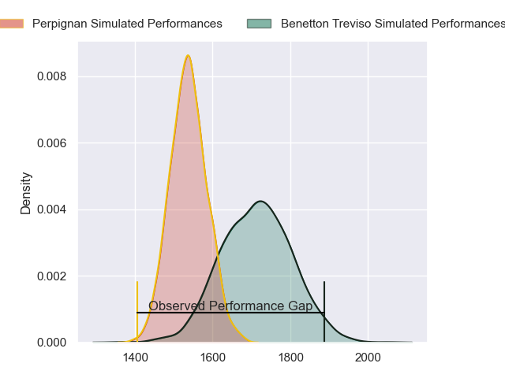
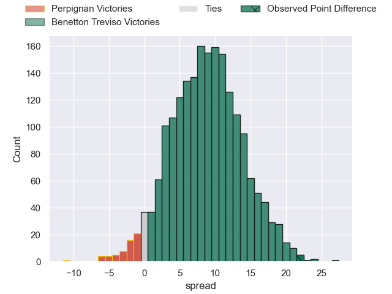
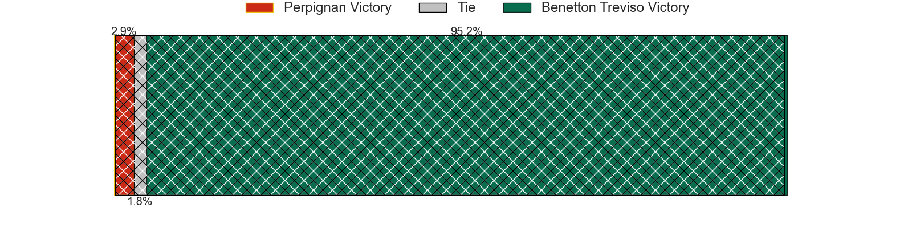
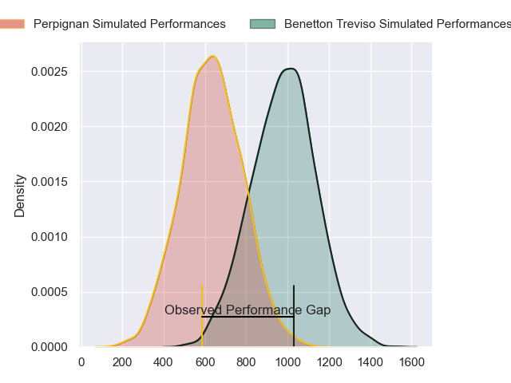
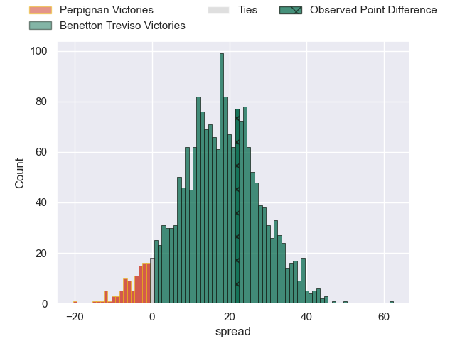
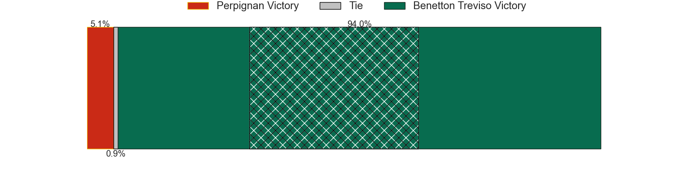
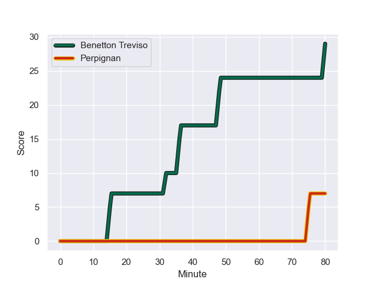
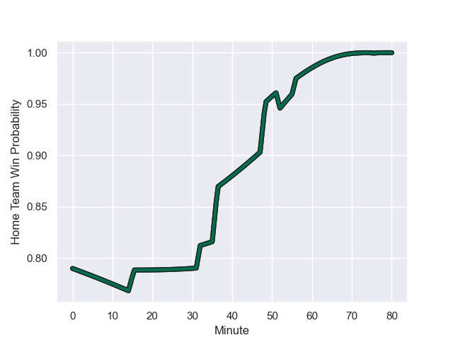

---  
layout: page  
title: Perpignan at Benetton Treviso; 7-29  
date: 2023-12-16 18:00:00 -0500  
categories: "European Rugby Challenge Cup 2023" match review  
---
# Perpignan at Benetton Treviso; 7-29

# Club Level Predictions

The first set of predictions treats a club as the smallest object, as the club develops its members, organizes a gameplan, and deploys its players as needed for each match. This club model has a prediction of 0.731, which translates to predicting Benetton Treviso to win by 8.8.

Each club has a rating and a rating deviation (similar to a Glicko rating), and expected performances can be generated. This allows for simulated matches and spreads like the ones below.
## Projected Performances - Club Model

## Projected Spreads - Club Model

## Projected Results - Club Model

# Player Level Predictions - Version 2

Treating teams instead as an entity made up of the currently active players, I have ratings for each player in an altogether different system. These can be combined to form team ratings once teamsheets are announced, weighting starters a bit higher than the reserves. After the match is played, players can be weighted by their minutes on the field, allowing for an accurate measure of the team's composition. With these compiled team ratings, we can make predictions, measure inaccuracy, and update the individual player ratings.
## Prediction with Player Minutes: Benetton Treviso by 14.5

Benetton Treviso by 10.6 on a neutral field
## Prediction without Player Minutes: Benetton Treviso by 14.3

Benetton Treviso by 10.3 on a neutral pitch

## Projected Performances - Player Model

## Projected Spreads - Player Model

## Projected Results - Player Model

## Scores over Time

## Win Probability over Time

There were 2 large changes in win probability in this match

|   Away Minutes | Away Player           |   Away elo |   Number |   Home elo | Home Player         |   Home Minutes |
|---------------:|:----------------------|-----------:|---------:|-----------:|:--------------------|---------------:|
|             50 | Akato Fakatika        |      37.11 |        1 |      56.56 | Mirco Spagnolo      |             56 |
|             50 | Vakhtang Jintcharadze |      46.51 |        2 |      42.74 | Bautista Bernasconi |             56 |
|             56 | Arthur Joly           |     102.07 |        3 |      60.65 | Tiziano Pasquali    |             56 |
|             52 | Tristan Labouteley    |      44.13 |        4 |      62.66 | Edoardo Iachizzi    |             69 |
|             50 | Shahn Eru             |      -0.53 |        5 |      62.99 | Eli Snyman          |             60 |
|             80 | Lucas Bachelier       |      63.25 |        6 |      56.81 | Alessandro Izekor   |             80 |
|             56 | Alan Brazo            |      54.33 |        7 |      61.59 | Sebastian Negri     |             80 |
|             80 | Valentin Moro         |      43.15 |        8 |      84.79 | Lorenzo Cannone     |             50 |
|             80 | Matteo Rodor          |      39.62 |        9 |      40.17 | Andy Uren           |             72 |
|             72 | Jean Pascal Barraque  |      38.25 |       10 |      77.01 | Jacob Umaga         |             80 |
|             80 | Mathieu Acebes        |      78.98 |       11 |      45.63 | Onisi Ratave        |             80 |
|             80 | Edward Sawailau       |     -22.74 |       12 |      70.63 | Paolo Odogwu        |             56 |
|             56 | Afusipa Taumoepeau    |      69.47 |       13 |      86.87 | Juan Ignacio Brex   |             80 |
|             80 | Louis Dupichot        |      55.9  |       14 |      52.45 | Edoardo Padovani    |             80 |
|             80 | Boris Goutard         |       2.71 |       15 |      76.78 | Rhyno Smith         |             80 |
|             30 | Xavier Chiocci        |      35.04 |       16 |      36.79 | Filippo Alongi      |             24 |
|             30 | Victor Montgaillard   |      29.68 |       17 |      39.37 | Federico Zani       |             24 |
|             24 | Nemo Roelofse         |      40.88 |       18 |      11.11 | Siua Maile          |             24 |
|             28 | Marvin Orie           |      55.66 |       19 |      38.89 | Niccolo Cannone     |             11 |
|             30 | Mathieu Tanguy        |      28.08 |       20 |      39.2  | Riccardo Favretto   |             20 |
|             24 | Ewan Bertheau         |      26.63 |       21 |      61.08 | Leonardo Marin      |             24 |
|              8 | Lenny Viola           |      46.24 |       22 |      51.84 | Nicolo Casilio      |              8 |
|             24 | Nicola Bozzo          |      46.65 |       23 |      24.8  | Henry Time-Stowers  |             30 |

