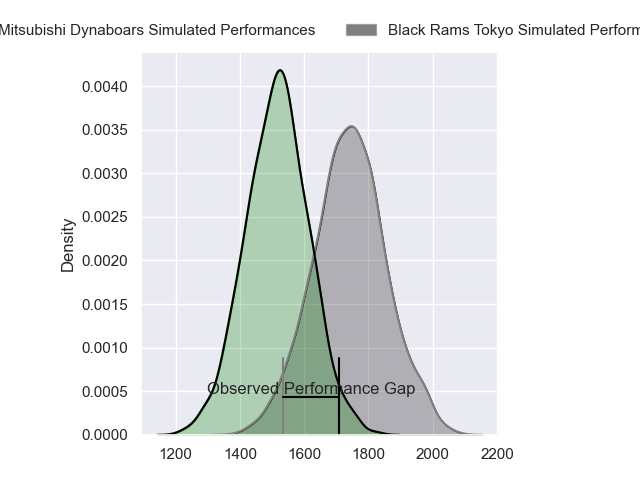
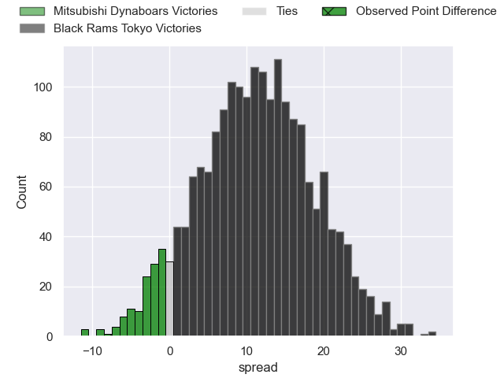
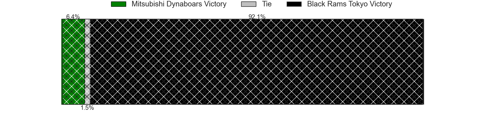
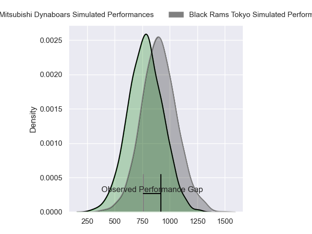
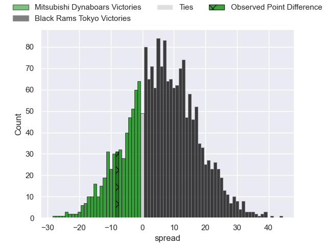
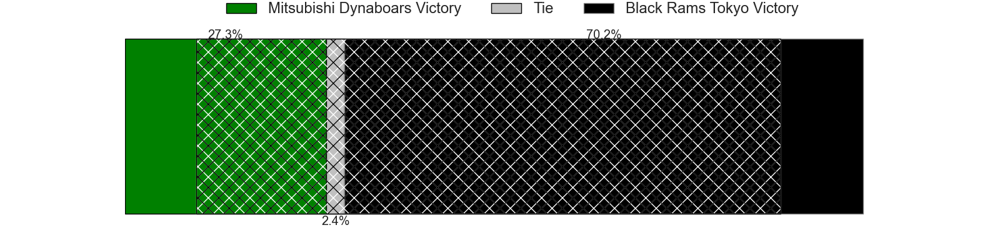
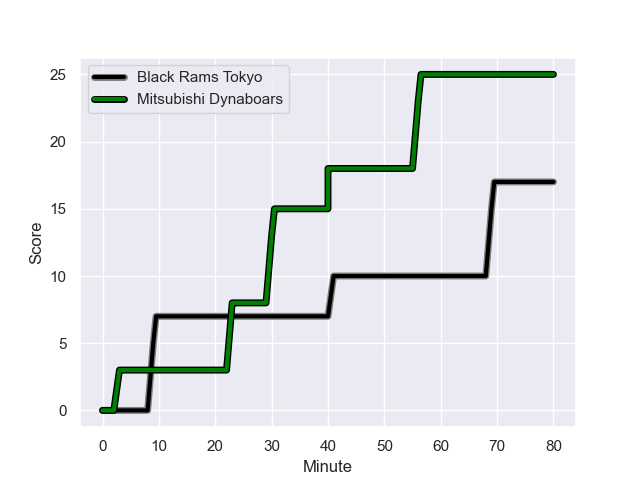
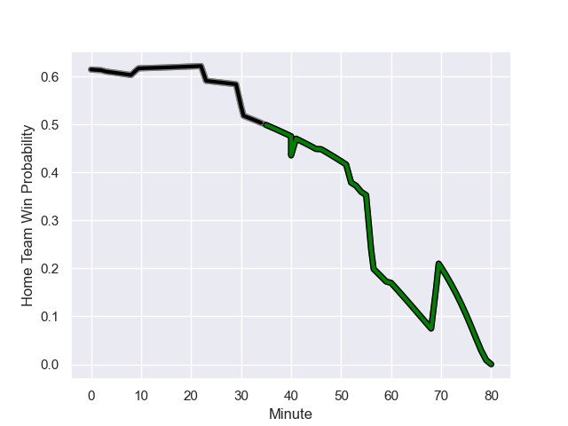

---  
layout: page  
title: Mitsubishi Dynaboars at Black Rams Tokyo; 25-17  
date: 2023-12-16 18:00:00 -0500  
categories: "Japan Rugby League One 2023" match review  
---
# Mitsubishi Dynaboars at Black Rams Tokyo; 25-17

# Club Level Predictions

The first set of predictions treats a club as the smallest object, as the club develops its members, organizes a gameplan, and deploys its players as needed for each match. This club model has a prediction of 0.773, which translates to predicting Black Rams Tokyo to win by 11.1.

Each club has a rating and a rating deviation (similar to a Glicko rating), and expected performances can be generated. This allows for simulated matches and spreads like the ones below.
## Projected Performances - Club Model

## Projected Spreads - Club Model

## Projected Results - Club Model

# Player Level Predictions - Version 2

Treating teams instead as an entity made up of the currently active players, I have ratings for each player in an altogether different system. These can be combined to form team ratings once teamsheets are announced, weighting starters a bit higher than the reserves. After the match is played, players can be weighted by their minutes on the field, allowing for an accurate measure of the team's composition. With these compiled team ratings, we can make predictions, measure inaccuracy, and update the individual player ratings.
## Prediction with Player Minutes: Black Rams Tokyo by 5.1

Black Rams Tokyo by 1.8 on a neutral field
## Prediction without Player Minutes: Black Rams Tokyo by 5.6

Black Rams Tokyo by 2.3 on a neutral pitch

## Projected Performances - Player Model

## Projected Spreads - Player Model

## Projected Results - Player Model

## Scores over Time

## Win Probability over Time

There were 10 large changes in win probability in this match

|   Away Minutes | Away Player         |   Away elo |   Number |   Home elo | Home Player        |   Home Minutes |
|---------------:|:--------------------|-----------:|---------:|-----------:|:-------------------|---------------:|
|             60 | Shunsuke Sakamoto   |      35.1  |        1 |      64.84 | Yuichiro Taniguchi |             56 |
|             80 | Yuki Miyazato       |      40.13 |        2 |      48.88 | Hinata Takei       |             61 |
|             60 | Tomoaki Ishii       |      90.85 |        3 |      48.98 | Shohei Oyama       |             66 |
|             80 | Epineri Uluiviti    |      11.71 |        4 |      38.75 | Daiki Yanagawa     |             80 |
|             54 | Walt Steenkamp      |      56.37 |        5 |       4.22 | Mike Stolberg      |             80 |
|             46 | Masataka Tsuruya    |      73.68 |        6 |      40.08 | Amato Fakatava     |             52 |
|             80 | Yusuke Sakamoto     |      44.95 |        7 |      53.1  | Shuhei Matsuhashi  |             80 |
|             61 | Jackson Hemopo      |      48.41 |        8 |      88.24 | Nathan Hughes      |             66 |
|             80 | Kota Iwamura        |      62.58 |        9 |      55.16 | Syota Yamamoto     |             54 |
|             80 | James Grayson       |      59.99 |       10 |      77.43 | Matt McGahan       |             80 |
|             80 | Honeti Taumoha'apai |      68.04 |       11 |      66.54 | Netani Vakayalia   |             80 |
|             80 | Tonishio Vaiahu     |      46.65 |       12 |     132.38 | Hadleigh Parkes    |             52 |
|             80 | Curtis Rona         |      70.71 |       13 |      35.9  | Yuta Kurihara      |             80 |
|             54 | Ben Paltridge       |      50.15 |       14 |      41.03 | Siope Lolo Tavo    |             66 |
|             80 | Kazuki Ishida       |      35.19 |       15 |      63.67 | Isaac Lucas        |             80 |
|             26 | Matt Vaega          |      57.49 |       16 |      36.53 | Taichi Chiba       |             14 |
|             34 | Kyo Yoshida         |      63.52 |       17 |      36.22 | Jacob Skeen        |             28 |
|             26 | Daniel Linde        |      46.64 |       18 |      69.58 | Kohei Horigome     |             28 |
|             20 | Akihiro Ogiso       |      48.05 |       19 |      39.52 | Takanobu Minami    |             26 |
|             20 | Kanzo Schinckel     |      46.65 |       20 |      56.89 | Kazuma Nishi       |             24 |
|             19 | Marino Mikaele-Tu'u |      43.57 |       21 |      62.11 | Ko Sato            |             19 |
|            nan | nan                 |     nan    |       22 |      46.65 | Otoya Kihara       |             14 |
|            nan | nan                 |     nan    |       23 |      55.11 | Semisi Tupou       |             14 |

