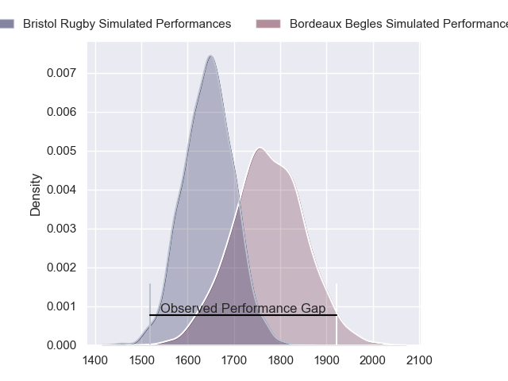
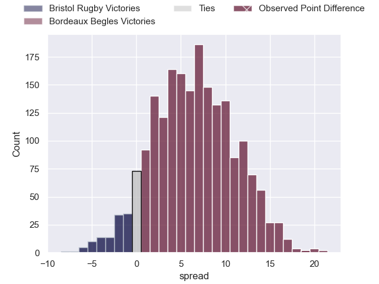
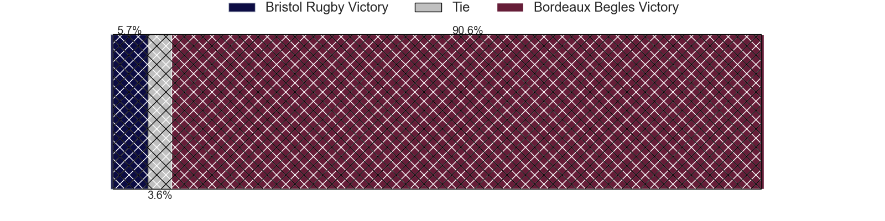
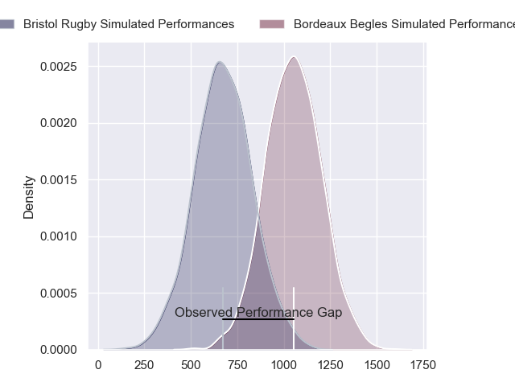
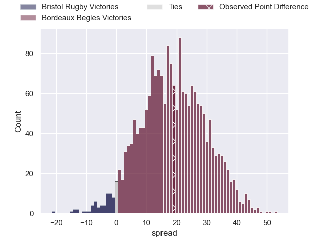
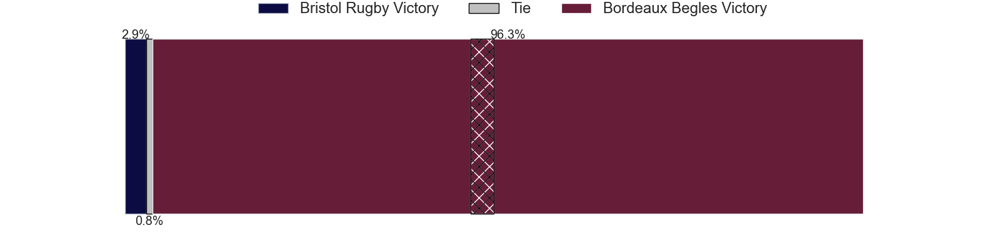
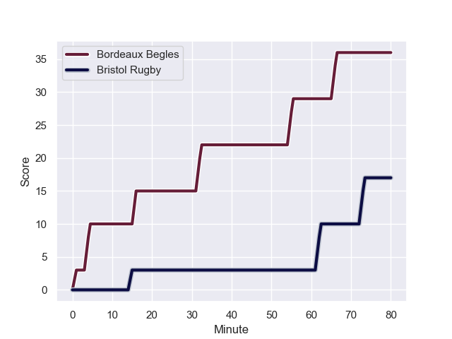
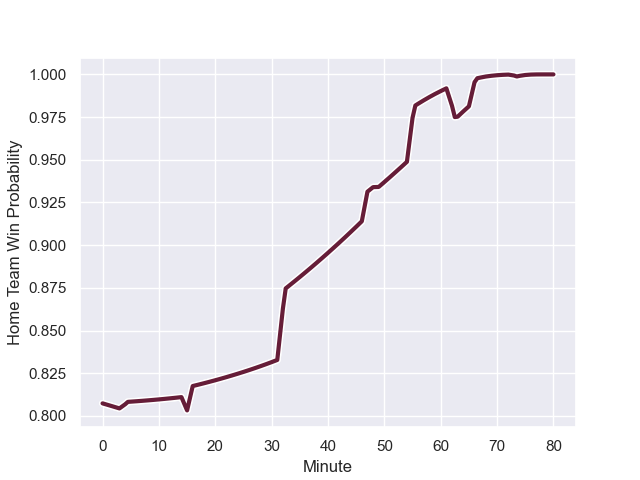

---  
layout: page  
title: Bristol Rugby at Bordeaux Begles; 17-36  
date: 2023-12-16 18:00:00 -0500  
categories: "European Rugby Champions Cup 2023" match review  
---
# Bristol Rugby at Bordeaux Begles; 17-36

# Club Level Predictions

The first set of predictions treats a club as the smallest object, as the club develops its members, organizes a gameplan, and deploys its players as needed for each match. This club model has a prediction of 0.677, which translates to predicting Bordeaux Begles to win by 6.5.

Each club has a rating and a rating deviation (similar to a Glicko rating), and expected performances can be generated. This allows for simulated matches and spreads like the ones below.
## Projected Performances - Club Model

## Projected Spreads - Club Model

## Projected Results - Club Model

# Player Level Predictions - Version 2

Treating teams instead as an entity made up of the currently active players, I have ratings for each player in an altogether different system. These can be combined to form team ratings once teamsheets are announced, weighting starters a bit higher than the reserves. After the match is played, players can be weighted by their minutes on the field, allowing for an accurate measure of the team's composition. With these compiled team ratings, we can make predictions, measure inaccuracy, and update the individual player ratings.
## Prediction with Player Minutes: Bordeaux Begles by 15.8

Bordeaux Begles by 11.1 on a neutral field
## Prediction without Player Minutes: Bordeaux Begles by 16.5

Bordeaux Begles by 11.8 on a neutral pitch

## Projected Performances - Player Model

## Projected Spreads - Player Model

## Projected Results - Player Model

## Scores over Time

## Win Probability over Time

There were 2 large changes in win probability in this match

|   Away Minutes | Away Player                 |   Away elo |   Number |   Home elo | Home Player               |   Home Minutes |
|---------------:|:----------------------------|-----------:|---------:|-----------:|:--------------------------|---------------:|
|             67 | Max Lahiff                  |      42.75 |        1 |      55.4  | Jefferson Poirot          |             57 |
|             67 | Gabriel Oghre               |      44.18 |        2 |      52.08 | Maxime Lamothe            |             57 |
|             63 | George Kloska               |      51.12 |        3 |      33.1  | Carlu Sadie               |             57 |
|             80 | Ed Holmes                   |      36.37 |        4 |      69.08 | Guido Petti               |             49 |
|             80 | Josh Caulfield              |      59.39 |        5 |      25.76 | Thomas Jolmes             |             80 |
|             68 | Joe Owen                    |      43.74 |        6 |      66.03 | Bastien Vergnes Taillefer |             49 |
|             47 | Jake Heenan                 |      48.45 |        7 |      59.83 | Mahamadou Diaby           |             49 |
|             80 | Magnus Bradbury             |      41.09 |        8 |      80.01 | Pete Samu                 |             80 |
|             69 | Sam Wolstenholme            |      40.31 |        9 |     112.81 | Maxime Lucu               |             61 |
|             80 | Sam Worsley                 |      41.41 |       10 |     102.41 | Matthieu Jalibert         |             80 |
|             61 | Kalaveti Ravouvou           |      59.24 |       11 |      61.77 | Louis Bielle-Biarrey      |             21 |
|             80 | James Williams              |      35.01 |       12 |      33.27 | Ben Tapuai                |             80 |
|             65 | Piers O'Conor               |      24.29 |       13 |      59.12 | Yoram Moefana             |             80 |
|             80 | Noah Heward                 |      44.44 |       14 |      90.32 | Damian Penaud             |             80 |
|             80 | Richard Lane                |      61.85 |       15 |      91.02 | Romain Buros              |             80 |
|             17 | Samuel Alexander Grahamslaw |      74.87 |       16 |      63.76 | Ugo Boniface              |             23 |
|             13 | Steven Longwell             |      39.11 |       17 |      60.74 | Clement Maynadier         |             23 |
|             13 | Will Capon                  |      33.95 |       18 |      54.44 | Sipili Falatea            |             23 |
|             33 | James Dun                   |      59.49 |       19 |      57.02 | Antoine Miquel            |             31 |
|             12 | Paddy Pearce                |      46.65 |       20 |      54.08 | Marko Gazzotti            |             31 |
|             11 | Oscar Lennon                |      47.43 |       21 |      52.65 | Kane Douglas              |             31 |
|             19 | Jack Bates                  |       9.07 |       22 |      14.19 | Theo Nanette              |             19 |
|             15 | Joe Jenkins                 |      48.82 |       23 |      28    | Pablo Uberti              |             59 |

