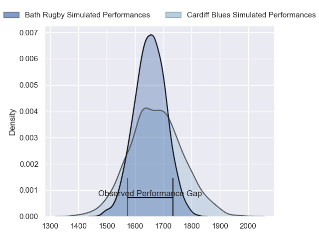
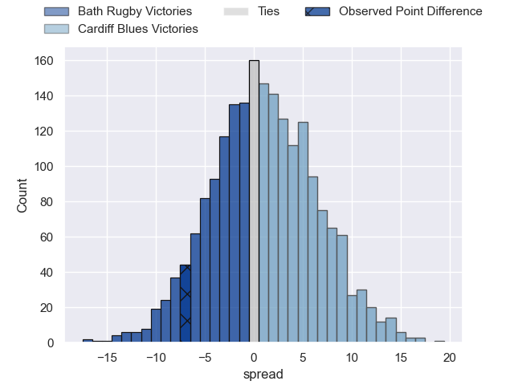
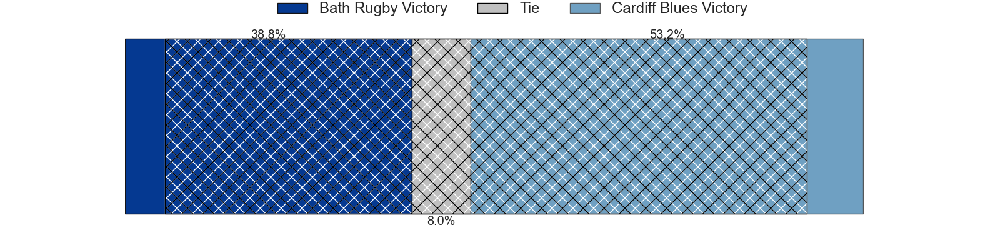
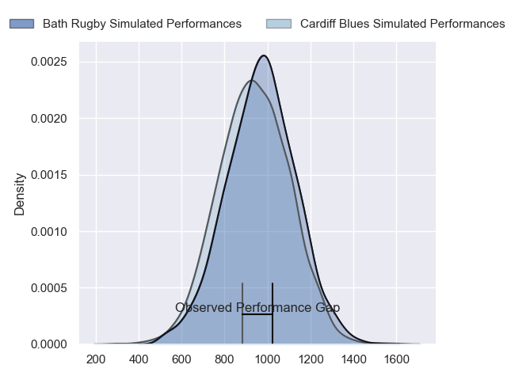
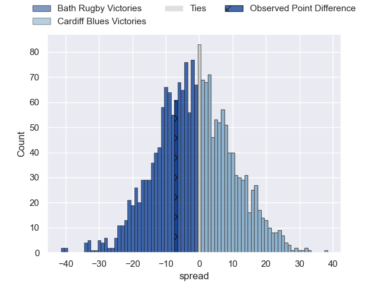
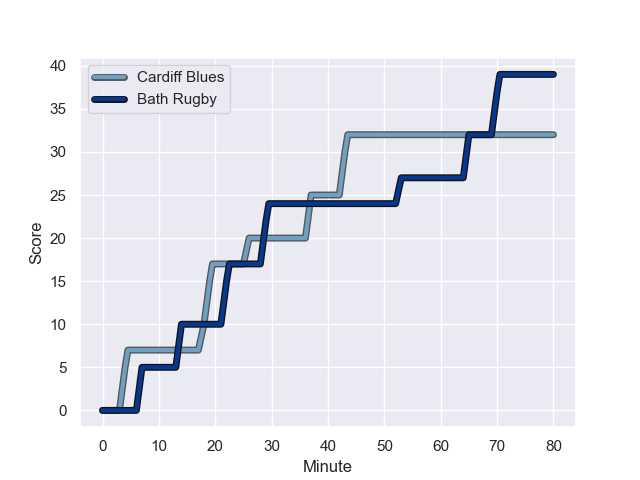
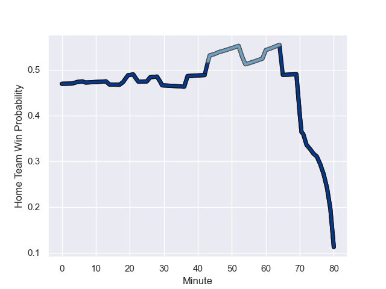

---  
layout: page  
title: Bath Rugby at Cardiff Blues; 39-32  
date: 2023-12-16 18:00:00 -0500  
categories: "European Rugby Champions Cup 2023" match review  
---
# Bath Rugby at Cardiff Blues; 39-32

# Club Level Predictions

The first set of predictions treats a club as the smallest object, as the club develops its members, organizes a gameplan, and deploys its players as needed for each match. This club model has a prediction of 0.531, which translates to predicting Cardiff Blues to win by 1.1.

Each club has a rating and a rating deviation (similar to a Glicko rating), and expected performances can be generated. This allows for simulated matches and spreads like the ones below.
## Projected Performances - Club Model

## Projected Spreads - Club Model

## Projected Results - Club Model

# Player Level Predictions - Version 2

Treating teams instead as an entity made up of the currently active players, I have ratings for each player in an altogether different system. These can be combined to form team ratings once teamsheets are announced, weighting starters a bit higher than the reserves. After the match is played, players can be weighted by their minutes on the field, allowing for an accurate measure of the team's composition. With these compiled team ratings, we can make predictions, measure inaccuracy, and update the individual player ratings.
## Prediction with Player Minutes: Bath Rugby by 1.4

Bath Rugby by 5.8 on a neutral field
## Prediction without Player Minutes: Bath Rugby by 2.2

Bath Rugby by 6.7 on a neutral pitch

## Projected Performances - Player Model

## Projected Spreads - Player Model

## Projected Results - Player Model

## Scores over Time

## Win Probability over Time

There were 7 large changes in win probability in this match

|   Away Minutes | Away Player      |   Away elo |   Number |   Home elo | Home Player        |   Home Minutes |
|---------------:|:-----------------|-----------:|---------:|-----------:|:-------------------|---------------:|
|             60 | Beno Obano       |      53.03 |        1 |      58.17 | Corey Domachowski  |             54 |
|             75 | Tom Dunn         |      86.72 |        2 |      52.97 | Liam Belcher       |             72 |
|             60 | Thomas du Toit   |      78.59 |        3 |      41.18 | Keiron Assiratti   |             54 |
|             46 | Josh McNally     |      74.56 |        4 |      24.01 | Rory Thornton      |             80 |
|             80 | Charlie Ewels    |      33.59 |        5 |      48.38 | Teddy Williams     |             62 |
|             80 | Miles Reid       |      86.62 |        6 |      40.57 | Alex Mann          |             80 |
|             46 | Chris Cloete     |     124.97 |        7 |      46.4  | Lucas De la Rua    |             62 |
|             75 | Alfie Barbeary   |      48.24 |        8 |      48.66 | Mackenzie Martin   |             80 |
|             75 | Ben Spencer      |      49.69 |        9 |      72.42 | Tomos Williams     |             74 |
|             80 | Finn Russell     |     135.89 |       10 |      69.46 | Tinus de Beer      |             80 |
|             80 | Will Muir        |      10.67 |       11 |      72.18 | Mason Grady        |             80 |
|             80 | Cameron Redpath  |      56.41 |       12 |      52.32 | Ben Thomas         |             72 |
|             80 | Ollie Lawrence   |      61.59 |       13 |     100.01 | Rey Lee-Lo         |             80 |
|             80 | Joe Cokanasiga   |      85.43 |       14 |      58.95 | Josh Adams         |             29 |
|             75 | Tom de Glanville |      35.14 |       15 |      30.23 | Cam Winnett        |             80 |
|             20 | Juan Schoeman    |      45.05 |       16 |      30.39 | Rhys Carré         |             26 |
|             20 | Will Stuart      |      31.98 |       17 |      47.1  | Evan Lloyd         |              8 |
|              5 | Hame Faiva       |      16.73 |       18 |      43.91 | Rhys Litterick     |             26 |
|             34 | Elliott Stooke   |      67.72 |       19 |      66.77 | Josh Turnbull      |             18 |
|             34 | Jaco Coetzee     |      46.88 |       20 |      65.34 | Alun Lawrence      |             18 |
|              5 | Quinn Roux       |      89.07 |       21 |      44.53 | Ellis Bevan        |              6 |
|              5 | Louis Schreuder  |      59.26 |       22 |      96.96 | Uilisi Halaholo    |              8 |
|              5 | Orlando Bailey   |      36.78 |       23 |      76.5  | Gabriel Hamer-Webb |             51 |

