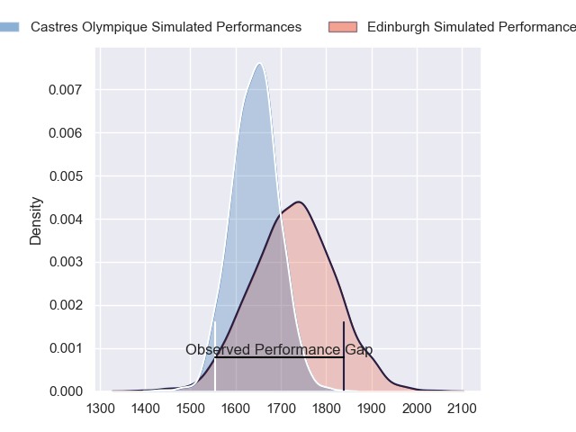
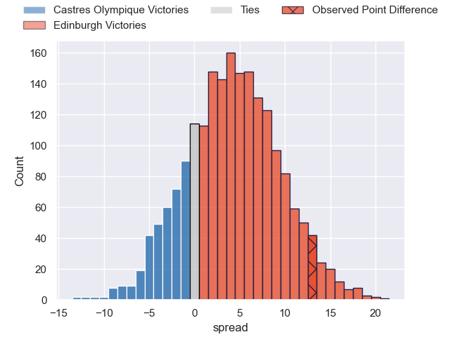
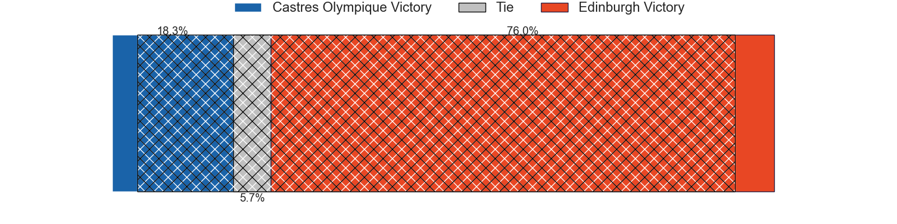
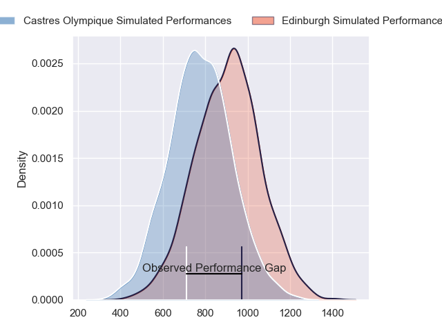
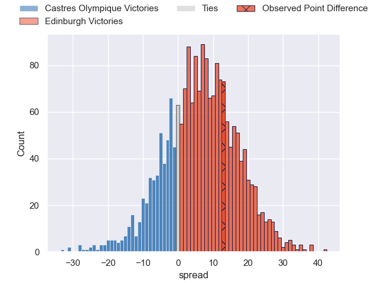
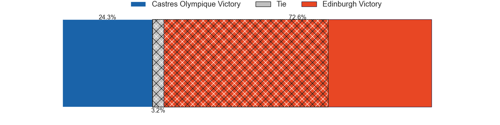
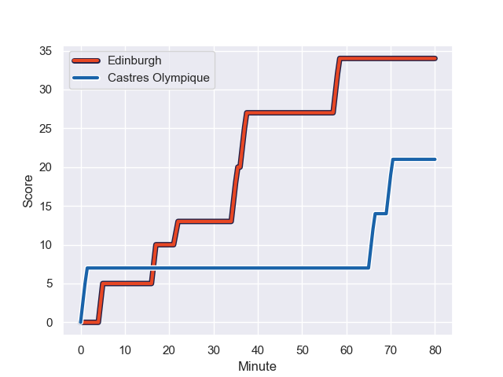
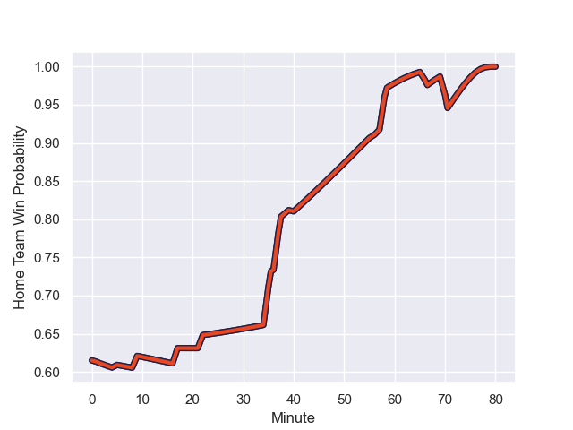

---  
layout: page  
title: Castres Olympique at Edinburgh; 21-34  
date: 2023-12-16 18:00:00 -0500  
categories: "European Rugby Challenge Cup 2023" match review  
---
# Castres Olympique at Edinburgh; 21-34

# Club Level Predictions

The first set of predictions treats a club as the smallest object, as the club develops its members, organizes a gameplan, and deploys its players as needed for each match. This club model has a prediction of 0.615, which translates to predicting Edinburgh to win by 4.1.

Each club has a rating and a rating deviation (similar to a Glicko rating), and expected performances can be generated. This allows for simulated matches and spreads like the ones below.
## Projected Performances - Club Model

## Projected Spreads - Club Model

## Projected Results - Club Model

# Player Level Predictions - Version 2

Treating teams instead as an entity made up of the currently active players, I have ratings for each player in an altogether different system. These can be combined to form team ratings once teamsheets are announced, weighting starters a bit higher than the reserves. After the match is played, players can be weighted by their minutes on the field, allowing for an accurate measure of the team's composition. With these compiled team ratings, we can make predictions, measure inaccuracy, and update the individual player ratings.
## Prediction with Player Minutes: Edinburgh by 5.1

Edinburgh by 0.8 on a neutral field
## Prediction without Player Minutes: Edinburgh by 5.9

Edinburgh by 1.6 on a neutral pitch

## Projected Performances - Player Model

## Projected Spreads - Player Model

## Projected Results - Player Model

## Scores over Time

## Win Probability over Time

There were 3 large changes in win probability in this match

|   Away Minutes | Away Player          |   Away elo |   Number |   Home elo | Home Player         |   Home Minutes |
|---------------:|:---------------------|-----------:|---------:|-----------:|:--------------------|---------------:|
|             40 | Loïs Guerois         |      42.5  |        1 |      44.53 | Pierre Schoeman     |             62 |
|             40 | Pierre Colonna       |      30.68 |        2 |      36.89 | Ewan Ashman         |             49 |
|             41 | Aurélien Azar        |      29.37 |        3 |      42.33 | Javan Sebastian     |             41 |
|             80 | Gauthier Maravat     |      12.01 |        4 |       5.58 | Glen Young          |             80 |
|             52 | Florent Vanverberghe |      48.12 |        5 |      92.66 | Grant Gilchrist     |             59 |
|             80 | Mathieu Babillot     |      66.56 |        6 |     120.02 | Jamie Ritchie       |             56 |
|             80 | Baptiste Cope        |      41.88 |        7 |      49.87 | Hamish Watson       |             80 |
|             56 | Abraham Papali'i     |      52.3  |        8 |      37.3  | Viliame Mata        |             80 |
|             56 | Gauthier Doubrere    |      48.72 |        9 |      68.09 | Ali Price           |             59 |
|             56 | Pierre Popelin       |      61.39 |       10 |      45.41 | Ben Healy           |             80 |
|             80 | Antoine Bouzerand    |      45.38 |       11 |      66.57 | Duhan van der Merwe |             80 |
|             80 | Adrea Cocagi         |      71.37 |       12 |      55.25 | James Lang          |             80 |
|             80 | Adrien Seguret       |      42.79 |       13 |      44.26 | Matt Currie         |             67 |
|             80 | Nathanael Hulleu     |      75.82 |       14 |      64.95 | Wes Goosen          |             80 |
|             69 | Geoffrey Palis       |      91.54 |       15 |      29.92 | Harry Paterson      |              9 |
|             40 | Wayan de Benedittis  |      49.86 |       16 |      31.63 | Robin Hislop        |             18 |
|             40 | Loris Zarantonello   |      42.7  |       17 |      50.63 | D'Arcy Rae          |             39 |
|             39 | Wilfrid Hounkpatin   |      58.33 |       18 |      44.38 | Dave Cherry         |             31 |
|             28 | Leone Nakarawa       |      78.83 |       19 |      38.2  | Marshall Sykes      |             21 |
|             24 | Baptiste Delaporte   |      53.27 |       20 |      69.15 | Luke Crosbie        |             24 |
|             24 | Jeremy Fernandez     |      16.43 |       21 |      48    | Ben Vellacott       |             21 |
|             24 | Vilimoni Botitu      |      53.98 |       22 |      60.58 | Mark Bennett        |             13 |
|             11 | Théo Chabouni        |      40.11 |       23 |      53.2  | Darcy Graham        |             71 |

