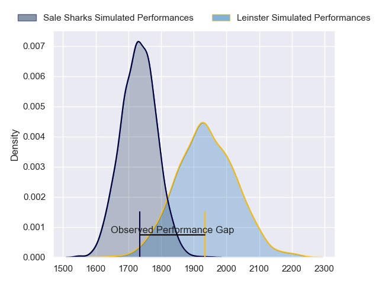
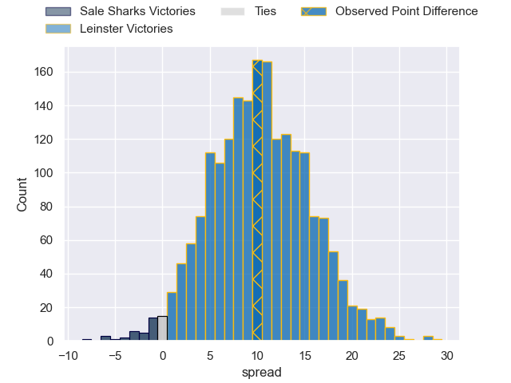
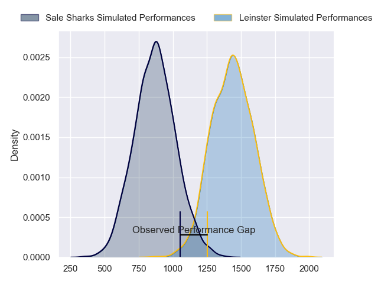
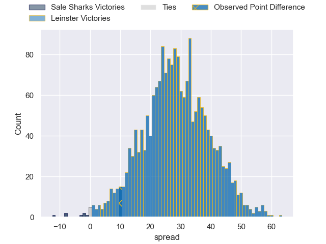
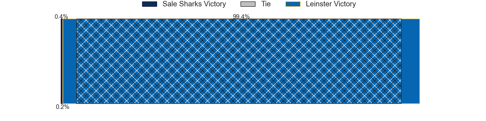
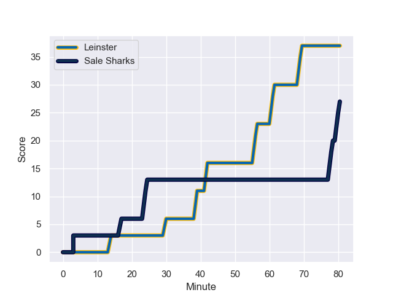
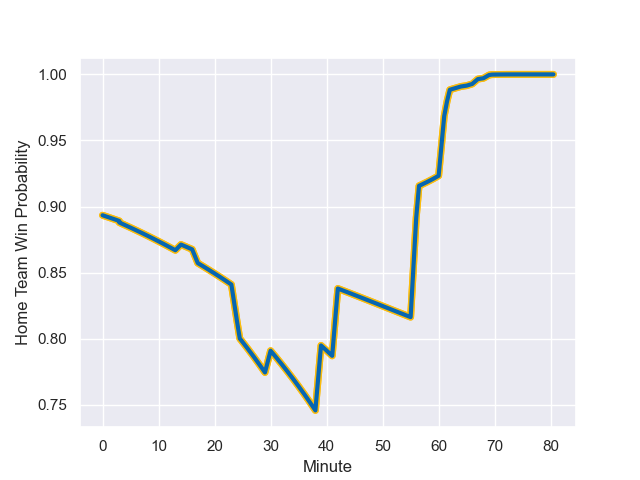

---  
layout: page  
title: Sale Sharks at Leinster; 27-37  
date: 2023-12-16 18:00:00 -0500  
categories: "European Rugby Champions Cup 2023" match review  
---
# Sale Sharks at Leinster; 27-37

# Club Level Predictions

The first set of predictions treats a club as the smallest object, as the club develops its members, organizes a gameplan, and deploys its players as needed for each match. This club model has a prediction of 0.761, which translates to predicting Leinster to win by 10.2.

Each club has a rating and a rating deviation (similar to a Glicko rating), and expected performances can be generated. This allows for simulated matches and spreads like the ones below.
## Projected Performances - Club Model

## Projected Spreads - Club Model

## Projected Results - Club Model

# Player Level Predictions - Version 2

Treating teams instead as an entity made up of the currently active players, I have ratings for each player in an altogether different system. These can be combined to form team ratings once teamsheets are announced, weighting starters a bit higher than the reserves. After the match is played, players can be weighted by their minutes on the field, allowing for an accurate measure of the team's composition. With these compiled team ratings, we can make predictions, measure inaccuracy, and update the individual player ratings.
## Prediction with Player Minutes: Leinster by 23.3

Leinster by 18.9 on a neutral field
## Prediction without Player Minutes: Leinster by 22.2

Leinster by 17.8 on a neutral pitch

## Projected Performances - Player Model

## Projected Spreads - Player Model

## Projected Results - Player Model

## Scores over Time

## Win Probability over Time

There were 5 large changes in win probability in this match

|   Away Minutes | Away Player          |   Away elo |   Number |   Home elo | Home Player         |   Home Minutes |
|---------------:|:---------------------|-----------:|---------:|-----------:|:--------------------|---------------:|
|             56 | Ross Harrison        |      72.93 |        1 |      78.3  | Andrew Porter       |             62 |
|             80 | Tommy Taylor         |      28.55 |        2 |      61.56 | Dan Sheehan         |             59 |
|             45 | James Harper         |      24.11 |        3 |      57.23 | Thomas Clarkson     |             43 |
|             80 | Ben Bamber           |      47.37 |        4 |      60.54 | Jason Jenkins       |             40 |
|             51 | Josh Beaumont        |      62.91 |        5 |      92.87 | James Ryan          |             80 |
|             67 | Ernst van Rhyn       |      84.24 |        6 |      75.69 | Ryan Baird          |             80 |
|             80 | Sam Dugdale          |      40.02 |        7 |     120.52 | Josh van der Flier  |             80 |
|             47 | Rouben Birch         |      16.93 |        8 |     109.57 | Caelan Doris        |             65 |
|             63 | Raffi Quirke         |      50.32 |        9 |     115.96 | Jamison Gibson-Park |             69 |
|             80 | Robert du Preez      |      57.25 |       10 |      62.01 | Ciaran Frawley      |             65 |
|             80 | Arron Reed           |      68.14 |       11 |      84.92 | Jimmy O'Brien       |             80 |
|             80 | Sam Bedlow           |      69.06 |       12 |      92.79 | Robbie Henshaw      |             80 |
|             60 | Connor Doherty       |      54.9  |       13 |     115.53 | Garry Ringrose      |             80 |
|             80 | Tom Roebuck          |      57.38 |       14 |      72.55 | Jordan Larmour      |             55 |
|             56 | Telusa Veainu        |     138.74 |       15 |     118.57 | Hugo Keenan         |             80 |
|             35 | Asher Opoku          |      46.9  |       16 |      86.68 | Cian Healy          |             18 |
|             24 | Olatumylara Onasanya |      46.65 |       17 |      78.66 | Ronan Kelleher      |             21 |
|             29 | Jonny Hill           |      44.19 |       18 |      76.99 | Michael Ala'alatoa  |             37 |
|             13 | Ethan Caine          |      41.1  |       19 |      54.63 | Joe McCarthy        |             40 |
|             33 | Jean-Luc du Preez    |     113.43 |       20 |     108.15 | Jack Conan          |             15 |
|             17 | Anerin (Nye) Thomas  |      31.93 |       21 |      47.4  | Ben Murphy          |             11 |
|             20 | Tom Curry            |      66.14 |       22 |      40.75 | Sam Prendergast     |             15 |
|             24 | Joe Carpenter        |      36.01 |       23 |     102.91 | Charlie Ngatai      |             25 |

