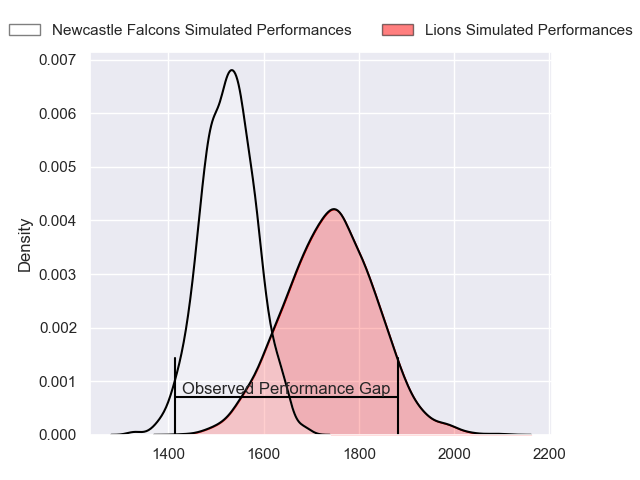
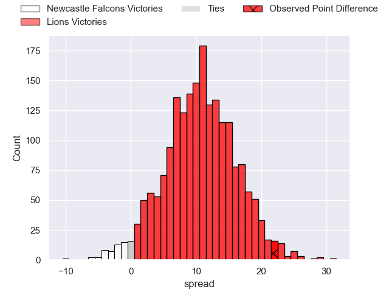
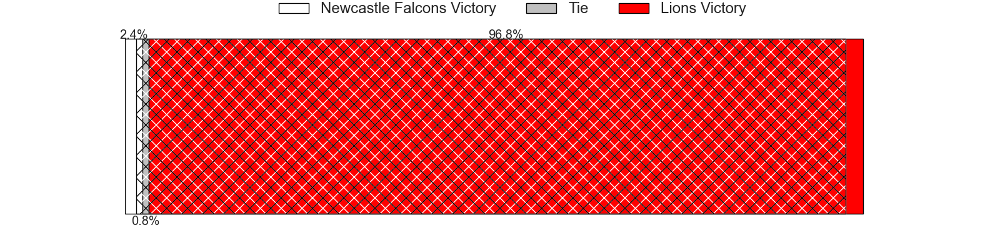
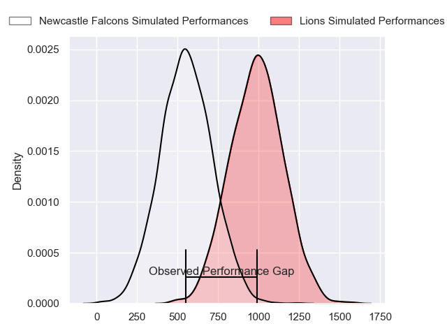
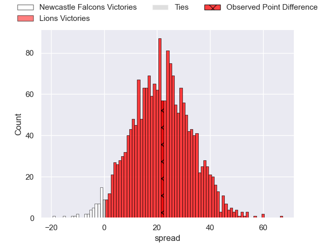
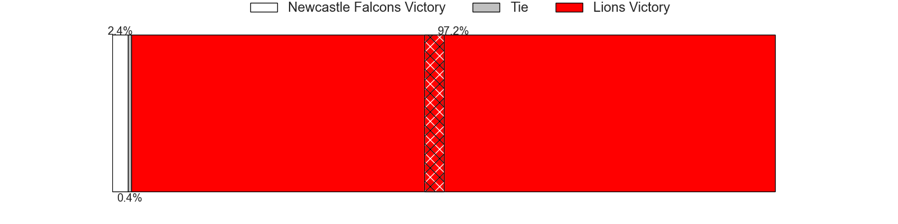
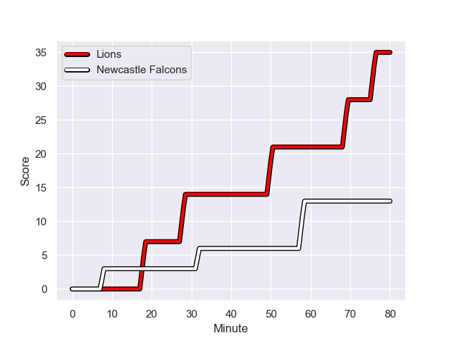
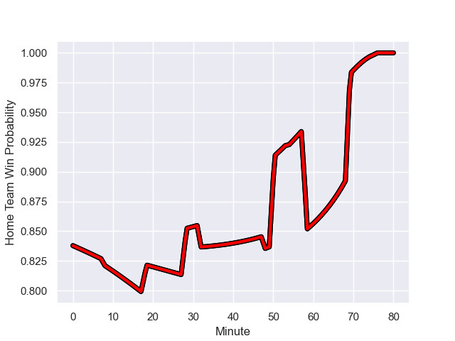

---  
layout: page  
title: Newcastle Falcons at Lions; 13-35  
date: 2023-12-16 18:00:00 -0500  
categories: "European Rugby Challenge Cup 2023" match review  
---
# Newcastle Falcons at Lions; 13-35

# Club Level Predictions

The first set of predictions treats a club as the smallest object, as the club develops its members, organizes a gameplan, and deploys its players as needed for each match. This club model has a prediction of 0.772, which translates to predicting Lions to win by 10.7.

Each club has a rating and a rating deviation (similar to a Glicko rating), and expected performances can be generated. This allows for simulated matches and spreads like the ones below.
## Projected Performances - Club Model

## Projected Spreads - Club Model

## Projected Results - Club Model

# Player Level Predictions - Version 2

Treating teams instead as an entity made up of the currently active players, I have ratings for each player in an altogether different system. These can be combined to form team ratings once teamsheets are announced, weighting starters a bit higher than the reserves. After the match is played, players can be weighted by their minutes on the field, allowing for an accurate measure of the team's composition. With these compiled team ratings, we can make predictions, measure inaccuracy, and update the individual player ratings.
## Prediction with Player Minutes: Lions by 18.1

Lions by 14.4 on a neutral field
## Prediction without Player Minutes: Lions by 17.7

Lions by 14.1 on a neutral pitch

## Projected Performances - Player Model

## Projected Spreads - Player Model

## Projected Results - Player Model

## Scores over Time

## Win Probability over Time

There were 5 large changes in win probability in this match

|   Away Minutes | Away Player         |   Away elo |   Number |   Home elo | Home Player            |   Home Minutes |
|---------------:|:--------------------|-----------:|---------:|-----------:|:-----------------------|---------------:|
|             80 | Adam Brocklebank    |      14.78 |        1 |      57    | Jean-Pierre Smith      |             54 |
|             41 | Charlie Maddison    |      35.95 |        2 |      45.5  | PJ Botha               |             54 |
|             44 | Mark Tampin         |      26.67 |        3 |      31.44 | Asenathi Ntlabakanye   |             54 |
|             80 | Tim Cardall         |      40.52 |        4 |      45.63 | Willem Alberts         |             59 |
|             57 | Kiran McDonald      |      35.56 |        5 |      30.92 | Darrien-Lane Landsberg |             74 |
|             48 | Philip van der Walt |      26.3  |        6 |      50.44 | Emmanuel Tshituka      |             80 |
|             80 | Josh Bainbridge     |      38.64 |        7 |      86.56 | Hanru Sirgel           |             60 |
|             80 | John Kelly          |      57.36 |        8 |     108.51 | Francke Horn           |             80 |
|             68 | Josh Barton         |      25.29 |        9 |      42.6  | Morne Van den Berg     |             66 |
|             80 | Brett Connon        |      29.57 |       10 |      94.45 | Sanele Nohamba         |             80 |
|             57 | Louis Brown         |      55.36 |       11 |      53    | Rabz Maxwane           |             80 |
|             64 | Cameron Hutchison   |      52.29 |       12 |      82.69 | Marius Louw            |             80 |
|             80 | Ben Stevenson       |      29.65 |       13 |      64.01 | Rynardt Jonker         |             80 |
|             80 | Nathan Greenwood    |      46.65 |       14 |      36.38 | Richard Kriel          |             80 |
|             80 | Elliott Obatoyinbo  |      28.54 |       15 |      77.87 | Quan Horn              |             73 |
|             36 | Murray McCallum     |      54.15 |       16 |      43.27 | Morgan Naude           |             26 |
|             39 | Michael van Vuuren  |      48.53 |       17 |      51.4  | Jaco Visagie           |             26 |
|             32 | Freddie Lockwood    |      40.75 |       18 |      62.4  | Ruan Smith             |             26 |
|             23 | Adam Scott          |      46.65 |       19 |      48.23 | Raynard Roets          |             21 |
|             12 | Ben Douglas         |      46.65 |       20 |      45.14 | Izan Esterhuizen       |              6 |
|             23 | George Wacokecoke   |      23.25 |       21 |      60.53 | Johannes JC Pretorius  |             20 |
|             16 | Josh Thomas         |      25.71 |       22 |      40.6  | Jordan Hendrikse       |             14 |
|            nan | nan                 |     nan    |       23 |      72.26 | Gianni Lombard         |              7 |

