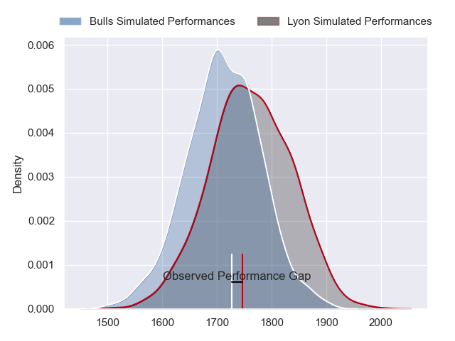
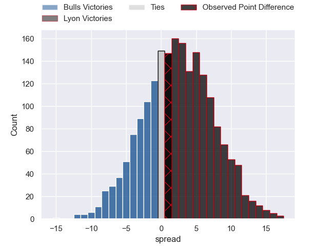
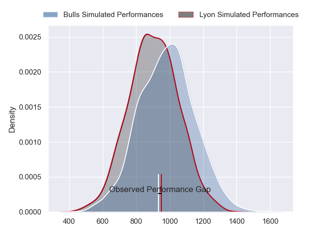
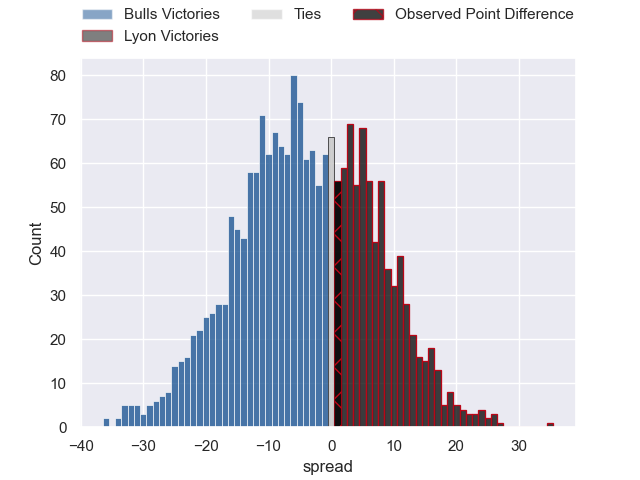
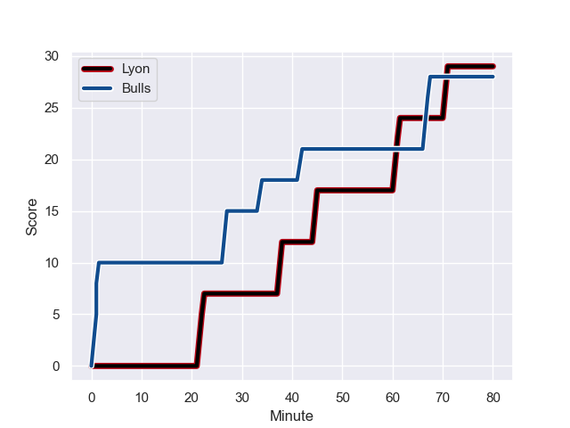
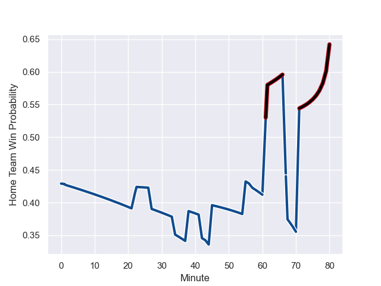

---  
layout: page  
title: Bulls at Lyon; 28-29  
date: 2023-12-16 18:00:00 -0500  
categories: "European Rugby Champions Cup 2023" match review  
---
# Bulls at Lyon; 28-29

# Club Level Predictions

The first set of predictions treats a club as the smallest object, as the club develops its members, organizes a gameplan, and deploys its players as needed for each match. This club model has a prediction of 0.572, which translates to predicting Lyon to win by 2.6.

Each club has a rating and a rating deviation (similar to a Glicko rating), and expected performances can be generated. This allows for simulated matches and spreads like the ones below.
## Projected Performances - Club Model

## Projected Spreads - Club Model

## Projected Results - Club Model

# Player Level Predictions - Version 2

Treating teams instead as an entity made up of the currently active players, I have ratings for each player in an altogether different system. These can be combined to form team ratings once teamsheets are announced, weighting starters a bit higher than the reserves. After the match is played, players can be weighted by their minutes on the field, allowing for an accurate measure of the team's composition. With these compiled team ratings, we can make predictions, measure inaccuracy, and update the individual player ratings.
## Prediction with Player Minutes: Bulls by 3.2

Bulls by 7.9 on a neutral field
## Prediction without Player Minutes: Bulls by 2.9

Bulls by 7.6 on a neutral pitch

## Projected Performances - Player Model

## Projected Spreads - Player Model

## Projected Results - Player Model

## Scores over Time

## Win Probability over Time

There were 12 large changes in win probability in this match

|   Away Minutes | Away Player           |   Away elo |   Number |   Home elo | Home Player           |   Home Minutes |
|---------------:|:----------------------|-----------:|---------:|-----------:|:----------------------|---------------:|
|             50 | Simphiwe Matanzima    |      58.72 |        1 |      36.66 | Sebastien Taofifenua  |             55 |
|             80 | Jan Hendrik Wessels   |      27.44 |        2 |      55.5  | Liam Coltman          |             57 |
|             50 | Mornay Smith          |      53.44 |        3 |      49.85 | Feao Fotuaika         |             44 |
|             64 | Deon Slabbert         |      68.51 |        4 |      35.18 | Killian Geraci        |             80 |
|             80 | Janko Swanepoel       |      61.32 |        5 |      48.87 | Romain Taofifenua     |             57 |
|             80 | Marco van Staden      |      73.74 |        6 |      46.64 | Marvin Okuya          |             80 |
|             80 | Celimpilo Gumede      |      48.16 |        7 |      43.56 | Pierre-Samuel Pacheco |             80 |
|             80 | Marcell Coetzee       |      86.88 |        8 |      95.54 | Jordan Taufua         |             50 |
|             64 | Zak Burger            |      73.52 |        9 |      56.23 | Martin Page-Relo      |             50 |
|             72 | Chris Smith           |      54.43 |       10 |      28.94 | Fletcher Smith        |             50 |
|             80 | Sergeal Petersen      |      81.17 |       11 |      96.38 | Monty Ioane           |             80 |
|             80 | Harold Vorster        |      98.48 |       12 |      53.07 | Kyle Godwin           |             64 |
|             80 | Lionel Mapoe          |      83.08 |       13 |      45.65 | Alfred Parisien       |             80 |
|             63 | Henry Immelman        |      68.23 |       14 |      48.2  | Ethan Dumortier       |             80 |
|             80 | Devon Williams        |      52.83 |       15 |      27.84 | Thaakir Abrahams      |             80 |
|             30 | Dylan Smith           |      65.75 |       16 |      27.32 | Jerome Rey            |             25 |
|             30 | Ntuthuko Mchunu       |      33.87 |       17 |      46.37 | Yanis Charcosset      |             23 |
|             16 | JF Van Heerden        |      46.65 |       18 |      41.7  | Valentin Simutoga     |             36 |
|              8 | Jaco van der Walt     |      53.86 |       19 |      63.82 | Felix Lambey          |             23 |
|             16 | Bernard van der Linde |      34.91 |       20 |      67.57 | Arno Botha            |             30 |
|             17 | Sebastian de Klerk    |     101.99 |       21 |      88.38 | Baptiste Couilloud    |             30 |
|            nan | nan                   |     nan    |       22 |      79.02 | Paddy Jackson         |             30 |
|            nan | nan                   |     nan    |       23 |      76.73 | Thibault Regard       |             16 |

