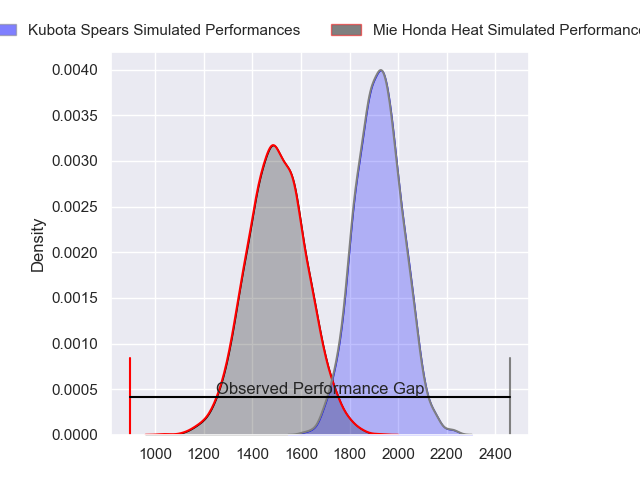
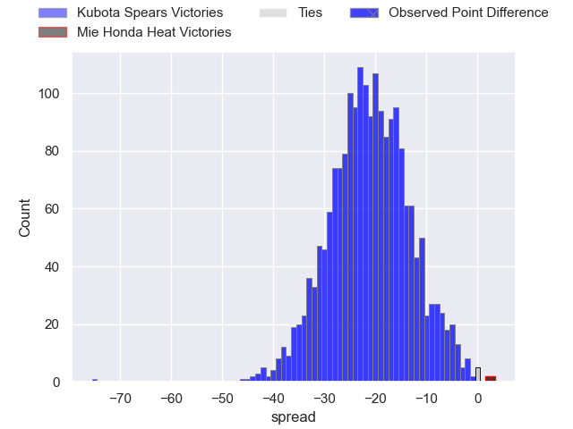
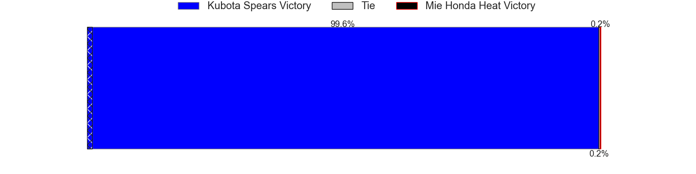
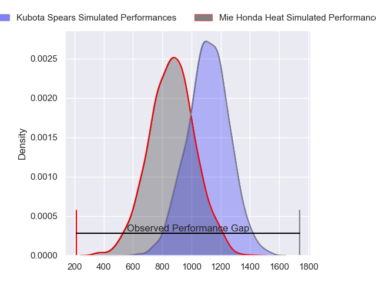
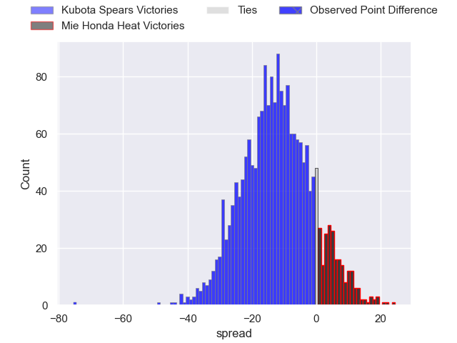
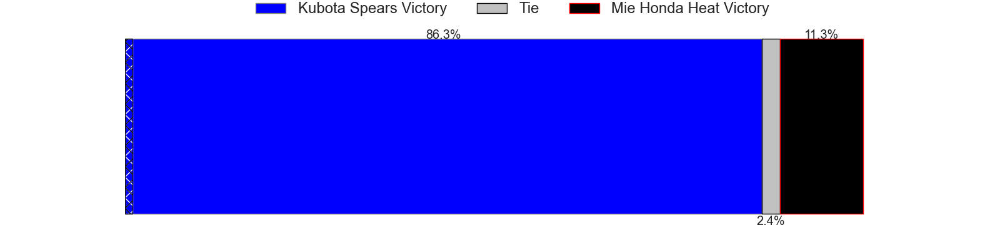
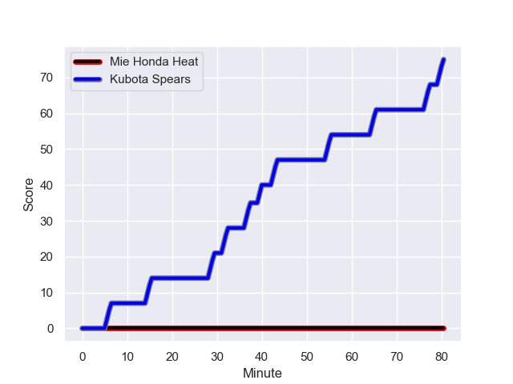
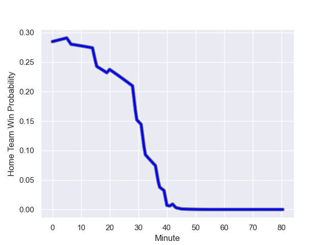

---  
layout: page  
title: Kubota Spears at Mie Honda Heat; 75-0  
date: 2023-12-16 18:00:00 -0500  
categories: "Japan Rugby League One 2023" match review  
---
# Kubota Spears at Mie Honda Heat; 75-0

# Club Level Predictions

The first set of predictions treats a club as the smallest object, as the club develops its members, organizes a gameplan, and deploys its players as needed for each match. This club model has a prediction of 0.089, which translates to predicting Kubota Spears to win by 21.1.

Each club has a rating and a rating deviation (similar to a Glicko rating), and expected performances can be generated. This allows for simulated matches and spreads like the ones below.
## Projected Performances - Club Model

## Projected Spreads - Club Model

## Projected Results - Club Model

# Player Level Predictions - Version 2

Treating teams instead as an entity made up of the currently active players, I have ratings for each player in an altogether different system. These can be combined to form team ratings once teamsheets are announced, weighting starters a bit higher than the reserves. After the match is played, players can be weighted by their minutes on the field, allowing for an accurate measure of the team's composition. With these compiled team ratings, we can make predictions, measure inaccuracy, and update the individual player ratings.
## Prediction with Player Minutes: Kubota Spears by 10.1

Kubota Spears by 13.3 on a neutral field
## Prediction without Player Minutes: Kubota Spears by 8.5

Kubota Spears by 11.7 on a neutral pitch

## Projected Performances - Player Model

## Projected Spreads - Player Model

## Projected Results - Player Model

## Scores over Time

## Win Probability over Time

There were 4 large changes in win probability in this match

|   Away Minutes | Away Player            |   Away elo |   Number |   Home elo | Home Player         |   Home Minutes |
|---------------:|:-----------------------|-----------:|---------:|-----------:|:--------------------|---------------:|
|             49 | Yota Kaminori          |      52.38 |        1 |      35.17 | Tatsuhiko Tsurukawa |             66 |
|             49 | Hiraoki Sugimoto       |      59    |        2 |      36.04 | Lee Seung Hyok      |             60 |
|             42 | Opeti Helu             |      61.6  |        3 |      44.52 | Taiki Yoshioka      |             40 |
|             57 | JD Schickerling        |      17.66 |        4 |      46.23 | Tetuhi Roberts      |             80 |
|             80 | Ruan Botha             |     123.81 |        5 |     108.56 | Franco Mostert      |             80 |
|             40 | Lappies Labuschagne    |      76.4  |        6 |      29.82 | Ryota Kobayashi     |             20 |
|             80 | Takeo Suenaga          |      69.28 |        7 |      28.92 | Ryo Furuta          |             80 |
|             80 | Faulua Makisi          |      89.79 |        8 |      57.93 | Waimana Kapa        |             80 |
|             57 | Shinobu Fujiwara       |      54.99 |        9 |      39.69 | Kenta Yamaji        |             45 |
|             80 | Bernard Foley          |     149.4  |       10 |      53.4  | Gwangtee Oh         |             80 |
|             80 | Haruto Kida            |      76.76 |       11 |     113.49 | Tevita Li           |             40 |
|             80 | Harumichi Tatekawa     |      53.9  |       12 |      45.31 | Issei Shige         |             66 |
|             49 | Rikus Pretorius        |      52.29 |       13 |      39.1  | Fraser Quirk        |             80 |
|             57 | Koga Nezuka            |      76.73 |       14 |      60.95 | Yoshikazu Fujita    |             80 |
|             80 | Gerhard van den Heever |      98.87 |       15 |      75.39 | Mitch Hunt          |             60 |
|             40 | Finau Tupa             |      62.47 |       16 |      42.33 | Sosiceni Tokoqio    |             60 |
|             38 | Kengo Kitagawa         |      55.56 |       17 |      39.04 | Matthys Basson      |             40 |
|             31 | Kota Kaishi            |      74.95 |       18 |      51.52 | Kanta Watanabe      |             40 |
|             31 | Schalk Erasmus         |      52.73 |       19 |      46.27 | Shogo Nezuka        |             35 |
|             31 | Sione Teaupa           |      54.79 |       20 |      46.65 | Koki Hida           |             20 |
|             23 | Shunta Koga            |      46.65 |       21 |      38.25 | Dawid Kellerman     |             20 |
|             23 | Suryung Kim            |      62.85 |       22 |      46.37 | Kanato Hirano       |             14 |
|             23 | Yuki Aoki              |      42.38 |       23 |      46.65 | Kei Toma            |             14 |

