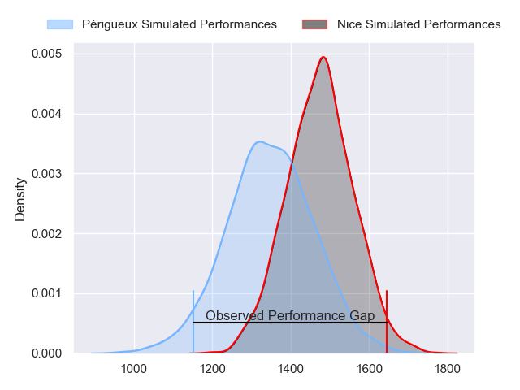
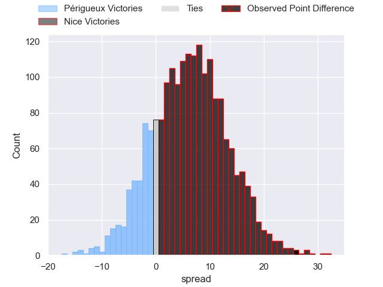
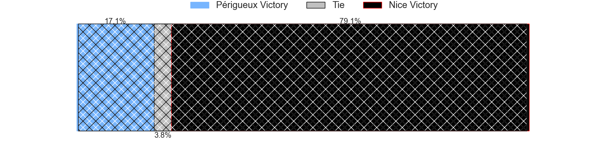
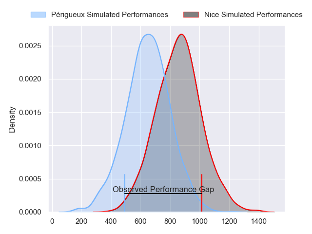
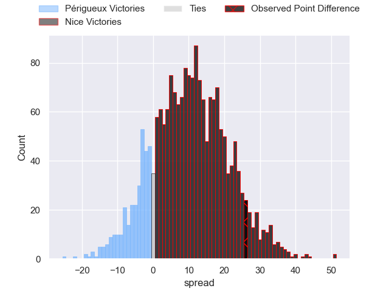
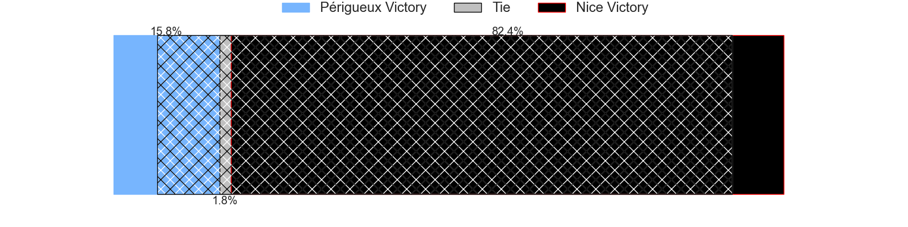
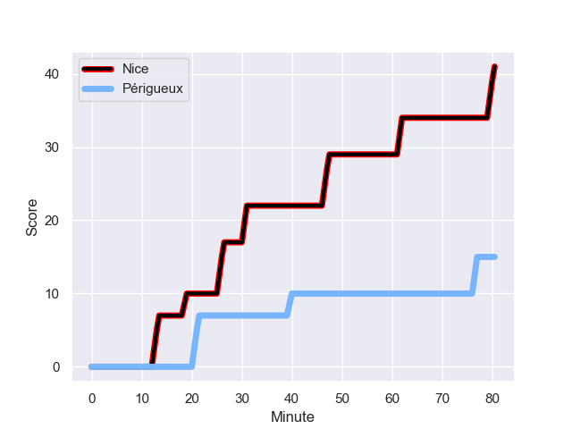
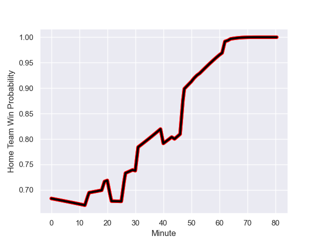

---  
layout: page  
title: Perigueux at Nice; 15-41  
date: 2023-12-16 18:00:00 -0500  
categories: "Nationale 2023" match review  
---
# Perigueux at Nice; 15-41

# Club Level Predictions

The first set of predictions treats a club as the smallest object, as the club develops its members, organizes a gameplan, and deploys its players as needed for each match. This club model has a prediction of 0.669, which translates to predicting Nice to win by 6.5.

Each club has a rating and a rating deviation (similar to a Glicko rating), and expected performances can be generated. This allows for simulated matches and spreads like the ones below.
## Projected Performances - Club Model

## Projected Spreads - Club Model

## Projected Results - Club Model

# Player Level Predictions - Version 2

Treating teams instead as an entity made up of the currently active players, I have ratings for each player in an altogether different system. These can be combined to form team ratings once teamsheets are announced, weighting starters a bit higher than the reserves. After the match is played, players can be weighted by their minutes on the field, allowing for an accurate measure of the team's composition. With these compiled team ratings, we can make predictions, measure inaccuracy, and update the individual player ratings.
## Prediction with Player Minutes: Nice by 8.4

Nice by 5.2 on a neutral field
## Prediction without Player Minutes: Nice by 8.3

Nice by 5.1 on a neutral pitch

## Projected Performances - Player Model

## Projected Spreads - Player Model

## Projected Results - Player Model

## Scores over Time

## Win Probability over Time

There were 5 large changes in win probability in this match

|   Away Minutes | Away Player          |   Away elo |   Number |   Home elo | Home Player               |   Home Minutes |
|---------------:|:---------------------|-----------:|---------:|-----------:|:--------------------------|---------------:|
|             53 | Jason Tindiliere     |      42.75 |        1 |      31.22 | Jules Martinez            |             57 |
|             53 | Baptiste Arvouet     |      43.3  |        2 |      58.38 | Sione Anga'aelangi        |             61 |
|             53 | Anthony Pelmard      |      48.39 |        3 |      33.09 | Luvuyo Pupuma             |             57 |
|             80 | Damien Lavergne      |      48.44 |        4 |       3.54 | Thibault Rey              |             57 |
|             80 | Jaco Willemse        |      35.52 |        5 |      66.24 | Adrien Vigne              |             80 |
|             80 | Nicolas Labattut     |      53.89 |        6 |      58.51 | Arthur Vignolles          |             61 |
|             64 | Madioke Konate       |      34.2  |        7 |      17.43 | Bastien Berenguel         |             80 |
|             51 | Karl Lambert         |      45.13 |        8 |      74.53 | Laijiasa Bolenaivalu      |             44 |
|             51 | Matteo Bordenave     |      46.65 |        9 |      55.49 | Jules Solinas             |             57 |
|             51 | Yann Caillat         |      40.74 |       10 |      56.48 | Mathis Viard              |             57 |
|             80 | Benjamin Yarde       |      36.68 |       11 |      53.52 | Simon Delas               |             80 |
|             80 | Nicolas Piaton       |      42.67 |       12 |      53.28 | Romain Riguet             |             80 |
|             80 | Paul Piveteau        |      49.14 |       13 |      58.19 | Nathan Courtade           |             80 |
|             30 | Pierre Tournebize    |      30.21 |       14 |      73.66 | Andrzej Charlat           |             80 |
|             80 | Djamel Ouchene       |      44.73 |       15 |      69.58 | David Odiete              |             80 |
|             27 | Emilien Borges       |      45    |       16 |      60.39 | Sunia Vola                |             23 |
|             27 | Lucas Marijon        |      54.9  |       17 |      43.74 | Santiago Benjamin Ovejero |             19 |
|             27 | Martin Augeix        |      42.25 |       18 |      47.86 | Nicolas Ciancio           |             23 |
|             29 | Richard Fourcade     |      37.02 |       19 |      62.32 | Yann Tivoli               |             23 |
|             29 | Enzo Hardy           |      43.26 |       20 |      79.62 | Louis Suaud               |             19 |
|             16 | Alexandre Zibzibadze |      46.65 |       21 |      56.79 | Martin Freytes            |             36 |
|             29 | Joffrey Tallet       |      46.65 |       22 |      23.03 | Matéo Jeune-Joly          |             23 |
|             50 | Clément Cavaliere    |      36.51 |       23 |      49.67 | Luca Cutayar              |             23 |

