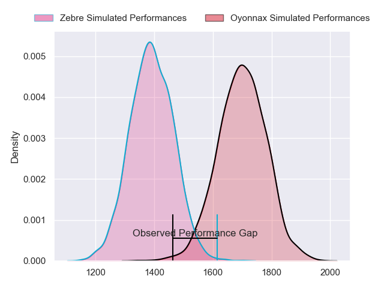
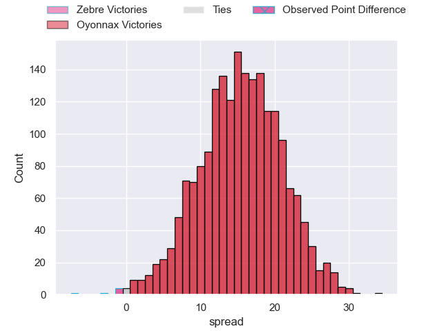
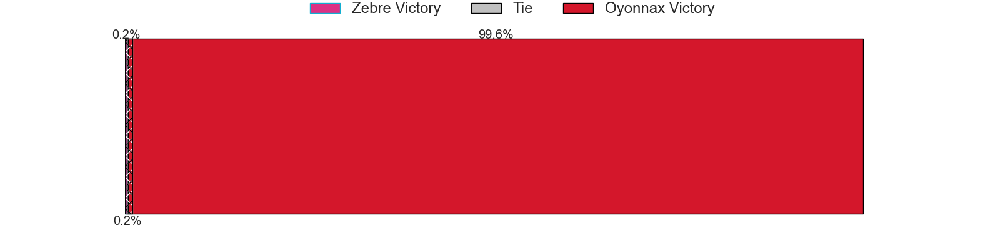
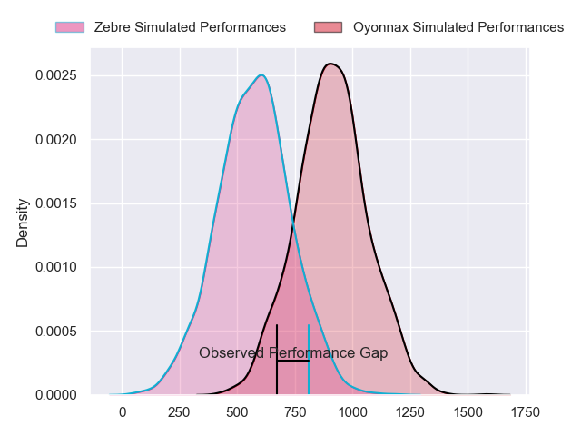
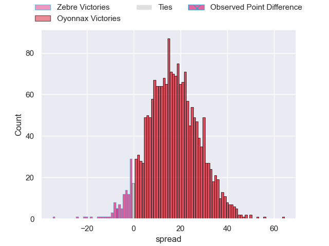
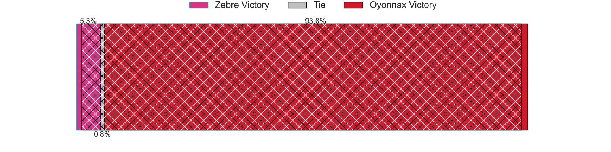
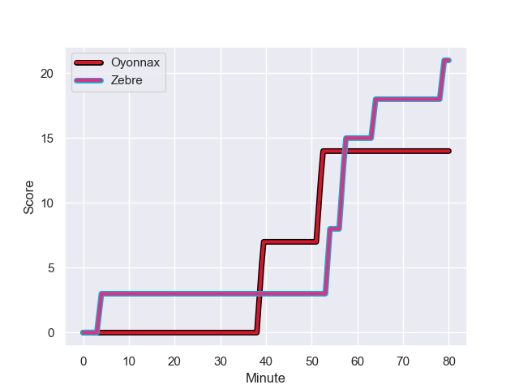
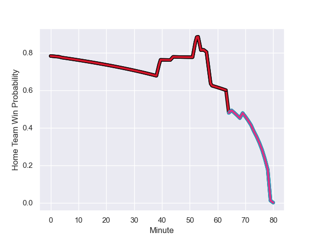

---  
layout: page  
title: Zebre at Oyonnax; 21-14  
date: 2023-12-16 18:00:00 -0500  
categories: "European Rugby Challenge Cup 2023" match review  
---
# Zebre at Oyonnax; 21-14

# Club Level Predictions

The first set of predictions treats a club as the smallest object, as the club develops its members, organizes a gameplan, and deploys its players as needed for each match. This club model has a prediction of 0.85, which translates to predicting Oyonnax to win by 15.5.

Each club has a rating and a rating deviation (similar to a Glicko rating), and expected performances can be generated. This allows for simulated matches and spreads like the ones below.
## Projected Performances - Club Model

## Projected Spreads - Club Model

## Projected Results - Club Model

# Player Level Predictions - Version 2

Treating teams instead as an entity made up of the currently active players, I have ratings for each player in an altogether different system. These can be combined to form team ratings once teamsheets are announced, weighting starters a bit higher than the reserves. After the match is played, players can be weighted by their minutes on the field, allowing for an accurate measure of the team's composition. With these compiled team ratings, we can make predictions, measure inaccuracy, and update the individual player ratings.
## Prediction with Player Minutes: Oyonnax by 14.1

Oyonnax by 9.3 on a neutral field
## Prediction without Player Minutes: Oyonnax by 13.6

Oyonnax by 8.9 on a neutral pitch

## Projected Performances - Player Model

## Projected Spreads - Player Model

## Projected Results - Player Model

## Scores over Time

## Win Probability over Time

There were 15 large changes in win probability in this match

|   Away Minutes | Away Player            |   Away elo |   Number |   Home elo | Home Player         |   Home Minutes |
|---------------:|:-----------------------|-----------:|---------:|-----------:|:--------------------|---------------:|
|             77 | Luca Rizzoli           |      32.35 |        1 |      48.64 | Rory Sutherland     |             53 |
|             56 | Marco Manfredi         |      12.99 |        2 |      45.4  | Teddy Durand        |             53 |
|             44 | Juan Manuel Pitinari   |      41.6  |        3 |      39.79 | Ali Oz              |             53 |
|             69 | Matteo Canali          |      66.07 |        4 |      59.95 | Ewan Thomas Johnson |             58 |
|             80 | Leonard Krumov         |      -3.83 |        5 |      57.25 | Hugo Fabregue       |             80 |
|             80 | Guido Volpi            |      52.92 |        6 |      46.4  | Kevin Lebreton      |             80 |
|             53 | Taina Fox-Matamua      |      55.15 |        7 |      40.5  | Hugo Hermet         |             80 |
|             53 | Jake Polledri          |      50.34 |        8 |      67.99 | Rory Grice          |             58 |
|             73 | Gonzalo Jesus Garcia   |      26.64 |        9 |      35.68 | Ilan El Khattabi    |             65 |
|             80 | Geronimo Prisciantelli |      73.72 |       10 |      45.17 | Justin Bouraux      |             80 |
|             58 | Jacopo Trulla          |      19.29 |       11 |      65.13 | Daniel Ikpefan      |             80 |
|             80 | Enrico Lucchin         |      49.03 |       12 |      77.79 | Theo Millet         |             58 |
|             80 | Fetuli Paea            |      60.64 |       13 |      48.01 | Leo Treilles        |             80 |
|             80 | Pierre Bruno           |      26.16 |       14 |      42.46 | Gavin Stark         |             65 |
|             80 | Lorenzo Pani           |      24.77 |       15 |      86.25 | Darren Sweetnam     |             80 |
|             24 | Luca Bigi              |      49.75 |       16 |      46.92 | Antoine Abraham     |             27 |
|              3 | Alessio Sanavia        |      61.99 |       17 |      32.54 | Benjamin Geledan    |             27 |
|             36 | Matteo Nocera          |       6.56 |       18 |      41.24 | Christopher Vaotoa  |             27 |
|             27 | Giacomo Ferrari        |      47.81 |       19 |      57.55 | Loïc Credoz         |             22 |
|             11 | Dylan De Leeuw         |      49.76 |       20 |      38.02 | Steve Mafi          |             22 |
|             22 | Giovanni Montemauri    |       5.97 |       21 |      45.41 | Yvan David          |             15 |
|              7 | Thomas Dominguez       |      46.37 |       22 |      54.84 | Maxime Salles       |             15 |
|             27 | Giovanni Licata        |      43.22 |       23 |      93.01 | Domingo Miotti      |             22 |

