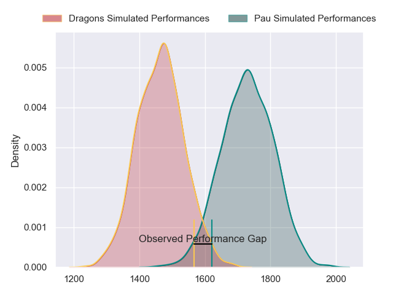
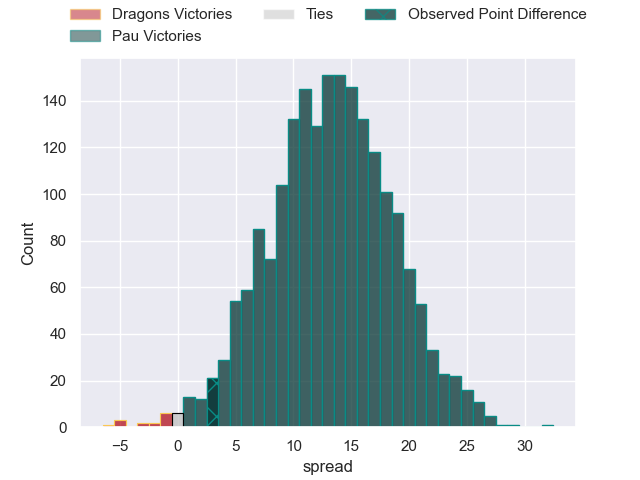
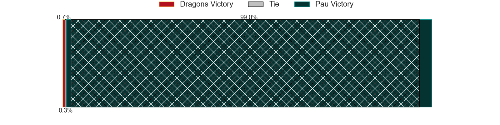
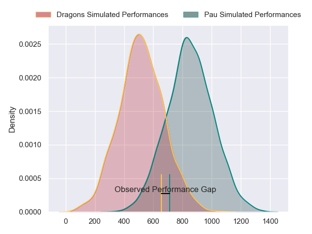
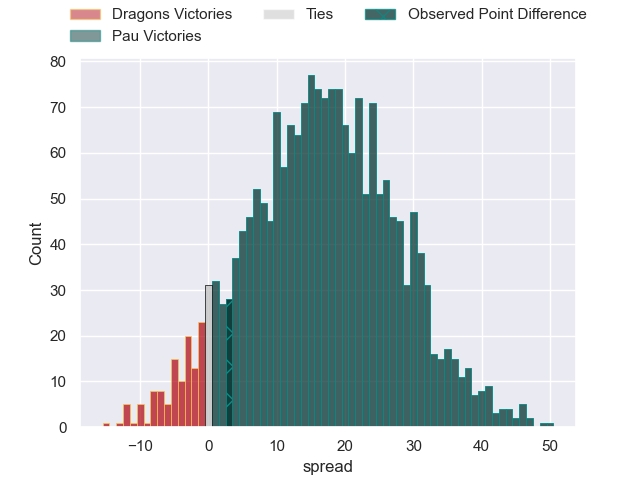
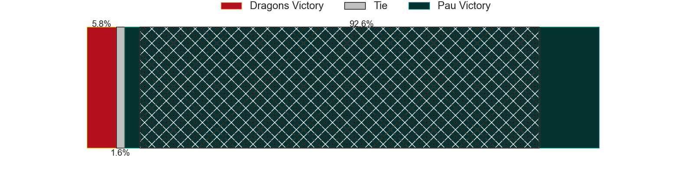
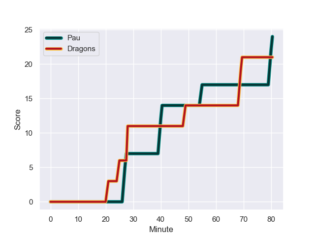
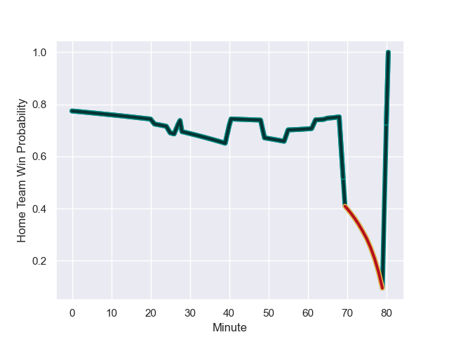

---  
layout: page  
title: Dragons at Pau; 21-24  
date: 2023-12-16 18:00:00 -0500  
categories: "European Rugby Challenge Cup 2023" match review  
---
# Dragons at Pau; 21-24

# Club Level Predictions

The first set of predictions treats a club as the smallest object, as the club develops its members, organizes a gameplan, and deploys its players as needed for each match. This club model has a prediction of 0.817, which translates to predicting Pau to win by 13.3.

Each club has a rating and a rating deviation (similar to a Glicko rating), and expected performances can be generated. This allows for simulated matches and spreads like the ones below.
## Projected Performances - Club Model

## Projected Spreads - Club Model

## Projected Results - Club Model

# Player Level Predictions - Version 2

Treating teams instead as an entity made up of the currently active players, I have ratings for each player in an altogether different system. These can be combined to form team ratings once teamsheets are announced, weighting starters a bit higher than the reserves. After the match is played, players can be weighted by their minutes on the field, allowing for an accurate measure of the team's composition. With these compiled team ratings, we can make predictions, measure inaccuracy, and update the individual player ratings.
## Prediction with Player Minutes: Pau by 13.6

Pau by 8.7 on a neutral field
## Prediction without Player Minutes: Pau by 13.2

Pau by 8.3 on a neutral pitch

## Projected Performances - Player Model

## Projected Spreads - Player Model

## Projected Results - Player Model

## Scores over Time

## Win Probability over Time

There were 18 large changes in win probability in this match

|   Away Minutes | Away Player       |   Away elo |   Number |   Home elo | Home Player       |   Home Minutes |
|---------------:|:------------------|-----------:|---------:|-----------:|:------------------|---------------:|
|             49 | Aki Seiuli        |      28.38 |        1 |      38    | Facundo Gigena    |             55 |
|             55 | James Benjamin    |      31.12 |        2 |      39.19 | Romain Ruffenach  |             50 |
|             40 | Chris Coleman     |      38.83 |        3 |      32.43 | Nicolas Corato    |             50 |
|             80 | Joseph Davies     |      27.96 |        4 |      31.43 | Hugo Auradou      |             80 |
|             80 | Matthew Screech   |      -1.99 |        5 |      53.56 | Mickael Capelli   |             65 |
|             75 | Ryan Woodman      |      42.41 |        6 |      40.49 | Mehdi Tlili       |             80 |
|             55 | Harrison Keddie   |     -10.38 |        7 |      59.93 | Martin Puech      |             80 |
|             80 | Taine Basham      |      29.44 |        8 |      29.37 | Thibault Hamonou  |             65 |
|             62 | Gonzalo Bertranou |      54.23 |        9 |     112.94 | Dan Robson        |             80 |
|             80 | Cai Evans         |      29.28 |       10 |      48.07 | Thibault Debaes   |             55 |
|             80 | Ashton Hewitt     |      63.75 |       11 |      52.95 | Thomas Carol      |             80 |
|             80 | Aneurin Owen      |      48.06 |       12 |      -3.92 | Jale Vatubua      |             80 |
|             62 | Steffan Hughes    |      67.49 |       13 |      58.9  | Nathan Decron     |             50 |
|             80 | Jared Rosser      |      11.44 |       14 |      71.54 | Aminiasi Tuimaba  |             80 |
|             62 | Jordan Williams   |      55.17 |       15 |      46.7  | Axel Desperes     |             80 |
|             25 | Brodie Coghlan    |      42.33 |       16 |      48.01 | Paul Tailhades    |             25 |
|             40 | Luke Yendle       |      47.99 |       17 |      44.48 | Lucas Rey         |             30 |
|             31 | Rodrigo Martinez  |      43.08 |       18 |      77.23 | Siate Tokolahi    |             30 |
|              5 | Sean Lonsdale     |      33.94 |       19 |      46.65 | Josselin Bouhier  |             15 |
|             25 | George Young      |      46.54 |       20 |      46.65 | Victor Templier   |             15 |
|             18 | Lewis Jones       |      36.19 |       21 |      46.49 | Théo Attissogbe   |             25 |
|             18 | Corey Baldwin     |      10.52 |       22 |      65.83 | Emilien Gailleton |             30 |
|             18 | Ewan Rosser       |      47.41 |       23 |     nan    | nan               |            nan |

