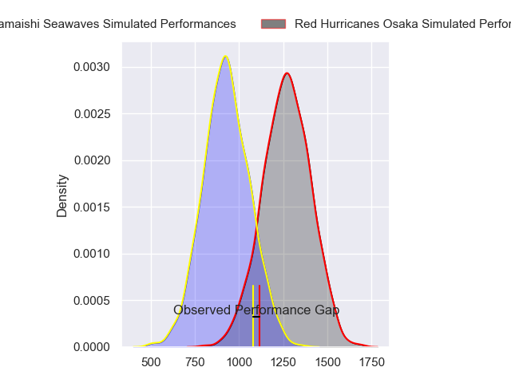
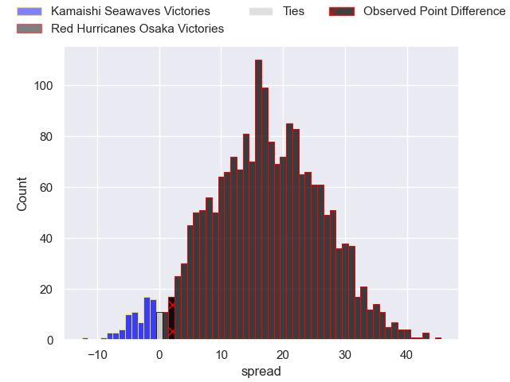
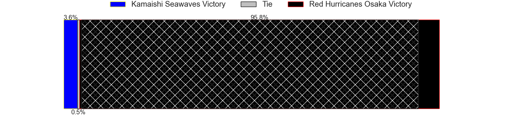
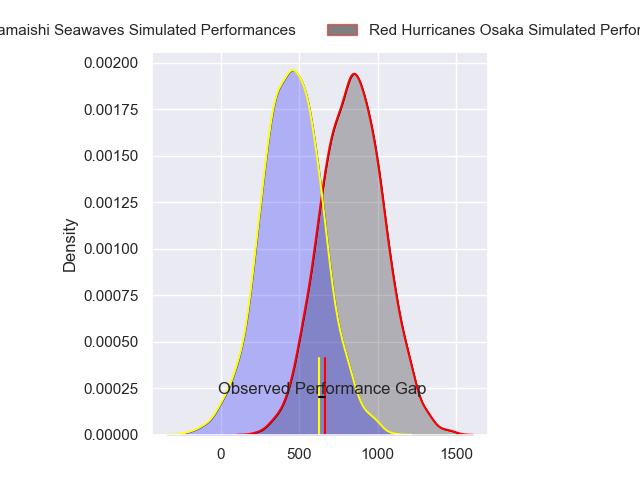
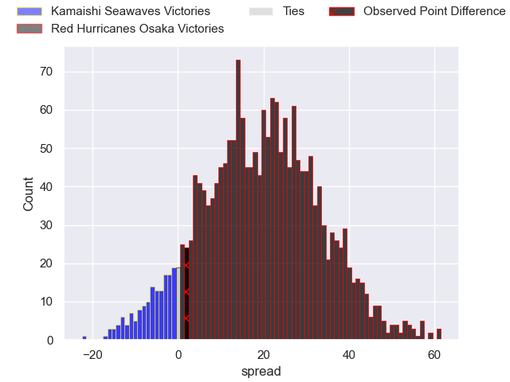
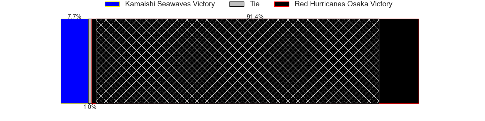
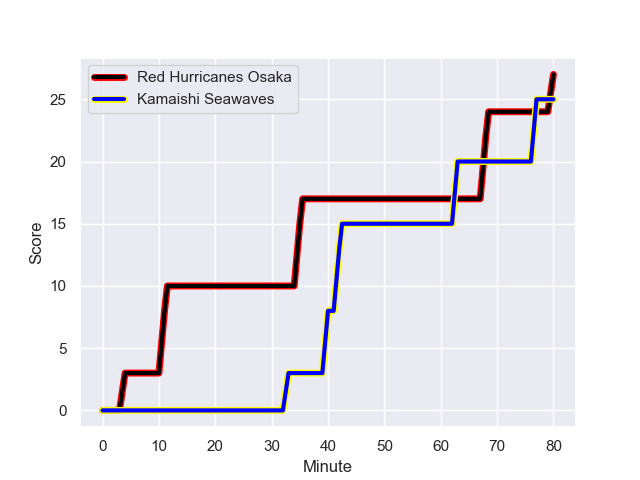
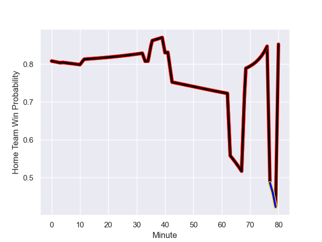

---  
layout: page  
title: Kamaishi Seawaves at Red Hurricanes Osaka; 25-27  
date: 2023-12-16 18:00:00 -0500  
categories: "Japan Rugby League One D2 2023" match review  
---
# Kamaishi Seawaves at Red Hurricanes Osaka; 25-27

# Club Level Predictions

The first set of predictions treats a club as the smallest object, as the club develops its members, organizes a gameplan, and deploys its players as needed for each match. This club model has a prediction of 0.86, which translates to predicting Red Hurricanes Osaka to win by 17.1.

Each club has a rating and a rating deviation (similar to a Glicko rating), and expected performances can be generated. This allows for simulated matches and spreads like the ones below.
## Projected Performances - Club Model

## Projected Spreads - Club Model

## Projected Results - Club Model

# Player Level Predictions - Version 2

Treating teams instead as an entity made up of the currently active players, I have ratings for each player in an altogether different system. These can be combined to form team ratings once teamsheets are announced, weighting starters a bit higher than the reserves. After the match is played, players can be weighted by their minutes on the field, allowing for an accurate measure of the team's composition. With these compiled team ratings, we can make predictions, measure inaccuracy, and update the individual player ratings.
## Prediction with Player Minutes: Red Hurricanes Osaka by 16.3

Red Hurricanes Osaka by 13.3 on a neutral field
## Prediction without Player Minutes: Red Hurricanes Osaka by 16.3

Red Hurricanes Osaka by 13.3 on a neutral pitch

## Projected Performances - Player Model

## Projected Spreads - Player Model

## Projected Results - Player Model

## Scores over Time

## Win Probability over Time

There were 11 large changes in win probability in this match

|   Away Minutes | Away Player        |   Away elo |   Number |   Home elo | Home Player       |   Home Minutes |
|---------------:|:-------------------|-----------:|---------:|-----------:|:------------------|---------------:|
|             80 | Yusuke Yamada      |      48.22 |        1 |      45.98 | Takai Shota       |             80 |
|             80 | Daiki Ito          |      19.44 |        2 |      65.12 | Hisamitsu Shimada |             80 |
|             80 | Flyn Yates         |      11.4  |        3 |      60.15 | Munekata Sashida  |             80 |
|             80 | Hamish Dalzell     |      32.64 |        4 |      51.48 | Michael Allardice |             80 |
|             80 | Ben Nee Nee        |      31.67 |        5 |      74.87 | Tom Jeffries      |             80 |
|             80 | Kohei Ishigaki     |      33.47 |        6 |      62.14 | Hiroki Hanada     |             80 |
|             80 | Daisuke Musya      |      22.92 |        7 |      75.67 | Blake Gibson      |             80 |
|             80 | Sam Henwood        |      22.27 |        8 |      41.14 | Tsukasa Yasuda    |             80 |
|             80 | Atsushi Minami     |      35.17 |        9 |      25.62 | Akira Inoue       |             80 |
|             80 | Kazuki Ochi        |      42.5  |       10 |      22.07 | Bryce Hegarty     |             80 |
|             80 | Jamie Henry        |      67.03 |       11 |      51.25 | Yuki Ishii        |             80 |
|             80 | Mosese Tonga       |      36.47 |       12 |      26.24 | Mifiposeti Paea   |             80 |
|             80 | Osuka Lloyd Murata |      10.09 |       13 |      53.42 | Daisuke Iba       |             80 |
|             80 | Kodai Ono          |      -3.85 |       14 |      72.02 | Ryo Tsuruda       |             80 |
|             80 | Ryo Kikkawa        |      43.41 |       15 |      46.65 | Dobashi Fumiya    |             80 |

